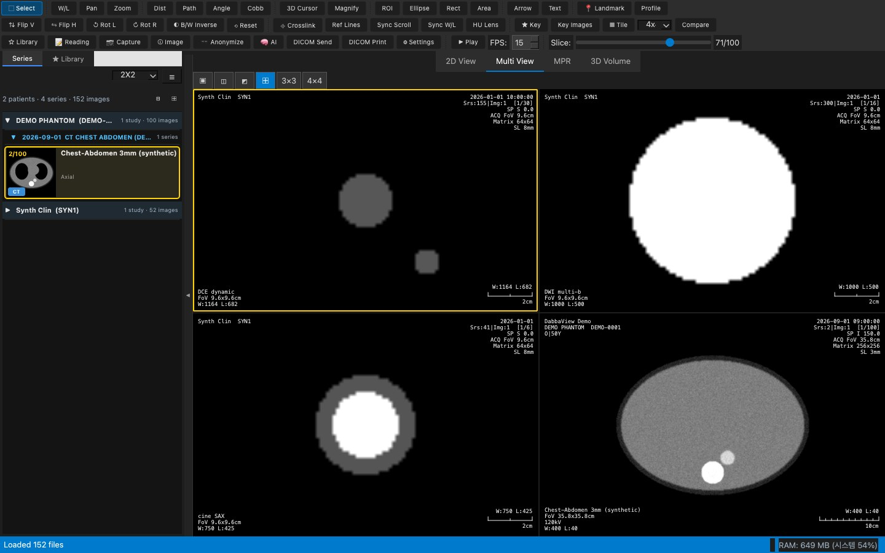

<div align="center">


# DabbaView — Free Open-Source DICOM Viewer

**Cardiac MRI · ACR phantom QC · AI segmentation · MPR · 3D volume rendering · PACS**

[](https://github.com/Dabbabbu/DabbaView/releases/latest)
[](https://www.python.org/)
[](https://pypi.org/project/PyQt5/)
[](LICENSE)
[](https://github.com/Dabbabbu/DabbaView/releases/latest)

[**⬇️ 내려받기 Download**](https://github.com/Dabbabbu/DabbaView/releases/latest) ·
[**🌐 웹 버전 Web**](https://dabbabbu.github.io/DabbaView-Web/) ·
[**📖 매뉴얼 Manual**](docs/manual.md) ·
[**🔬 분석 가이드**](docs/analysis_guide.md) ·
[**🐛 버그 · 기능 제안**](https://github.com/Dabbabbu/DabbaView/issues/new/choose)

</div>

**DabbaView** is a free, open-source **DICOM viewer and medical image analysis platform** for radiologic technologists, researchers and students.
It opens DICOM, NIfTI, NRRD, MetaImage, NumPy and image sequences, and adds **cardiac MRI quantification** (EF, T1/T2 mapping, flow, LGE),
**ACR phantom quality control** with automatic reports and DICOM Secondary Capture evidence, **AI segmentation**
(TotalSegmentator, MONAI, nnU-Net, MedSAM), **MPR**, **3D volume rendering**, ROI measurement, DICOM Send/Print and structured reading.
Built with Python and PyQt5, it runs on **macOS and Windows** — no licence, no server, no account.

**DabbaView**는 무료 오픈소스 **DICOM 뷰어이자 의료영상 분석 플랫폼**입니다. RadiAnt · GE AW · INFINITT PACS 워크스테이션의 작업 방식을 참고해 만들었고,
DICOM은 물론 NIfTI · NRRD · MetaImage · NumPy · 이미지 시퀀스를 열어 **심장 MRI 정량화**(EF, T1/T2 map, Flow, LGE),
**ACR 팬텀 정도관리**(자동 보고서 · DICOM SC 증빙), **AI 세그멘테이션**, **MPR**, **3D 볼륨 렌더링**, 측정 · ROI, DICOM Send/Print를 지원합니다.
Python · PyQt5로 만들어 **macOS(.app)와 Windows(.exe)** 로 빌드되며, 설치 비용도 서버도 계정도 필요 없습니다.



### ✨ 한눈에 보기 / At a glance

| | |
|---|---|
| 🖼 **보기 Viewing** | 2D · Tile · Multi View(최대 4×4) · MPR · 3D Volume, Crosslink · Reference Lines · Sync Scroll, 3D Cursor, Cine 재생 · Phase 보기 |
| 📏 **측정 Measure** | 거리 · 각도 · Cobb · 면적 · ROI(원 · 사각 · 자유형) · 프로파일 · 랜드마크, ROI Manager, 주석 저장 · 복원 |
| ❤️ **Cardiac MRI** | EF · 심근 두께 · Bull's-eye, T1/T2 mapping, Perfusion, Flow(Qp/Qs), LGE 정량 |
| 🧪 **ACR QC** | 대형 팬텀 7항목 자동 측정, 수동 절차와 같은 단계별 증빙 46장, PDF · DOCX · XLSX 보고서, **DICOM Secondary Capture** 내보내기, 추이 그래프 |
| 🤖 **AI** | TotalSegmentator · MONAI · nnU-Net · MedSAM · SAM, 라벨 편집, DICOM SEG 입출력 |
| 🔌 **PACS · 연동** | C-STORE(DICOM Send) · DICOM Print, 익명화, Google Drive · OneDrive 열기, 포맷 변환(NIfTI ↔ DICOM 등) |
| 🎬 **내보내기** | 화면 캡처, 동영상(MP4 · AVI · GIF), **여러 시리즈 일괄 동영상**, PNG 시퀀스 |

<!-- version -->**Version** 3.0.0 — 버전은 `dabbaview/__init__.py`의 `__version__` 하나로 관리합니다 (앱 번들·타이틀 바·About·시작 화면이 이 값을 사용하고, 빌드할 때 이 줄도 자동으로 맞춰집니다).

> ⚠️ 진단용으로 인증된 의료기기가 아닙니다. 학습·연구·참고용으로 사용하세요.

## 📖 문서

| 문서 | Markdown | PDF |
|---|---|---|
| 사용자 매뉴얼 (설치 · 보기 · 측정 · ROI · Library · Settings · 단축키) | [docs/manual.md](docs/manual.md) | [manual.pdf](docs/manual.pdf) |
| AI & Analysis Guide (Cardiac · Neuro · Oncology · Lung · Diffusion · Perfusion · 화질 평가 · ACR QC · AI · 세그멘테이션) | [docs/analysis_guide.md](docs/analysis_guide.md) | [analysis_guide.pdf](docs/analysis_guide.pdf) |

화면은 실제 앱을 실행해서 찍었습니다 (합성 팬텀 데이터 + 실제 ACR 팬텀 영상). PDF는 `python docs/build_pdf.py`로 다시 만듭니다.

## 주요 기능

### 불러오기 / 시리즈 목록
- **파일·폴더 열기**: 메뉴, 드래그 앤 드롭, Recent Files(최근 10개). 앱 시작 시 자동으로 불러오지 않음
- **다중 포맷**: DICOM 외에 아래 형식도 파일 열기·드래그 앤 드롭·폴더 열기로 불러와 DICOM 시리즈처럼 봅니다 (MPR·3D·AI·측정 모두 사용 가능, 공간 정보 유지)

  | 형식 | 확장자 | 비고 |
  |---|---|---|
  | NIfTI | .nii, .nii.gz | nibabel. 4D는 볼륨마다 시리즈. 이름에 label/mask/seg가 있는 라벨맵은 같은 위치의 영상에 AI 오버레이로 |
  | NRRD | .nrrd, .nhdr | pynrrd (LPS/RAS 공간 자동 변환) |
  | MetaImage | .mha, .mhd | SimpleITK |
  | NumPy | .npy, .npz | (슬라이스, 행, 열). `_mask.npy` / npz의 `mask`는 오버레이로, 옆의 `.json`·`dataset.json`에서 간격 복원 |
  | 이미지 시퀀스 | .png, .jpg, .bmp, .tif | 폴더(또는 여러 파일)를 파일 이름 순서대로 한 시리즈로. `images/` 옆 `masks/`는 오버레이로 |
  | DICOM SEG | .dcm (SEG) | 참조 시리즈 위에 세그멘테이션 오버레이 (참조 시리즈를 나중에 열어도 자동 적용) |
  | STL | .stl | 3D Volume 탭에 메시로 표시 (LPS mm 좌표, 볼륨과 겹쳐 봄) |
- **클라우드** (File → Open from Google Drive / Open from OneDrive): 브라우저로 로그인 → 폴더 탐색(내 드라이브·공유 문서함·공유 드라이브 / 내 OneDrive·공유 항목) → 파일 또는 **폴더 단위**로 열기. 폴더는 하위 폴더까지 로컬 Open Folder와 같은 기준으로 DICOM(과 지원 형식)만 골라 병렬로 내려받고 진행률(X/Y files) 표시, '현재 폴더 전체 열기' 버튼. 한 번 받은 파일은 캐시(파일 ID + 수정 시각)에 보관해 다시 열 때 내려받지 않음. 읽기 전용 권한, **각자 자기 OAuth 키를 Settings → Cloud에 입력** (앱에 내장된 키 없음, 없으면 설정 방법 안내). 로그인 토큰·Client Secret은 OS 키체인(macOS 키체인 / Windows 자격 증명 관리자)에 저장
  - Google: Cloud Console에서 Drive API 사용 설정 + OAuth 클라이언트(유형 '데스크톱 앱') → Client ID·Client Secret (API Key는 선택)
  - OneDrive: Azure Portal 앱 등록(개인+조직 계정), 플랫폼 '모바일 및 데스크톱' 리디렉션 URI `http://localhost`, 위임 권한 Files.Read.All → Application (client) ID
- **포맷 변환** (File → Convert / Export As): DICOM → NIfTI / NRRD / MetaImage / NumPy / PNG 시퀀스, NIfTI → DICOM / NumPy / NRRD, NumPy → NIfTI 등 모든 조합. 소스는 현재 시리즈 또는 파일·폴더, 옵션: voxel spacing 변경, 데이터 타입(int16/float32/uint8), 압축, AI 마스크 함께 저장(DICOM은 SEG로), PNG 8/16비트, DICOM Modality·환자 정보. 진행률 표시
- **빠른 로딩**: 메타데이터만 병렬로 먼저 읽고 픽셀은 필요할 때 읽음 (확장자 사전 필터링)
- **시리즈 패널 (INFINITT 스타일)**: 중간 슬라이스 썸네일, `시리즈번호/총 장수`, 시퀀스 이름, 선택 시 노란 테두리, 검사별 묶음
  - 환자 → 검사 → 시리즈로 묶음. ▶/▼로 환자·검사 접기/펼치기, 상단 ⊟/⊞로 모두 접기/펼치기 (트리 보기도 동일)
  - 기본은 선택된 환자만 펼침. 환자 이름을 누르면 그 환자만 펼치고 첫 시리즈를 바로 로드 (환자 간 빠른 전환)
  - 상단 요약: `12 patients · 194 series · 4,440 images` (마우스를 올리면 검사 수까지)
- **DICOM과 이미지가 섞인 폴더**: 한 폴더에 DICOM과 그림 파일(JPG·PNG)이 300장 넘게 같이 있으면 그림은 건너뛰고 ⚠ 목록에 몇 장을 건너뛰었는지 남깁니다 (논문 그림·캡처가 섞인 자료 폴더에서 수만 장을 읽느라 멈춘 것처럼 보이던 문제). 그림만 보려면 그 폴더만 따로 여세요
- **불러오기 안정성**: 파일마다 10초 제한, 손상·미지원 파일은 건너뛰고 ⚠ 목록(폴더 | 파일명 | 단계 | 이유, Show in Finder)에 표시, OneDrive 등 클라우드 동기화 폴더 감지(로컬로 복사 후 열기 / 다운로드하며 / 받은 것만), 압축 DICOM(JPEG, JPEG-LS, JPEG 2000, RLE)·Enhanced 멀티프레임 지원, 불러오는 동안 RAM 표시
  - **클릭(버튼을 뗄 때) / Enter = 활성 칸에 표시**, 누른 채 **끌면 로드하지 않고 드래그 앤 드롭** → 놓은 칸에 표시 (트리도 동일)
- **환자/검사 트리**: Patient → Study → Series (☰ 버튼으로 전환)
- **패널 접기/펼치기**: 패널과 영상 사이의 ◀/▶ 버튼 또는 **F2** — 슬라이드로 접히면 영상이 전체 너비 사용 (상태·너비는 다음 실행 때도 유지)
- **시퀀스 툴팁**: TR/TE/TI, Flip Angle, ETL, NEX, Bandwidth, 두께/간격, Matrix, FoV, 시퀀스 종류 (SE/FSE/GRE/EPI/IR, FatSat)

### 화면 구성
- **2D View**: Stack 모드와 Tile 모드(2x2~6x6)
- **Multi View**: 1x1 ~ 4x4 (최대 16칸), 트리/패널이나 Finder에서 칸으로 드래그 앤 드롭
- **레이아웃 드롭다운**: `2D` / `1X1`~`3X3` / `Default`(Hanging Protocol) / `ALL`(검사의 모든 시리즈)
- **Hanging Protocol**: 폴더를 열면 모달리티·부위에 맞춰 자동 배치 (예: Brain MRI → 2x2 T1/T2/FLAIR/DWI, Spine MRI → 1x2 Sag T1/T2). 편집하거나 현재 배치를 프로토콜로 저장 가능
- **MPR**: Axial/Sagittal/Coronal 3평면 (mm 기준 실제 비율) + Oblique: 크로스헤어 끝 핸들 드래그로 각도 회전, Shift+드래그 1° 단위 미세 조절, 각도 오버레이·리셋
- **3D Volume Rendering**: VTK (macOS 앱 번들에 포함)

### 비교 / 동기화
- **Crosslink (Sync Cursor)**: 한 뷰에서 찍은 위치(mm)를 같은 좌표계(Frame of Reference)의 다른 뷰·MPR에 십자선으로 표시하고 가장 가까운 슬라이스로 이동
- **Reference Line (Scout)**: 다른 칸의 현재 슬라이스 위치를 노란 선으로 표시
- **동기화 스크롤 / 동기화 W/L**: 같은 좌표계의 평행한 시리즈끼리 위치 기준으로 연동
- **Compare**: 같은 환자의 다른 날짜 검사를 나란히 비교 (슬라이스 간격을 유지하며 함께 스크롤)

### 측정 / 주석
- 거리, 각도, **Cobb 각**, **Freehand ROI**, **타원 ROI**(면적·Mean·SD·Min·Max), Freehand 면적, 2D 화살표(라벨), **텍스트 메모**(크기·색상)
- **3D Cursor**: 클릭 위치의 환자 좌표 (R/L, A/P, S/I). Crosslink 여부와 관계없이 같은 좌표계의 다른 칸·MPR에도 같은 위치를 표시 (각 시리즈의 픽셀 값, 슬라이스에서 벗어나면 Δ mm)
- **Pixel Probe**: 상태바에 좌표(x, y, z mm)와 픽셀 값 (CT: HU, MR: SI, PET: SUVbw)
- 측정·주석은 영상(SOPInstanceUID)별로 저장되며 **JSON 저장/불러오기** 가능
- **Key Image**: 표시 → 모아보기(Tile) → PNG + 목록(JSON) 내보내기

### 영상 조작 (GE AW 스타일)
- W/L 조절, 사용자 정의 **W/L 프리셋**(추가/편집/삭제), Pan, Zoom, 돋보기 렌즈(2x~4x)
- 상하/좌우 반전, 90° 회전, 흑백 반전 (측정·주석은 영상에 붙어서 함께 회전)
- **GE 스타일 오버레이**: 기관·환자·성별/나이/체중, 날짜·시리즈/영상 번호·위치·FoV·Matrix·두께, 시퀀스·장비·코일·TR/TE/TI·FA/ETL/NEX·W/L, 우하단 W/L + 스케일 바
- **Image 정보 패널**: 현재 영상의 환자·검사·시리즈·획득 파라미터 상세

### 내보내기 / 네트워크
- 이미지 내보내기, **Capture**(오버레이·측정선 포함), **동영상**(MP4/AVI/GIF)
- **DICOM Send** (C-STORE), **DICOM Print** (Basic Grayscale Print), 연결 확인(C-ECHO) — pynetdicom 사용
- **DICOM 익명화** (툴바 🕶 Anonymize / Tools 메뉴): 개인정보·기관정보·검사정보·촬영 파라미터를 항목별로 선택, 프리셋(최소/표준/완전/연구용), 카테고리별 미리보기에서 변경될 태그 강조, Private 태그 제거, UID 재생성(시리즈 안에서 일관 유지)

> DICOM Send는 원본 파일을 그대로 보내므로 **환자 정보가 포함됩니다.** 외부로 보낼 때는 먼저 익명화하세요.

### AI Research — 툴바 🧠 AI (Ctrl+Shift+A)
오른쪽 사이드 패널에서 AI 학습 데이터를 만들고 모델을 연동합니다 (3D Slicer Segment Editor · MONAI Label 방식).

- **세그멘테이션**: Brush(D) / Eraser(X, 현재 라벨만 지움) / Magic Wand(W, 클릭한 값 ±허용범위의 연결 영역, 3D 옵션) / Threshold(G, 값 범위 미리보기 후 클릭한 슬라이스 또는 전체 적용, CT 프리셋)
- **슬라이스 보간**: 몇 장만 칠하면 사이 슬라이스를 모양 기반(거리 맵)으로 자동 채움
- **다중 라벨 / 라벨 매니저**: 추가·삭제·이름·색상·표시 여부, 반투명 오버레이(투명도 슬라이더), 되돌리기(Ctrl+Z)
- **통계**: 라벨별 볼륨(mL)·복셀·슬라이스 범위. 마스크는 시리즈별로 자동 저장되어 다시 열면 이어서 작업
- **내보내기**: NIfTI(.nii.gz) · NumPy(.npy) · PNG 시퀀스 · COCO(JSON) · Pascal VOC · DICOM SEG, train/val/test 자동 분할(케이스가 여러 개면 케이스 단위, 하나면 슬라이스 단위)
- **전처리**: 라벨 영역 크롭(+여유 mm), 리샘플링(목표 간격 mm), 가우시안/미디안 필터, 히스토그램 매칭(기준 시리즈), 윈도잉 후 0–1 정규화, 전/후 미리보기
- **MONAI Label**: 서버 연결(Settings → AI), 자동 세그멘테이션 결과를 오버레이로 받아 수정 → 최종 라벨 제출(active learning) → 학습 시작. 서버로는 픽셀 볼륨만 보냄 (환자 정보 제외)
- **ONNX 로컬 추론** (onnxruntime): (N,C,H,W) 모델은 슬라이스별, (N,C,D,H,W)는 3D. 결과를 빈 곳만 채우거나 교체
- **데이터셋 워크리스트**: 여러 환자/검사를 목록으로 관리, 상태(미완/진행중/완료), 라벨 통계, 폴더에서 다시 열기

> NIfTI/NumPy/PNG/COCO/VOC에는 환자 정보가 들어가지 않습니다. DICOM SEG는 원본 검사를 참조하므로 환자 정보가 포함됩니다.

### 분석 (3D Slicer · ImageJ/Fiji 스타일)
AI Research 패널의 **🧰 Image Tools** 탭, **Process** 메뉴, 하단 **Histogram / Profile** · **Python Console(F3)** 패널.

| 기능 | 내용 |
|---|---|
| Image Registration | 두 시리즈 선택 → Rigid / Affine (SimpleITK, Mutual Information · Mean Squares · Correlation, 다해상도). 결과는 기준 격자에 맞춘 새 시리즈 + 자동 융합 표시. 변환 `.tfm` 저장/불러오기 |
| Image Fusion | 기준 시리즈 위에 다른 시리즈를 컬러로 (예: CT 흑백 + PET Hot). 환자 좌표로 다시 샘플링하므로 해상도·방향이 달라도 겹침. 투명도, Overlay / Add / Multiply / Checkerboard, 컬러바 |
| Landmarks | Landmark 도구(**F**)로 점 찍기 → 이름·라벨 편집, 환자 좌표(mm) CSV / 3D Slicer `.mrk.json` 내보내기·불러오기, 같은 좌표계의 모든 시리즈와 3D 뷰에 표시 |
| Surface Model | AI 세그멘테이션 라벨 → Marching Cubes → 스무딩·데시메이션 → 3D 뷰, STL/OBJ/PLY 내보내기, 표면적·부피 |
| Filters (Process) | Gaussian, Median, Unsharp Mask, Sobel, Canny, Erosion/Dilation/Opening/Closing — 2D(슬라이스별) 또는 3D, 미리보기, **결과는 새 시리즈** (원본 보존) |
| Histogram | 현재 슬라이스 / 전체 볼륨 / ROI / AI 라벨 영역, Mean·StdDev·Min·Max·Median·Mode, log, CSV |
| Line Profile | Profile 도구(**Shift+L**)로 선을 그으면 거리(mm)별 값 그래프, CSV |
| Particle Analysis | 임계값 범위 또는 AI 라벨 → 객체별 면적·둘레·원형도·중심 좌표, 결과 표 + CSV |
| Color Map | Gray, Hot, Cool, Jet, Viridis, Magma, Inferno, Plasma, Bone, Rainbow, Fire + ImageJ `.lut`/텍스트 LUT, 컬러바 |
| Python Console (F3) | `app.current_array`, `app.current_image`, `app.mask`, `app.add_series(배열, "이름")`, `np`, `ndi`, `plt`, `skimage` — plt 그래프는 콘솔 오른쪽에 표시, 구문 강조, 스크립트 열기/저장 |
| Macros | 콘솔 스크립트를 매크로로 저장 → 원클릭 실행 (Process → Macros). 예제: Otsu → 입자 분석, Gaussian → 새 시리즈, 볼륨 통계, 라벨별 부피, MIP |

### 스터디 라이브러리 (Zotero 스타일, 왼쪽 패널 **★ Library** 탭)

| 기능 | 내용 |
|---|---|
| 즐겨찾기 | **★ Library** 버튼 / File → Add to Library / **⌘D**: 현재 스터디(환자명·검사일·설명·모달리티·폴더)를 저장. 툴바 별이 ★이면 이미 들어 있는 스터디 |
| 열기 | 더블클릭·Enter·📂 열기: 이미 불러온 스터디면 바로 선택, 아니면 그 스터디가 있는 폴더들만 불러와 첫 시리즈 표시. 폴더를 옮겼으면 새 위치 지정 |
| 컬렉션 | 사용자 폴더(예: Cardiac Cases, Teaching Cases) + 하위 컬렉션 트리. 스터디를 컬렉션으로 끌어다 놓기, 한 스터디가 여러 컬렉션에 (태그 방식). 이름 변경·삭제·위/아래·다른 컬렉션 안으로 이동. '컬렉션 없음'으로 정리 안 된 스터디 확인 |
| 메모 | StudyInstanceUID 기준, 굵게·기울임·글머리/번호 목록, 자동 저장. 본문의 `#태그`는 자동으로 스터디 태그. Markdown / TXT 내보내기 (선택·컬렉션·전체) |
| 태그 | 컬러 태그 칩으로 거르기(여러 개 = 모두 포함), 우클릭으로 색 변경, 빠른 태그 버튼(#interesting #teaching #followup, 편집 가능) |
| 검색 | 환자명·ID·설명·검사일·메모·폴더, `#태그` — 현재 컬렉션 안에서 (전체 스터디 선택 시 전체) |
| 저장 | `~/Library/Application Support/DabbaView/library.json` (앱 시작 시 자동 로드), JSON 내보내기 / 가져오기(병합) |
| 내보내기 | Library 우클릭 **Export…** / ⋯ 메뉴 / File → **Export Library...**: 범위(전체·컬렉션·선택), 형식 **PDF**(reportlab, 한글 글꼴) · **Word**(python-docx) · **Excel**(openpyxl: 스터디 목록 · 컬렉션별 · 시리즈 · 측정 시트) · PNG/JPEG 연락처 시트 또는 스터디별 이미지 · CSV · JSON · Markdown. 포함 항목(환자·스터디 정보·시리즈 목록·메모·태그·썸네일·측정/ROI) 선택, 미리보기. HWP는 macOS용 라이브러리가 없어 PDF/DOCX로 저장 후 한글에서 열도록 안내 |

### 스터디·시리즈 이름 / 환자 정보 바꾸기
- 시리즈 패널·트리·Library에서 우클릭 **Rename Study…**(F2) / **Rename Series…**(⇧F2) / **Edit Patient Name/ID…**
- **DICOM 파일 원본도 수정**(기본): pydicom으로 태그만 바꾸고 픽셀 데이터는 그대로, 진행률·취소, 수정 전 `<파일>.bak` 백업(Settings에서 끄기). 끄면 원본은 그대로 두고 Library에서만 표시 이름 변경
- 환자 이름·ID 변경은 익명화와 구분된 별도 경고 + 새 PatientID를 한 번 더 입력해야 진행

### 오픈소스 AI 모델 (AI 메뉴 → Open Source Models, AI 패널 → 🧩 Models 탭)

| 모델 | 방식 | 내용 |
|---|---|---|
| TotalSegmentator | 로컬 (pip) | CT(total) / MR(total_mr) 전신 해부학 구조 자동 세그멘테이션 → 구조 이름·색이 라벨로 자동 등록 |
| nnU-Net v2 | 로컬 (pip) | Settings → AI에 사전학습 모델 폴더(…/nnUNetTrainer__nnUNetPlans__3d_fullres)와 fold 지정 → 실행, 라벨 이름은 dataset.json |
| MONAI Label | 서버 | 기존 🤖 모델 탭 (자동 세그멘테이션, 피드백 제출, 학습) |
| MedSAM | 로컬 (ONNX) | 세그멘트 탭 🎯 MedSAM 도구(**M**): 클릭 한 번 → 클릭 중심 박스(또는 점) 프롬프트로 그 슬라이스의 구조를 현재 라벨로. SAM 형식 인코더/디코더 .onnx, 같은 슬라이스 두 번째 클릭부터는 즉시 |
| 사용자 ONNX | 로컬 | Settings → AI에 .onnx 경로 지정 → Models 탭에서 실행 |
| REST API | 원격 | 볼륨 NIfTI를 POST → 라벨 NIfTI(또는 JSON base64) 수신. 형식은 Models 탭 'REST 형식' |

- **원클릭 설치**: TotalSegmentator·nnU-Net은 PyTorch(수 GB)가 필요해서 앱에 넣지 않고, Models 탭의 **설치** 버튼이 DabbaView 전용 Python 환경(앱 데이터 폴더/ai/model-env)을 만들어 `pip install` 합니다. 시스템에 Python 3.9 이상이 필요하며, Settings → AI에서 다른 Python(conda 등)을 지정할 수도 있습니다.
- 실행 로그·진행률·취소(프로세스 종료), 결과는 세그멘테이션 오버레이 + 라벨 목록에 등록(번호가 겹치면 새 번호로), **📦 결과 내보내기**로 NIfTI / DICOM SEG.
- 모델·서버로 보내는 것은 픽셀 볼륨(NIfTI)뿐이며 환자 이름·ID 등 DICOM 정보는 보내지 않습니다.

**Help → 📚 Open Datasets**: TCIA, MedPix, MIMIC-CXR, NLST, UK Biobank, OpenNeuro, Grand Challenge, Medical Segmentation Decathlon, ACDC, BraTS, AMOS, Awesome DICOM, Awesome Medical Imaging Datasets (브라우저로 열림)

### ROI · 측정 (연구용)

| 기능 | 내용 |
|---|---|
| 정량 ROI | ROI Manager의 **＋원 / ＋타원 / ＋사각형**: 중심 좌표(px) + 반지름·장축/단축·가로/세로(mm)로 정확한 크기. 자유곡선은 기존대로(8) |
| 편집 | Select 도구로 클릭 = 선택(Shift/⌘로 여러 개), 몸통 끌기 = 이동, 끝점·모서리 핸들 끌기 = 수정 (그리기 도구에서도 핸들은 바로 잡힘). **Properties**에서 이름·색·중심·크기를 숫자로 |
| ROI Manager (Ctrl+Shift+M) | 현재 영상/시리즈의 ROI·측정 목록: ☑ 표시/숨김, 이름(더블클릭), 색(색 칸 더블클릭), 🔒 잠금, Select All / Deselect All |
| 분석 | **Measure**: ROI Name · Area(mm²) · Perimeter · Mean · StdDev · Min · Max · Median · Pixels 표 → CSV / 클립보드. **측정값 표**: 거리·경로·각도·면적 모두. **Volume**: 같은 이름 ROI의 여러 슬라이스 부피 (Σ면적 × 슬라이스 간격) |
| 복사 | Ctrl+C → 다른 슬라이스·시리즈에서 Ctrl+V, **슬라이스 복제**(예: 1-20), **Mirror**(좌우 대칭 위치) |
| 저장/불러오기 | `.roi.json`: 종류·좌표(환자 좌표 mm + 영상 상대 위치)·크기(mm)·이름·색·슬라이스. 같은 좌표계(T1 → T2)는 mm로 같은 위치, 다른 환자는 상대 위치로 적용. **템플릿**으로 자주 쓰는 ROI 세트 저장 |
| Compare | 다른 검사(이전 검사)의 ROI를 현재 영상에 점선으로 겹쳐 보기 (이전 평균값 표시) |
| Batch | AI 패널 Worklist의 모든 검사에 같은 ROI 적용 → 결과 CSV 일괄 |
| 빠른 측정 | 거리: 클릭→클릭 또는 끌기, Shift = 0/45/90° 스냅, 커서 옆 실시간 거리(측정 전에는 마지막 점에서의 거리), Select 도구 더블클릭 → 클릭 = 도구 바꾸지 않고 거리 측정. 다중 점 경로(Shift+D) 총 길이, 면적+둘레 동시 표시 |
| 표시 설정 | Tools → 측정 표시 설정: 글자 크기, 단위 (mm / cm / px) |
| 되돌리기 | Ctrl+Z / Ctrl+Y: ROI·측정 추가·이동·수정·삭제 (세그멘테이션과 편집 순서대로) |

### 전문 분석 도구 (Analysis 메뉴)

메뉴바 **Analysis ▸ Cardiac | Neuro | Oncology | Lung | MSK | Vascular | Diffusion | Perfusion | Spectroscopy | Image Quality Assessment** 에서 도구를 고르면 오른쪽 **Analysis** 패널에 입력 화면과 결과(표 + matplotlib 그래프, 복사·CSV·PNG)가 나옵니다. 맵은 **새 시리즈**로 만들어집니다 (원본 보존). 피팅은 `scipy.optimize`, 계산은 `numpy`.

| 카테고리 | 도구 |
|---|---|
| Cardiac | LV/RV Endo·Epi 윤곽 (ROI → 윤곽 저장, 영상 위 색 표시) → EDV·ESV·SV·EF·CO·심근 질량, AHA 17-segment Bull's Eye, T1(MOLLI)·T2 매핑, LGE (n-SD / FWHM), Phase-Contrast 유량 (순방향·역류·역류율·Qp/Qs), Strain (OpenCV optical flow, GCS·GRS), 관류 시간-신호 곡선 (upslope) |
| Neuro | ADC/FA 컬러맵, DWI–ADC 미스매치 (확산 제한 vs T2 shine-through), FLAIR 병변 부피, DSC 관류 맵 |
| Oncology | 종양 부피, RECIST 반자동 (장경·단경, 측정선 표시), Follow-up 변화율·반응 평가·배가 시간, ADC 히스토그램, SUVbw (SUVmax·peak·mean, MTV, TLG) |
| Lung | 결절 반자동 분할 (장경·단경·부피), Doubling Time, 폐기종 LAA% (<−950 HU, Perc15), GGO |
| MSK | 관절 각도 (두 선), 근육 단면적 (cm²), 지방 침윤 (CT HU 범위 / MR Otsu 자동), Cobb |
| Vascular | 혈관 직경·면적, 협착률 (직경·면적), Curved MPR (랜드마크 경로), 동맥류 최대 직경·부피 |
| Diffusion | ADC 맵 (다중 b 단일 지수 피팅), b-value 신호 감쇠 곡선, IVIM (D · D* · f 맵 + ROI 비선형 피팅) |
| Perfusion | DCE Tofts (Ktrans · ve · kep), DSC (ΔR2* → sSVD CBV · CBF · MTT, rCBV/rCBF 정규화, 감마 바리에이트 피팅), AIF 자동 / 동맥 ROI / Parker 집단 AIF, 시간-신호 곡선 |
| Spectroscopy | DICOM MR Spectroscopy / Siemens `.rda` → 스펙트럼 (선폭 가중, 자동·수동 위상), NAA · Cho · Cr · mI · Lac 피크, Cho/Cr · NAA/Cr · Cho/NAA |

> 연구·교육용입니다. 진단용으로 검증된 소프트웨어가 아니므로 결과는 검증된 도구와 대조하세요.

### 영상화질 평가 (Analysis ▸ Image Quality Assessment)

현재 보고 있는 영상에서 화질 지표를 잽니다. 자동으로 놓은 ROI는 `IQ …` 주석이라 ROI Manager에서 보이고 옮길 수 있습니다 (옮긴 뒤 '다시 계산'). 계산은 `numpy` · `scipy`(FFT·ndimage), 그래프는 matplotlib.

| 도구 | 내용 |
|---|---|
| MTF (Edge) | 에지를 가로지르는 직선 하나 → 줄마다 에지 위치를 찾아 기울기 맞춤 → 4배 과표본 ESF → LSF → MTF. MTF50·MTF10 표시, Nyquist 선. '자동'은 팬텀 가장자리 |
| SNR | 단일 영상: 신호(물체 75%) 평균 / 배경 SD (MR 크기 영상 Rayleigh ÷0.655), 두 영상: 차영상 SD/√2 (NEMA). ROI 자동 배치 (글자·자 오버레이 피함) |
| CNR | 마지막 ROI 두 개: \|m1−m2\| / √((σ1²+σ2²)/2), 배경 잡음 기준 CNR |
| Uniformity | NEMA 5-ROI(중심+상하좌우), ACR PIU, 균일도 지도(1 cm² 이동 평균 편차 %, 컬러맵 새 시리즈) |
| Ghosting | ACR PSG (팬텀 밖 4방향 10 cm² 타원 자동), 고스팅 비율 지도 |
| Geometric Distortion | 격자 칸 중심 자동 검출 → 이상 격자(회전·이동, 공칭 간격 선택) 대비 변위, 벡터 화살표·quiver 그래프 |
| NPS | 균일 영역 조각 2D FFT (2차 추세 제거) → 2D NPS · 방사 평균 1D NPS, 백색/상관/구조 잡음 판별(스파이크 주파수), 두 영상 차분 옵션 |
| NEQ | S²·MTF²/NPS (마지막 MTF·NPS 결과), 입사 양자 q를 넣으면 DQE |
| Resolution | 점 광원 FWHM/FWTM(가로·세로), 선 광원 FWHM, 바 패턴 묶음별 lp/mm·변조도 → 분해 한계 |
| Artifact | 링(극좌표 변환 후 반지름 줄무늬), 지퍼(한 열/행 전체의 튀는 값 + 주기 성분), 밴딩(행·열 주기 성분 진폭 %) |
| Auto IQ Assessment | SNR · CNR · NEMA 균일도 · PIU · PSG · MTF를 한 번에, 이전 결과와 변화 비교, PDF 보고서, 날짜별 추세 (`iq_history.json`) |

### ACR Phantom QC (Analysis ▸ ACR Phantom QC)

ACR 대형 MRI 팬텀의 7개 검사를 자동으로 분석합니다. 기준값은 **3.0T ACR**(GE SIGNA Architect 기준) 기본, Settings → **ACR QC**에서 변경(1.5T 프리셋 포함).

1. **Auto Analyze**: 불러온 영상에서 localizer · T1 slice 1–11 · T2 slice 1–11을 자동으로 찾음 (DICOM은 EchoTime으로 T1/T2·이중 에코 구분, 콘솔 화면 캡처 JPEG 폴더는 격자 영상(slice 5) 기준, T2 이중 에코는 둘째 에코)
2. 검사마다 해당 슬라이스로 이동해 ROI·측정선을 **주석으로 배치** (진행 목록에 단계 표시) → ROI Manager에서 보이고 Measure All 가능

| 검사 | 자동 배치 / 계산 | 기준 (3T) |
|---|---|---|
| 1. 기하학적 정확도 | localizer 위아래 길이, slice 1 가로·세로, slice 5 가로·세로·대각 둘 (국소 반치 가장자리, 노치 피한 평행 현 보정) | 148 ± 2 / 190 ± 2 mm |
| 2. 고대조도 분해능 | slice 1 구멍 배열 6개(1.1·1.0·0.9 mm × UL·LR) 자동 판정 → 사용자 확인 | ≤ 1.0 mm |
| 3. 절편 두께 | slice 1 경사판 두 개, 기준 = 두 ROI 평균의 절반, 0.2 × 위 × 아래 / (위 + 아래) | 5.0 ± 0.7 mm |
| 4. 절편 위치 | slice 1·11 쐐기 막대 두 개 길이 차이 (오른쪽 − 왼쪽) | ≤ 5 mm |
| 5. 균일도 PIU | slice 7 200 cm² 원 안에서 1 cm² 평균 최대·최소 | ≥ 82 % |
| 6. 고스팅 PSG | 팬텀 밖 위·아래·좌·우 10 cm² 타원 (글자·자 오버레이 피함) | ≤ 2.5 % (T1) |
| 7. 저대조도 | slice 8–11 스포크 10개 × 원판 3개 (slice 11에서 회전·중심을 찾고 9°씩 예측) → 스포크 수 자동 → 사용자 확인·수정 | 합 ≥ 37 |

- **수동 수정**: ROI·측정선을 옮기면 자동으로 다시 계산 (또는 ↻ 버튼), 스포크 수·분해능은 표에서 직접 수정. 원판·구멍 배열은 초록(보임)/빨강 표시
- **결과 표**: 항목별 적합(초록)/부적합(빨강) + 종합 판정
- **Export Report**: 기록지 형식 PDF · Word · Excel (병원·연도/반기·장비·자장·호기·검사일·코일·검사자, 7개 항목 T1/T2, 종합 판정, ROI 그린 영상)
- **추세**: 결과를 날짜별로 저장(`acr_history.json`)하고 항목별 그래프(기준선 포함)로 비교
- 화면 캡처(JPEG·PNG)는 픽셀 크기를 FOV(기본 250 mm)로 가정하고 콘솔 글자 오버레이를 피합니다. 신호값은 표시 창이 적용된 값이라 L = W/2(하한 0)일 때 비율 검사(PIU·고스팅)가 유효합니다

## 마우스 조작 (PACS 표준, Settings에서 변경 가능)

| 조작 | 기능 |
|---|---|
| 좌클릭 드래그 | 선택한 도구 (기본: Selector = 선택만) |
| **우클릭 드래그** | **항상 W/L** (좌우 = Width, 상하 = Level) |
| **가운데 버튼 드래그** | **항상 Pan** |
| Ctrl(⌘) + 좌클릭 드래그 | **ROI 자동 W/L**: 사각형을 그리면 그 영역으로 W/L 설정 (기본 Mean±2SD, Settings에서 Min–Max로 변경 가능) |
| Alt(⌥) + 좌클릭 드래그 | Pan (도구 무관) |
| 휠 | 슬라이스 이동 (위 = 이전, 아래 = 다음) |
| Shift + 휠 | 5장씩 빠르게 이동 |
| Ctrl(⌘) + 휠 | Zoom (위 = 확대, 커서 위치 기준) |
| 좌측 더블클릭 | 화면에 맞춤 (Fit to Window) |
| 우측 더블클릭 | W/L을 DICOM 기본값으로 리셋 |

macOS에서는 표의 `Ctrl` 자리에 **⌘ (Command)** 와 **Control** 키 모두 쓸 수 있습니다.

## 키보드 단축키

한/영 입력 상태와 관계없이 동작합니다 (한글 입력 중 T → ㅅ 으로 들어와도 T 단축키로 처리).

| 키 | 기능 | 키 | 기능 |
|---|---|---|---|
| S | Selector | 1 | W/L |
| 2 | Pan | 3 | Zoom |
| 4 | 거리 | 5 | 각도 |
| B | Cobb 각 | 6 | 3D Cursor |
| 7 | 돋보기 | 8 | Freehand ROI |
| E | 타원 ROI (Shift: 원) | 9 | 면적 |
| 0 | 화살표 | A | 텍스트 메모 |
| V / H | 상하 / 좌우 반전 | [ / ] | 왼쪽 / 오른쪽 90° 회전 |
| I | 흑백 반전 | Shift+R | 회전·반전 초기화 + 화면 맞춤 |
| C | Crosslink | L | HU Lens (커서 옆 픽셀 값) |
| K | Key Image 표시/해제 | Shift+K | Key Image 모아보기 |
| Shift+T | Stack ↔ Tile | T / O | 환자 정보 + 측정/주석 표시/숨김 |
| Space | Multi View: 선택한 칸만 크게 ↔ 복귀 | P | 시네 재생/정지 |
| Shift (그리는 중) | 직선 0/45/90° 스냅 | | |
| Esc | 그리던 측정 취소 / 3D Cursor 지우기 / 세그멘테이션 도구 해제 | Ctrl+T | DICOM 태그 |
| Ctrl+I | Image 정보 패널 | Ctrl+Shift+S | Capture |
| Ctrl+O | 파일 열기 | Ctrl+Shift+O | 폴더 열기 |
| Ctrl+S | 이미지 내보내기 | Ctrl+Shift+E | 동영상 내보내기 |
| F2 | 시리즈 패널 접기/펼치기 | ⌘, (macOS) | Settings (Windows는 File → Settings) |
| Ctrl+Shift+A | AI Research 패널 | D / X | 세그멘테이션 Brush / Eraser |
| W / G / M | Magic Wand / Threshold / MedSAM (클릭 한 번) | Ctrl+Z / Ctrl+Y | 되돌리기 / 다시 하기 (ROI·측정·세그멘테이션, 가장 최근 편집부터) |
| Shift+E | 사각형 ROI (Shift: 정사각형) | Shift+D | 다중 점 경로 길이 (더블클릭/Enter로 끝) |
| Ctrl+C / Ctrl+V | ROI 복사 / 현재 슬라이스에 붙이기 | Ctrl+Shift+M | ROI Manager |
| Ctrl+D | 현재 스터디를 Library(즐겨찾기)에 추가 | ⌘B / ⌘I (메모 입력 중) | 굵게 / 기울임 |
| Ctrl+M | Measure (선택 ROI 통계 표) | Delete | 선택한 ROI/측정 삭제 (선택 없으면 마지막 것) |
| F | Landmark (점 찍기) | Shift+L | Line Profile |
| F3 | Python 콘솔 | | |

## 설정 (File → Settings, macOS ⌘,)
- **Mouse**: 버튼·휠·더블클릭 동작 매핑
- **W/L Presets**: 프리셋 추가/편집/삭제
- **Hanging Protocols**: 모달리티, 부위 키워드, 레이아웃, 칸별 시리즈 키워드
- **DICOM Nodes**: 이 컴퓨터의 AE Title, 전송/인쇄 대상 (AE Title, Host, Port)
- **Deploy Web**(Help → Deploy Web): 저장소·워크플로·브랜치, GitHub 토큰
- **AI**: MONAI Label 서버 주소, Access Token
- **Cloud**: Google OAuth Client ID / Client Secret / API Key, OneDrive(Azure) Client ID, 로그아웃
- **ACR QC**: 판정 기준값(3T / 1.5T 프리셋), 보고서 머리글(병원·호기·장비·자장·코일·검사자), 이미지 파일 FOV
- **Cache**: 캐시 위치·사용량(메타데이터/썸네일/클라우드 파일), 최대 용량 1~50 GB(기본 5 GB, 넘으면 오래 안 쓴 것부터 자동 삭제), Clear Cache

### 캐시
- 위치: macOS `~/Library/Caches/DabbaView`, Windows `%LOCALAPPDATA%\DabbaView\cache`
- **폴더 메타데이터**: 폴더를 처음 열 때 시리즈 분류·정렬에 쓰는 DICOM 헤더를 저장 → 파일 목록·수정일·크기가 같으면 다음에는 파싱 없이 바로 열기 (바뀌면 자동으로 다시 읽음). **썸네일**도 저장
- **클라우드 파일**: Google Drive / OneDrive에서 받은 파일을 파일 ID + 버전으로 보관
- 캐시에는 환자 정보가 든 영상 헤더·파일이 있으니 공용 PC에서는 Settings → Cache → Clear Cache

설정은 QSettings로 저장됩니다 (macOS: `~/Library/Preferences/com.dabbaview.DabbaView.plist`).

## 설치 및 실행

### 소스에서 실행 (macOS / Windows)

```bash
git clone https://github.com/Dabbabbu/DabbaView.git
cd DabbaView
python3 -m venv venv
source venv/bin/activate        # Windows: venv\Scripts\activate
pip install -r requirements.txt
python create_icon.py           # 아이콘과 시작 화면 로고 생성
python run.py                   # 또는: python run.py /path/to/dicom/folder
```

VTK는 3D Volume Rendering에만 쓰이며, 없으면 3D 탭만 비활성화되고 나머지 기능은 동작합니다.

### 앱 빌드

| 플랫폼 | 명령 | 결과 |
|---|---|---|
| macOS | `./build_app.sh` (py2app) | `dist/DabbaView.app` |
| macOS 대안 | `./build_pyinstaller.sh` | `dist/DabbaView.app` |
| Windows | `build_windows.bat` (PyInstaller) | `dist\DabbaView\DabbaView.exe` (ONNX·MedSAM 추론 제외 — 아래 참고) |

Windows 빌드는 `onnxruntime`을 넣지 않습니다 (PyInstaller가 분석 중 import하다 죽어서 빌드가 실패함). ONNX 모델·MedSAM 추론만 빠지고 나머지 기능은 같습니다. 이 기능이 필요하면 소스에서 실행하세요.

빌드된 앱은 서명되지 않았습니다. 처음 열 때 macOS는 우클릭 → 열기, Windows는 SmartScreen에서 "추가 정보 → 실행"을 선택하세요.

### 미리 빌드된 앱 받기 (권장)

[**Releases**](https://github.com/Dabbabbu/DabbaView/releases/latest) 에서 받으세요 (GitHub 로그인 없이 가능).

| 운영체제 | 파일 | 설치 |
|---|---|---|
| macOS | `DabbaView-v2.13.0-macOS.zip` (안에 `DabbaView.app`) | 압축을 풀고 `DabbaView.app`을 **응용 프로그램**으로 옮긴 뒤, 처음에는 **우클릭 → 열기** |
| Windows | `DabbaView-v2.13.0-Windows.zip` (안에 `DabbaView\DabbaView.exe`) | 압축을 풀고 `DabbaView.exe` 실행. SmartScreen에서 **추가 정보 → 실행** |

버전 태그(`v2.6.0` 등)를 올리면 GitHub Actions가 두 플랫폼을 빌드하고 실행되는지 확인한 뒤 Release를 만들고 zip을 붙입니다. 새 Release가 올라가면 이전 Release는 자동으로 지워져 **항상 최신 하나만** 남습니다 (태그는 그대로 남아 소스는 언제든 받을 수 있습니다).
태그 없이 main에 push한 빌드는 [Actions](https://github.com/Dabbabbu/DabbaView/actions) → 최근 빌드 → **Artifacts**에 남습니다 (GitHub 로그인 필요, 90일 보관).

## 프로젝트 구조

```
DabbaView/
├── run.py                   # 실행 스크립트
├── create_icon.py           # 아이콘(.icns/.ico) + 로고 생성
├── create_social_preview.py # GitHub 소셜 미리보기 이미지(1280×640) 생성
├── setup_app.py             # py2app 설정
├── build_app.sh / build_pyinstaller.sh / build_windows.bat
├── .github/workflows/build.yml   # macOS + Windows 자동 빌드
└── dabbaview/
    ├── main_window.py       # 메인 윈도우, 툴바, 메뉴
    ├── dicom_loader.py      # 병렬 로딩, 시리즈 분류/정렬, lazy 픽셀 로딩
    ├── dicom_info.py        # 태그 해석, 시퀀스 요약, GE 오버레이 문구, SUV
    ├── geometry.py          # 영상 ↔ 환자 좌표(mm), Reference Line 계산
    ├── viewport.py          # 2D 뷰포트 (도구, 측정, 오버레이, 마우스 매핑)
    ├── multi_viewport.py    # Multi View (레이아웃, 동기화, Reference Line)
    ├── tile_view.py         # Tile 모드 / Key Image 모아보기
    ├── series_panel.py      # INFINITT 스타일 썸네일 패널
    ├── series_tree.py       # 환자/검사/시리즈 트리, 썸네일 생성
    ├── hanging.py           # Hanging Protocol 매칭/배치
    ├── annotations.py       # 주석·Key Image 저장소 (JSON)
    ├── roi_tools.py         # ROI 모양·통계·환자 좌표 변환·.roi.json·부피
    ├── roi_manager.py       # ROI Manager 도크 (정량 ROI, Measure, 복사, 템플릿, Compare, Batch)
    ├── annotation_edit.py   # 주석 선택·이동·핸들 편집·스냅·실시간 거리
    ├── roi.py               # ROI/타원/Cobb 계산
    ├── cursor_sync.py       # Crosslink 컨트롤러
    ├── mpr_viewer.py        # MPR
    ├── volume_renderer.py   # 3D (VTK)
    ├── video_exporter.py    # 동영상 내보내기
    ├── dicom_net.py         # C-ECHO / C-STORE / Print (pynetdicom)
    ├── network_dialogs.py   # DICOM Send / Print 대화상자
    ├── settings_dialog.py   # Settings 대화상자
    ├── app_settings.py      # 설정 저장 (마우스, 프리셋, 프로토콜, 노드)
    ├── image_info_panel.py  # Image 정보 패널
    ├── anonymizer.py        # 익명화
    ├── tag_viewer.py        # DICOM 태그 뷰어
    ├── text_dialog.py       # 텍스트 주석 입력
    ├── render.py            # 8비트 렌더링 (내보내기/인쇄)
    ├── shortcut_fallback.py # 한글 입력 상태에서도 단축키 동작
    ├── about_dialog.py      # Help → About
    ├── deploy_web.py        # Help → Deploy Web (GitHub Actions)
    ├── net_ssl.py           # HTTPS 인증서 (certifi)
    ├── cloud/               # Google Drive / OneDrive (로그인, 탐색, 폴더 다운로드, 키체인 토큰)
    ├── cache.py             # 폴더 메타데이터·썸네일·클라우드 파일 캐시 (LRU 용량 관리)
    ├── clinical/            # 전문 분석 (Analysis 메뉴 9개 카테고리)
    │   ├── models.py        # ADC·IVIM·T1/T2·감마·DSC sSVD·Tofts·PC 유량
    │   ├── cardiac.py / lesion.py / mrs.py   # 심장·병변/폐/혈관·분광 엔진
    │   ├── panel.py         # 오른쪽 Analysis 도크, 결과 표·그래프
    │   ├── acr.py / acr_report.py / tools_acr.py   # ACR 팬텀 QC 엔진 · 기록지·추세 · 도구
    │   ├── iq.py / tools_iq.py                      # 영상화질 평가 (MTF·SNR·NPS·왜곡·아티팩트 …)
    │   └── tools_*.py, menu.py              # 도구 페이지, 메뉴 등록
    ├── analysis/            # 3D Slicer · ImageJ 스타일 분석
    │   ├── processing.py    # 필터 (Gaussian, Median, Unsharp, Sobel, Canny, Morphology)
    │   ├── measure.py       # 히스토그램 통계, 라인 프로파일, 입자 분석
    │   ├── registration.py  # SimpleITK 정합
    │   ├── fusion.py        # 영상 융합
    │   ├── surface.py       # Marching Cubes 표면 모델
    │   ├── landmarks.py     # 랜드마크 (Slicer Markups JSON)
    │   ├── colormaps.py     # 컬러맵 / LUT
    │   ├── console.py       # Python 콘솔
    │   ├── macros.py        # 매크로
    │   ├── plots.py         # Histogram / Profile 패널
    │   ├── process_dialog.py
    │   └── tab.py           # AI 패널 Analysis 탭
    ├── formats/             # DICOM 외 포맷
    │   ├── readers.py       # NIfTI/NRRD/MetaImage/NumPy/이미지 → 시리즈
    │   ├── volume_series.py # 메모리 볼륨을 DICOM 시리즈처럼
    │   ├── seg_reader.py    # DICOM SEG → 오버레이
    │   ├── writers.py       # 변환 (NIfTI/NRRD/MHA/NumPy/PNG/DICOM)
    │   └── convert_dialog.py
    ├── open_datasets.py     # Help → Open Datasets 링크
    ├── library.py           # 스터디 라이브러리 저장소 (즐겨찾기·컬렉션·메모·태그, library.json)
    ├── library_panel.py     # 왼쪽 Library 탭 (컬렉션 트리·목록·메모·검색)
    ├── (docs/)              # 매뉴얼 · 분석 가이드 (Markdown · PDF · 스크린샷), build_pdf.py
    ├── library_export.py / library_export_dialog.py   # Library 내보내기 (PDF·Word·Excel·이미지·CSV·JSON·MD)
    ├── dicom_edit.py / rename_dialog.py               # 스터디·시리즈 이름, 환자 정보 변경 (원본 태그 수정·.bak)
    └── ai/                  # AI Research
        ├── panel.py         # 사이드 패널 UI
        ├── segmentation.py  # 마스크 편집 (Brush/Eraser/Wand/Threshold/보간)
        ├── labels.py        # 라벨 목록
        ├── export.py        # NIfTI/NumPy/PNG/COCO/VOC/DICOM SEG + 분할
        ├── nifti.py         # NIfTI-1 읽기/쓰기
        ├── dicom_seg.py     # DICOM Segmentation 생성
        ├── preprocess.py    # 크롭/리샘플링/필터/히스토그램 매칭/정규화
        ├── monai_label.py   # MONAI Label REST 클라이언트
        ├── onnx_infer.py    # ONNX 로컬 추론
        ├── model_hub.py     # TotalSegmentator·nnU-Net(전용 Python 환경)·REST 실행
        ├── models_tab.py    # Models 탭 (상태·원클릭 설치·실행·로그)
        ├── medsam.py        # MedSAM / SAM ONNX (클릭 세그멘테이션)
        ├── worklist.py      # 데이터셋 워크리스트
        └── volume.py        # 시리즈 → 3D 볼륨 + 좌표
```

## Help 메뉴
- **📚 Open Datasets**: 공개 의료영상 데이터셋·대회 링크 13개 (브라우저로 열림)
- **About DabbaView**: 버전, 빌드 날짜·커밋, 저작권, 라이선스, GitHub 링크, 포함된 라이브러리 버전 (macOS는 앱 메뉴 → About)
- **Deploy Web**: [DabbaView-Web](https://github.com/Dabbabbu/DabbaView-Web)(GitHub Pages)을 GitHub Actions `deploy.yml`로 다시 배포하고, 진행 상태(Deploying... → Deploy complete!)와 사이트 주소를 표시
  - 선택: 배포 전에 웹 `package.json`·`package-lock.json` 버전을 앱 버전으로 맞춤 (`[skip ci]` 커밋 하나)
  - 토큰: `gh auth login`이 되어 있으면 gh CLI 토큰을 사용(저장 안 함). 아니면 한 번 입력 → 설정 파일에 **평문** 저장. 필요한 권한: Actions·Contents 쓰기, Pages 읽기
  - 배포되는 것은 GitHub의 브랜치 내용입니다 (로컬에서 커밋·푸시하지 않은 변경은 포함되지 않음)

## 향후 추가 예정

- [ ] PACS Query/Retrieve (C-FIND / C-MOVE)
- [ ] DICOM 수신 (Storage SCP)
- [ ] Enhanced 멀티프레임 DICOM의 프레임별 공간 정보 (Crosslink/MPR)
- [ ] 동영상 내보내기에 회전·반전·측정선 반영
- [ ] 코드 서명된 macOS/Windows 배포판

## License

This project is licensed under the GNU General Public License v3.0 - see the [LICENSE](LICENSE) file for details.

Copyright (c) 2026 Park Seongho ([Dabbabbu](https://github.com/Dabbabbu))

이 프로젝트는 GPL-3.0 라이선스를 따릅니다. 사용하는 주요 라이브러리 중 PyQt5는 GPL-3.0이며, pydicom·pynetdicom(MIT), NumPy·SciPy(BSD), OpenCV(Apache-2.0), pypdfium2(Apache-2.0/BSD), 압축 DICOM 디코더 pylibjpeg·pylibjpeg-openjpeg(MIT)·pylibjpeg-libjpeg(GPL-3.0)·GDCM(BSD) 등은 GPL-3.0과 함께 배포할 수 있는 라이선스입니다.
