# DabbaView AI & Analysis Guide

버전 2.6.0 · 예시는 **3.0T 심장 MRI(CMR) 임상 영상**을 중심으로 구성했습니다.

> **이 가이드의 예시**
> - GE SIGNA Architect 3.0T를 쓰는 MRI실의 실제 업무 흐름을 따라갑니다.
>   - SCMR 인증 준비: Cine, T1/T2 Mapping, LGE, Perfusion, Flow
>   - 반기마다 하는 ACR 팬텀 정도관리
>   - 화질 평가(MTF · NPS)와 AI 연구
> - 화면은 DabbaView를 실제로 실행해서 찍었습니다 (ACR 장은 2.2.x, 나머지는 2.0.0 — 분석 결과는 같음. 2.1.0부터 영상에 방향 문자와 위상 방향 표시가 더해졌습니다).
> - 임상 영상은 공개 문서에 싣기 위해 DabbaView **익명화** 기능으로 환자 이름·ID·생년월일·기관·검사일(2026-01-01로 통일)·오더 정보를 모두 지운 사본입니다 (`CMR^CASE-A` 등). 원본 문자열이 파일 어디에도 남지 않았는지 확인했습니다.
> - 결과값은 단일 증례에서 도구가 계산한 값입니다. 임상 판단과 정상 범위는 기관 기준과 검증된 소프트웨어를 따르세요. DabbaView는 연구·교육용이며 진단용으로 인증되지 않았습니다.

## 목차

**심장 MRI**
1. [Cine — LV EF](#1-cine--lv-ef)
2. [T1 / T2 Mapping](#2-t1--t2-mapping)
3. [LGE — 5SD 경색 정량](#3-lge--5sd-경색-정량)
4. [Bull's Eye (AHA 17분절)](#4-bulls-eye-aha-17분절)
5. [Perfusion — First-pass 시간-신호 곡선](#5-perfusion--first-pass-시간-신호-곡선)
6. [Flow — Phase Contrast 대동맥 유량](#6-flow--phase-contrast-대동맥-유량)

**정도관리 · 화질**

7. [ACR 팬텀 원클릭 분석](#7-acr-팬텀-원클릭-분석)
8. [MTF (에지 방법)](#8-mtf-에지-방법)
9. [Auto IQ Assessment](#9-auto-iq-assessment)

**확산 · AI · 연구**

10. [DWI → ADC Map (L-spine 적용 방법 포함)](#10-dwi--adc-map-l-spine-적용-방법-포함)
11. [TotalSegmentator 자동 세그멘테이션](#11-totalsegmentator-자동-세그멘테이션)
12. [Python 콘솔 — 심근 T1 히스토그램](#12-python-콘솔--심근-t1-히스토그램)
13. [부록: 분석 메뉴, 데이터 내보내기, 오픈 데이터셋](#13-부록)

기본 조작은 [사용자 매뉴얼](manual.md)을 보세요.

---

## 1. Cine — LV EF

**증례 A** (3T SAX bSSFP cine: 9 슬라이스 × 30 위상, 두께 8 mm / 간격 10 mm)

| ED (이완기 말) | ES (수축기 말) |
|---|---|
| 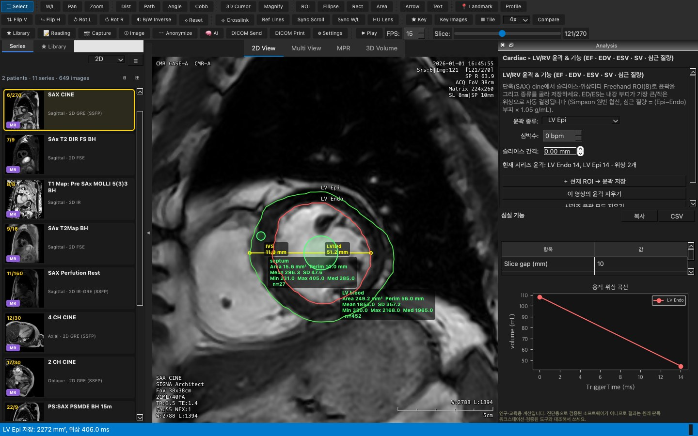 | 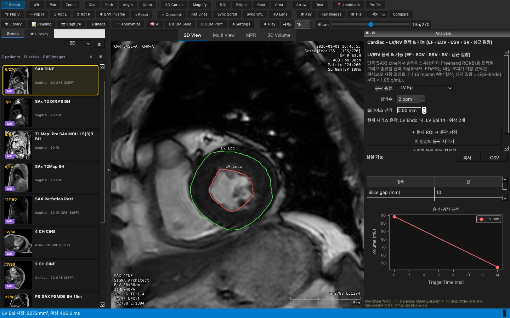 |

1. SAX CINE 시리즈를 엽니다.
2. **Analysis → Cardiac → LV/RV 윤곽 & 기능**을 엽니다.
3. 첨부(apex)부터 기저부(base)까지 LV가 보이는 슬라이스마다 ED와 ES 위상에서 윤곽을 저장합니다.
   1. Freehand ROI(**8**)로 **LV 내막**을 그리고 종류 `LV Endo`로 둔 채 **현재 ROI → 윤곽 저장**을 누릅니다.
   2. 종류를 `LV Epi`로 바꾸고 **외막**을 그려 저장합니다.
   3. 휠로 위상을 넘기며 ED(가장 큰 내강)와 ES(가장 작은 내강)를 찾습니다.
   4. 저장한 윤곽은 영상 위에 색으로 남습니다.
4. **계산**을 누르면 Simpson 원반 합산(면적 × 슬라이스 간격)으로 결과가 나옵니다.

   | 지표 | 증례 A |
   |---|---|
   | LV EDV | **108 mL** |
   | LV ESV | **45 mL** |
   | LV SV | 64 mL |
   | **LV EF** | **58.7 %** |
   | LV 심근 질량 | 105 g (1.05 g/mL) |
   | ED / ES 위상 | 1 ms / 393 ms |

> 💡 **슬라이스마다 TriggerTime이 다른 GE cine**: 같은 위상이라도 슬라이스마다 트리거 시각이 몇 ms씩 다릅니다. DabbaView는 윤곽을 **위치별 위상 순번**으로 묶어 ED/ES를 정합니다. (이 가이드를 만들며 실제 영상에서 발견해 고친 부분입니다.)
>
> 이 예시의 윤곽은 혈액풀 임계값과 심근 방사 프로파일로 자동 생성했습니다. 기관 판독 규칙(유두근·육주 포함 여부, 기저부 슬라이스 선택)에 맞춰 직접 그리거나 수정하세요.

## 2. T1 / T2 Mapping

### Native T1 (MOLLI 5(3)3, 증례 B)

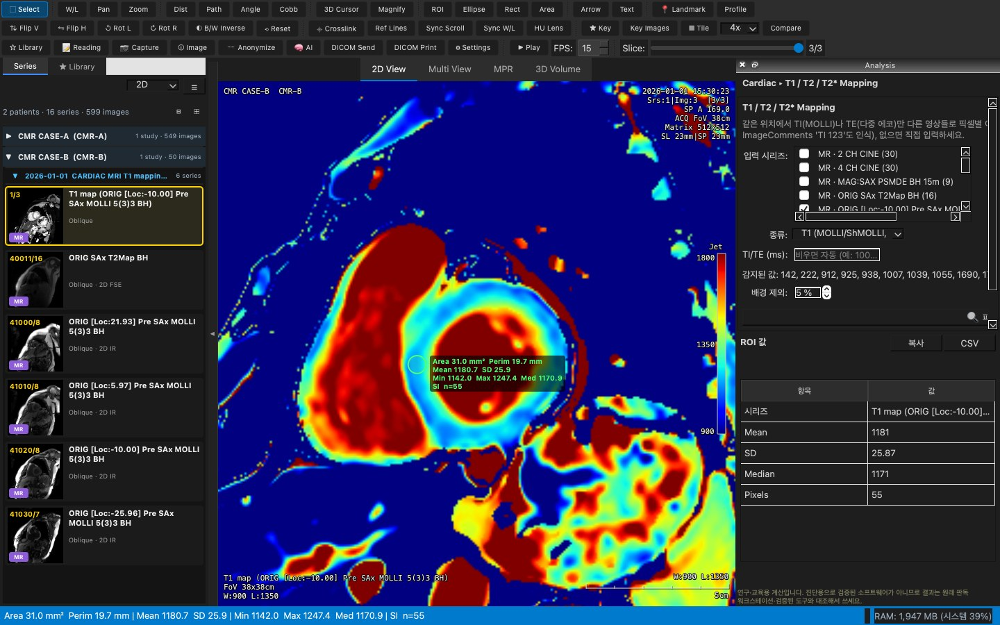

1. 원본 MOLLI 영상 시리즈(`ORIG [Loc:…] Pre SAx MOLLI 5(3)3`, 위치마다 TI 8개)를 불러옵니다.
2. **Analysis → Cardiac → T1 / T2 / T2\* Mapping**을 엽니다.
3. **입력 시리즈**에서 위치 세 곳의 MOLLI 시리즈를 체크하고 종류를 `T1 (MOLLI, Look-Locker 보정)`으로 둡니다.
4. **🔍 파라미터 확인**을 누르면 TI를 DICOM에서 읽어 표시합니다 (142, 222, 925, … 3315 ms).
5. **🗺 맵 생성**을 누르면 픽셀마다 3-파라미터 피팅과 Look-Locker 보정을 합니다. 결과는 `T1 map` 새 시리즈와 Jet 컬러맵으로 나옵니다.
6. 중격 중간벽에 작은 타원 ROI(**E**)를 그리고 **ROI 평균**을 누릅니다.
   - 결과: 중격 native T1 **1181 ± 26 ms** (중앙값 1171 ms, 55 픽셀)

### T2 (다중 에코, 증례 A)

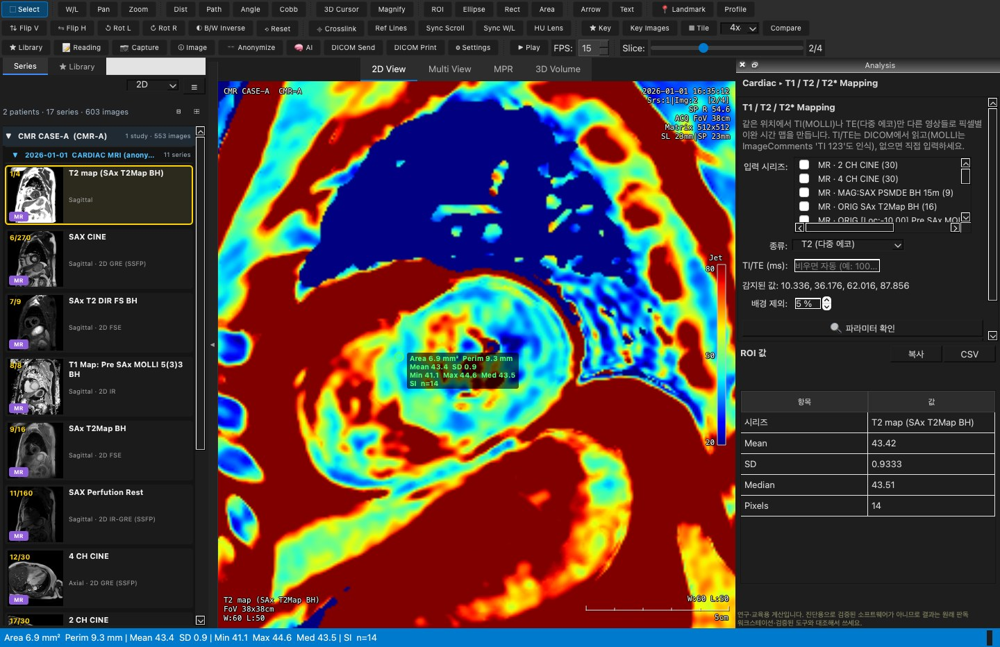

1. `SAx T2Map BH` 시리즈(4 위치 × TE 10 / 36 / 62 / 88 ms)를 체크하고 종류를 `T2`로 두고 **맵 생성**을 누릅니다.
2. 중격 ROI 결과: **43.4 ± 0.9 ms**
3. 부종이 의심되면 같은 방법으로 분절별 값을 비교하거나, [Bull's Eye](#4-bulls-eye-aha-17분절)에서 맵 평균을 봅니다.

> 3T MOLLI·T2 값은 시퀀스와 장비마다 달라서, SCMR 권고대로 **기관별 정상 범위**를 만들어 비교하세요. DabbaView의 맵은 GE가 만든 T1 Map 시리즈와 함께 열어 두고 같은 ROI로 비교할 수 있습니다.

## 3. LGE — 5SD 경색 정량

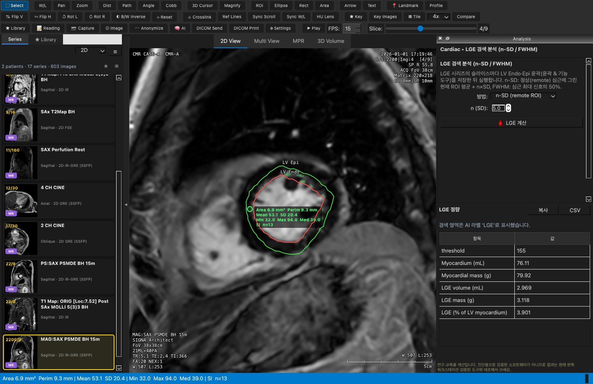

**증례 A** (PSMDE SAX 9 슬라이스, 조영 15분 후)

1. `MAG:SAX PSMDE` 시리즈를 엽니다.
2. **윤곽 & 기능** 도구에서 슬라이스마다 LV Endo·Epi를 저장합니다 (1번과 같은 방법).
3. 정상으로 보이는(remote) 심근, 예를 들어 중격 중간벽에 작은 ROI를 그립니다.
4. **Analysis → Cardiac → LGE 경색 분석**에서 방법 `n-SD (remote ROI)`, n = **5**로 두고 **🩸 LGE 계산**을 누릅니다.
5. 결과:
   - 임계값 = remote 평균 + 5 SD. 경색 영역은 AI 라벨 `LGE`로 표시됩니다.
   - 증례 A: 심근 76 mL (80 g) 중 LGE 3.0 mL, **LV 심근의 3.9 %**
6. 방법을 `FWHM`으로 바꾸면 심근 최대 신호의 50 %를 기준으로 계산합니다.

> 자동 임계값은 심내막 경계의 혈액풀 부분 용적에 민감합니다. 3.9 %처럼 작은 값은 영상에서 **라벨 위치를 확인**하고, 필요하면 내막 윤곽을 안쪽으로 조정한 뒤 다시 계산하세요.

## 4. Bull's Eye (AHA 17분절)

| 17분절 native T1 | 벽 두께 · LGE % |
|---|---|
| 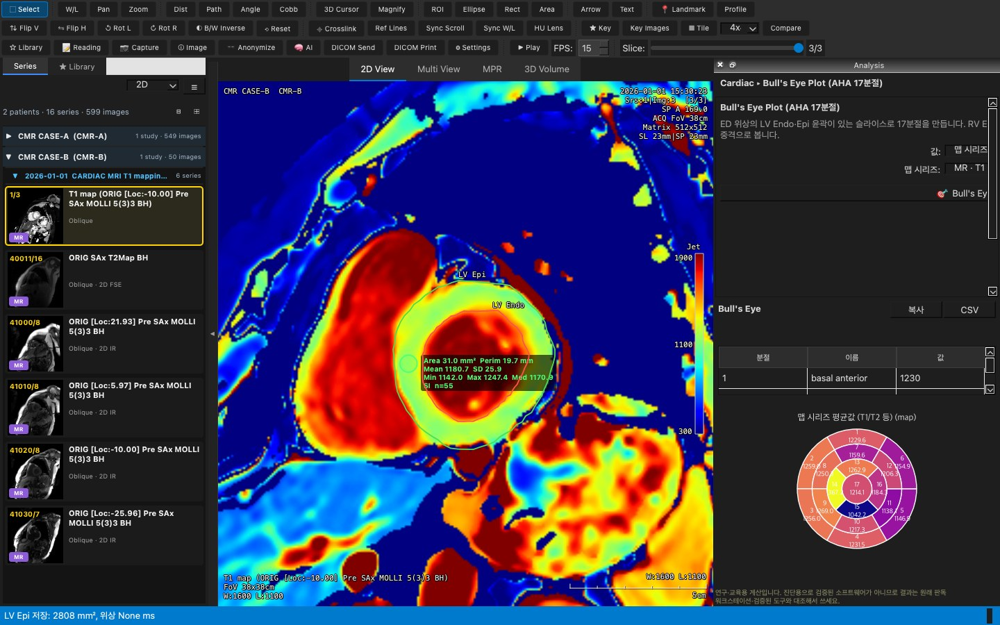 | 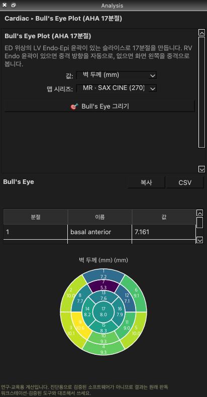 |

1. 분절을 만들 윤곽이 필요합니다.
   - T1 Bull's Eye: T1 맵 시리즈의 각 위치(기저부·중간·첨부)에 LV Endo·Epi를 저장합니다.
   - 벽 두께: cine의 ED 윤곽을 그대로 씁니다.
2. **Analysis → Cardiac → Bull's Eye Plot**을 엽니다.
3. **값**을 고르고 **🎯 Bull's Eye 그리기**를 누릅니다.
   - `벽 두께 (mm)`: cine ED 윤곽에서 계산
   - `맵 시리즈 평균값`: **맵 시리즈**로 T1 map을 고름
   - `LGE %`: LGE 분석 뒤 선택
4. 결과:
   - 17분절 표와 Bull's Eye 그림이 나옵니다.
   - 중격 방향은 RV Endo 윤곽이 있으면 자동으로 정하고, 없으면 화면 왼쪽을 중격으로 봅니다.
   - 증례 B native T1: 기저부 1147–1259 ms, 중간부 1138–1269 ms, 첨부 1042–1367 ms

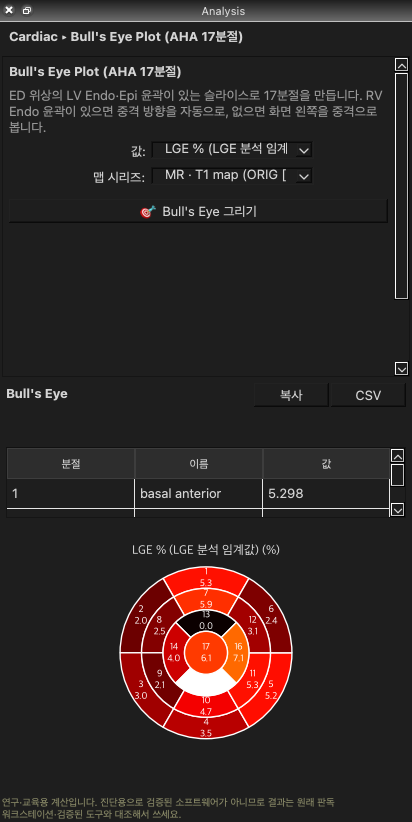

## 5. Perfusion — First-pass 시간-신호 곡선

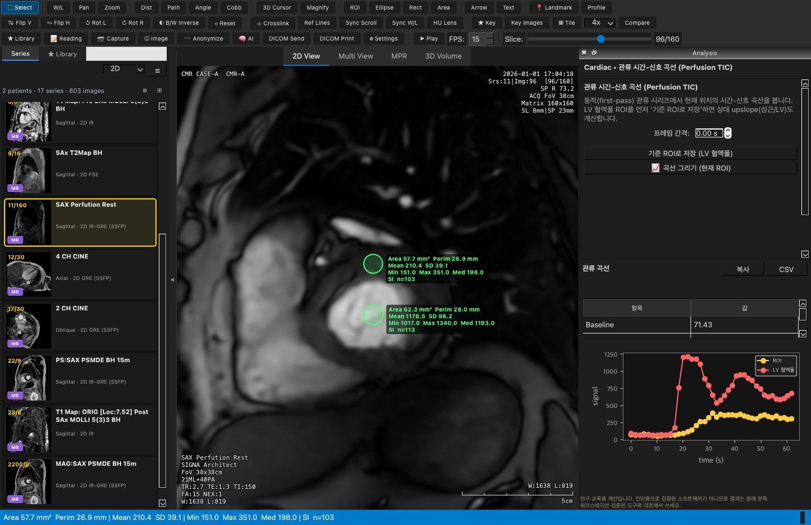

**증례 A** (SAX 휴식기 관류 4 위치 × 40 동적 영상)

1. `SAX Perfution Rest` 시리즈를 열고 LV 혈액풀이 가장 밝은 프레임으로 갑니다.
2. **Analysis → Cardiac → 관류 시간-신호 곡선**을 엽니다.
3. LV 혈액풀에 ROI를 그리고 **기준 ROI로 저장 (LV 혈액풀)** 을 누릅니다.
4. 평가할 심근(예: 앞벽 중간벽)에 ROI를 그리고 **📈 곡선 그리기**를 누릅니다.
5. 결과:
   - Baseline, Peak, TTP, Upslope, **Relative upslope (심근/LV) = 0.13**
   - 그래프: LV 혈액풀(빨강)과 심근(노랑) 곡선
6. 시간축은 GE 동적 영상의 TriggerTime(시작부터 ms)을 씁니다.
   - GE는 AcquisitionTime이 시리즈 전체에 하나뿐이라, 이 가이드를 만들며 이렇게 처리하도록 고쳤습니다.
   - 수동으로 정하려면 **프레임 간격**을 입력합니다.

## 6. Flow — Phase Contrast 대동맥 유량

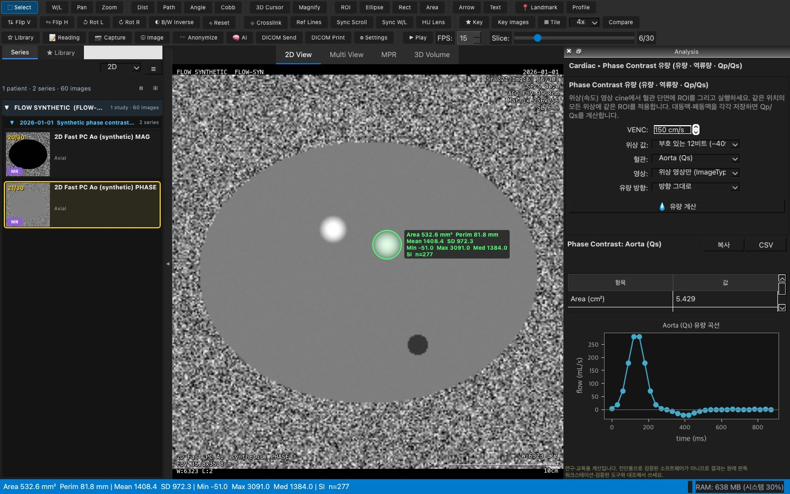

> 이 예시의 위상대조 영상은 **합성 데이터**입니다 (상행 대동맥, VENC 150 cm/s, 정답 순 유량 30.4 mL/beat).
> 실제 증례의 `2D Fast PC` 시리즈 일부가 OneDrive에서 내려받아지지 않아(클라우드 전용 파일) 정답을 아는 합성 영상으로 절차를 보였습니다.
> 실제 영상은 OneDrive 폴더를 **"항상 이 기기에 유지"** 로 받은 뒤 같은 방법으로 분석하면 됩니다.

1. 위상(phase/velocity) 시리즈를 열고 대동맥 단면에 원형 ROI(**E**, Shift를 누른 채 그리면 원)를 그립니다.
2. **Analysis → Cardiac → Phase Contrast 유량**을 엽니다.
3. VENC는 DICOM(0018,9197)에서 자동으로 읽습니다. 위상 값 형식(부호 있는 12비트 등)과 혈관(`Aorta (Qs)`)을 고릅니다.
4. **💧 유량 계산**을 누르면 같은 위치의 모든 위상에 ROI를 적용해 다음을 계산합니다.
   - Forward 33.1 mL, Backward 2.7 mL
   - **Net 30.4 mL** (정답 30.4)
   - 역류율 8.2 %, 최대 속도 116 cm/s, 심박출량
5. 폐동맥을 `Pulmonary artery (Qp)`로 한 번 더 계산하면 **Qp/Qs**가 나옵니다.

## 7. ACR 팬텀 원클릭 분석

**실제 ACR 대형 팬텀 영상** (GE SIGNA Architect 3.0T, Head 코일, 콘솔 화면 캡처 145장). 반기마다 장비 3대를 점검하는 흐름입니다.

| slice 1 (기하·두께·위치·분해능) | slice 7 (PIU·고스팅) | slice 11 (저대조·위치) |
|---|---|---|
| 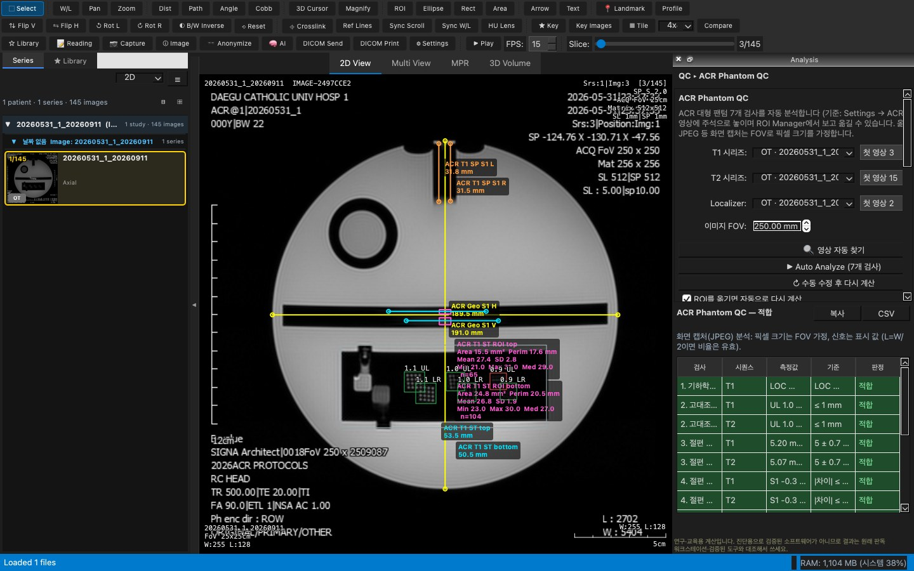 | 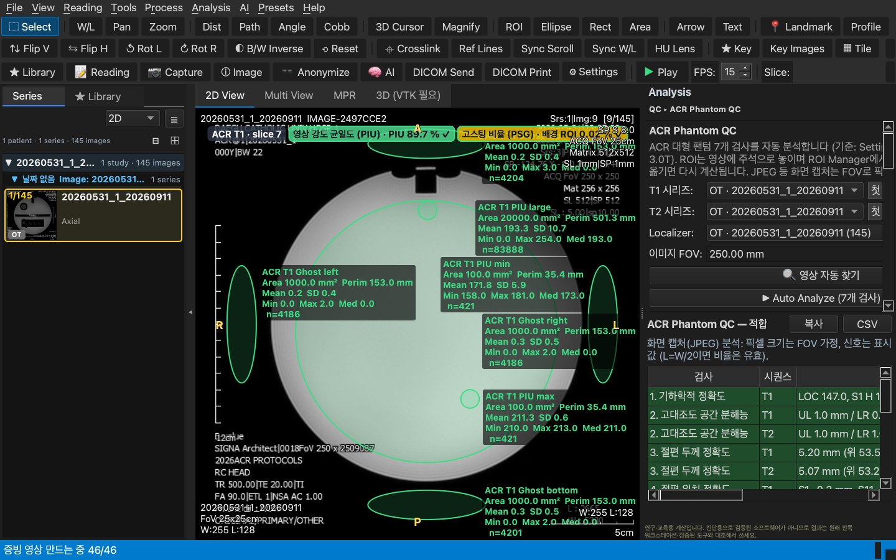 | 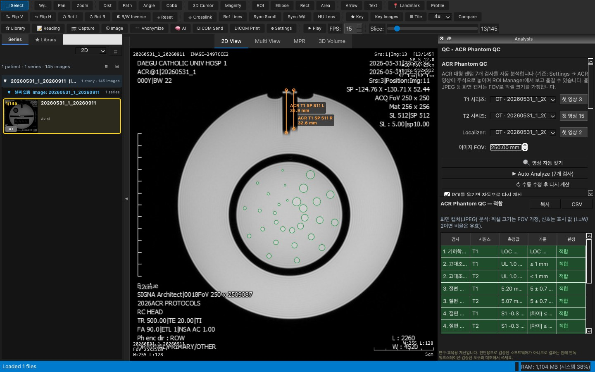 |

1. 팬텀 폴더를 엽니다 (DICOM 또는 이미지 폴더).
2. **Analysis → ACR Phantom QC → ▶ Auto Analyze (7개 검사)** 를 누릅니다.
   - localizer, T1 slice 1–11, T2 둘째 에코, 사이트 시퀀스를 자동으로 찾습니다.
   - 검사마다 슬라이스를 옮겨 가며 ROI·측정선을 그립니다.
3. **영상에서 바로 확인** (2.1.0부터)
   - 슬라이스마다 위쪽 가운데에 그 슬라이스를 쓰는 검사가 **색 배지**로 나옵니다 (값과 ✓ / ✗). 예: slice 1 = 기하 · 두께 · 위치 · 분해능, slice 7 = PIU · 고스팅, slice 8–11 = 저대조 (spoke 수).
   - ROI · 측정선은 **적합 초록 / 부적합 빨강**입니다. 휠로 넘기면 슬라이스마다 배지 · ROI · 값이 바뀝니다.
   - 끄려면 패널의 "영상 위에 ACR 검사 항목 · 판정 표시" 체크를 해제합니다.
4. 결과표 (3.0T ACR 기준, Settings → ACR QC에서 변경):

| 검사 | T1 | T2 | 기준 | 판정 |
|---|---|---|---|---|
| 기하학적 정확도 | LOC 147.0, S5 189.3–191.2 mm | – | 148 ± 2 / 190 ± 2 mm | 적합 |
| 고대조도 분해능 | UL 1.0 / LR 0.9 mm | 1.0 / 1.0 mm | ≤ 1.0 mm | 적합 |
| 절편 두께 | 5.20 mm | 5.07 mm | 5.0 ± 0.7 mm | 적합 |
| 절편 위치 (S1, S11) | −0.3, −3.3 mm | −0.3, −3.2 mm | ≤ 5 mm | 적합 |
| PIU | 89.7 % | 87.7 % | ≥ 82 % | 적합 |
| 고스팅 PSG | 0.02 % | 0.29 % | ≤ 2.5 % | 적합 |
| 저대조도 스포크 | 38 | 37 | ≥ 37 | 적합 |

| ACR 패널 | 7개 검사 요약표 (클릭하면 그 영상으로) |
|---|---|
| 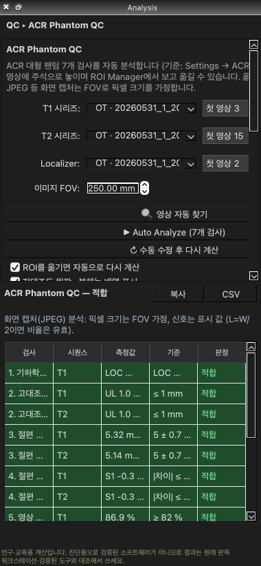 | 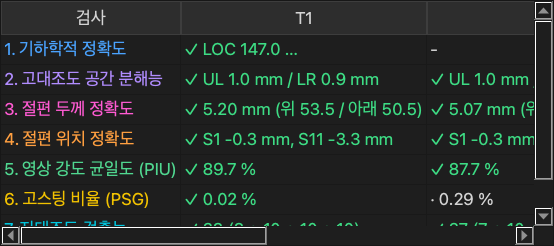 |

5. ROI를 옮기거나 스포크 수를 고치면 자동으로 다시 계산됩니다.

### 측정 절차 — 콘솔 수동 방법과 같은 순서

GE 콘솔에서 사람이 하는 순서(W/L 조절 → ROI → 계산기 → 측정)를 그대로 따릅니다.

| 검사 | 절차 |
|---|---|
| 절편 두께 | ① W/L을 좁혀 경사판을 봄 → ② 위·아래 경사판 가운데에 작은 ROI → 평균 m1, m2 → ③ **L = (m1 + m2) / 4** (평균의 절반), **W = 1** → ④ 밝게 남은 경사판 길이 위·아래 → ⑤ 두께 = 0.2 × 위 × 아래 / (위 + 아래) |
| PIU | ① slice 7 가운데 200 cm² ROI → ② W 1로 L을 올려 가장 어두운 곳만 남김 → 1 cm² ROI (Low) → ③ L을 내려 가장 밝은 곳만 남김 → 1 cm² ROI (High) → ④ PIU = 100 × (1 − (High − Low) / (High + Low)). 자동은 큰 ROI 안 모든 위치의 1 cm² 평균을 계산해 최저 · 최고를 고름 |
| 고스팅 | 팬텀 바깥 위·아래·왼쪽·오른쪽에 약 10 cm² 타원 (긴 축이 가장자리와 나란히) → \|(위 + 아래) − (왼쪽 + 오른쪽)\| / (2 × 큰 ROI) × 100 |

- 예: 1호기 T1 경사판 ROI 평균 27.43 / 26.80 (JPEG 표시값) → L 13.56 → 원 신호로 환산하면 284.2. 콘솔에서 계산한 (586.48 + 550.62) / 4 = 284.3과 같습니다.

### 보고서 · 증빙 영상 44장

6. **📄 Export Report**를 누르고 병원·호기·장비·검사자를 넣습니다.
   - 선택: ROI 캡처 · **측정 과정 단계별 영상** · **증빙 영상 44장** · 증빙 JPG를 보고서 옆 폴더에도 저장 · 추세 기록
   - 호기(1·2·3호기)를 구분해 저장하면 장비별 추세를 비교할 수 있습니다.

| 내보내기 | 기록지 (1쪽) |
|---|---|
| 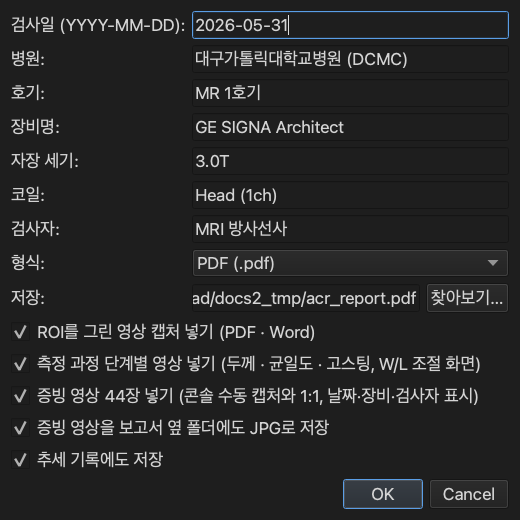 | 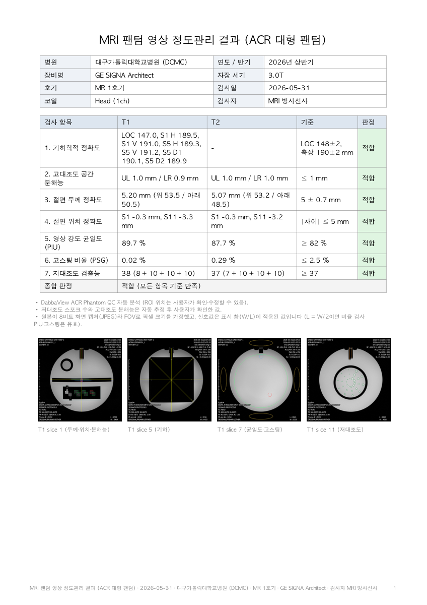 |

7. 보고서 구성: 결과표 → **측정 과정** (두께 · PIU · 고스팅, W/L 조절 영상과 계산식에 실제 숫자) → **증빙 영상 44장** + 분해능 확대 2장

| 측정 과정 | 증빙 영상 |
|---|---|
| 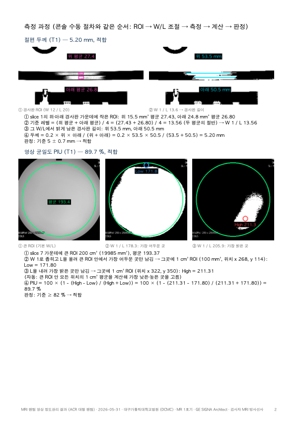 | 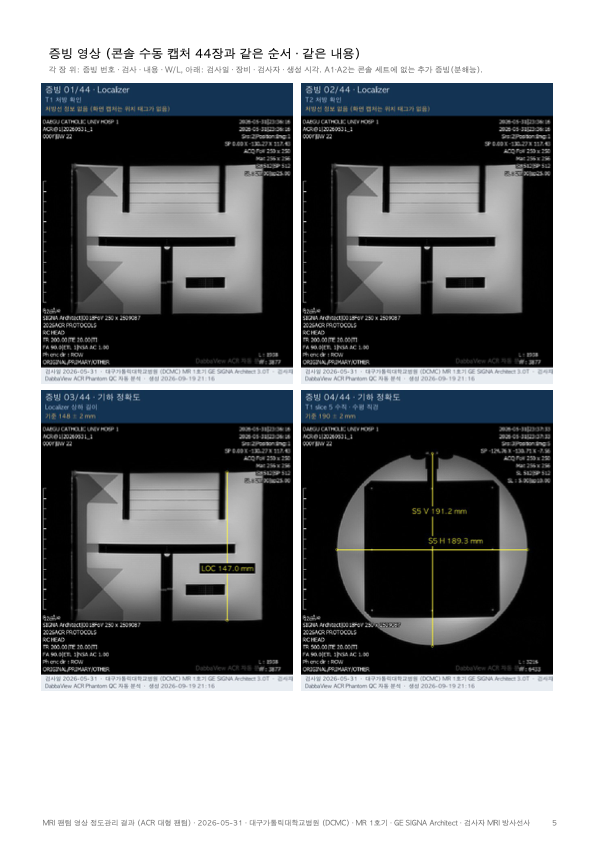 |

   - 증빙 44장은 콘솔에서 Screen Save로 남기는 44장과 **같은 순서 · 같은 내용**입니다: localizer 2 · 기하 3 · 두께 12 (원본 · W/L 좁힘 · ROI 평균 · W 1 길이, 사이트 시퀀스 포함) · 위치 4 · PIU 5 · 고스팅 2 · 저대조 16 (ACR T1 · T2 · 사이트 시퀀스 2개 × slice 8–11).
   - 각 장 위에 번호 · 검사 · W/L · 값, 아래 띠에 검사일 · 병원 · 호기 · 장비 · 검사자 · 생성 시각이 찍힙니다.
   - 사이트 시퀀스(병원 프로토콜 T1 · T2)는 ACR 판정 대상이 아니므로 "참고"로 표시합니다. FSE는 원판 가장자리 링잉 때문에 자동 spoke 수가 낮게 나올 수 있어 육안 확인이 필요합니다.
8. 패널의 **🖼 증빙 영상 44장 보기…** 로 보고서 없이 44장을 휠 · 화살표로 넘겨 봅니다.

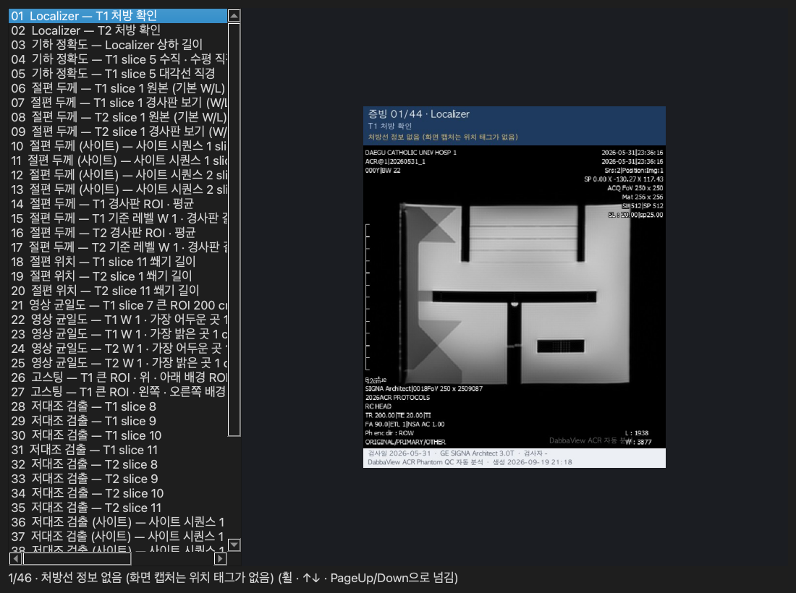

9. **📈 추세**에서 반기별 값을 기준선과 함께 봅니다.

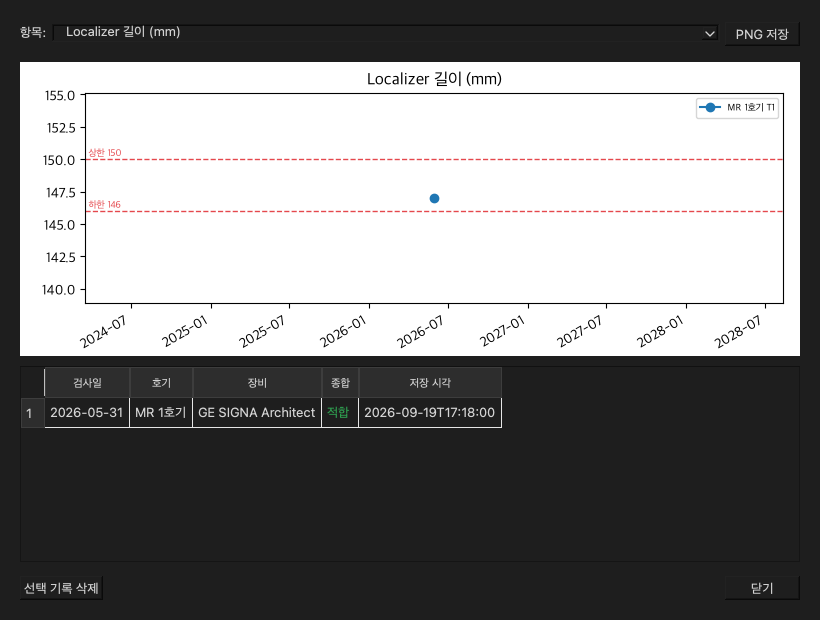

> 수동 기록과 비교: 이전 반기 수동 기록표와 자동 결과를 항목별로 비교해 보니 기하 · 위치 · 고스팅은 반올림 차이로 같았습니다. 다른 항목의 원인은 이렇습니다.
> - 두께(1호기 T2): 수동 측정의 L 값이 잘못 들어감
> - PIU: 최저 1 cm² 위치 차이
> - 저대조: 경계 spoke 판정
> - 분해능 0.9: JPEG 보간

## 8. MTF (에지 방법)

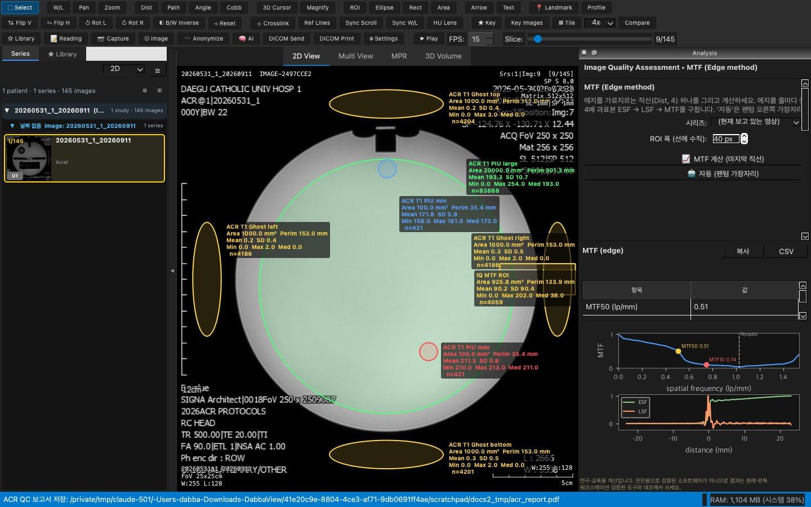

ACR 팬텀 slice 7의 팬텀 가장자리를 에지로 썼습니다.

1. 팬텀 영상을 열고 **Analysis → Image Quality Assessment → MTF (Edge method)** 를 엽니다.
2. 다음 둘 중 하나로 계산합니다.
   - 에지를 가로지르는 직선(**4**)을 그리고 **📈 MTF 계산**
   - **🤖 자동 (팬텀 가장자리)**
3. 계산 과정:
   1. 에지를 줄마다 찾아 기울기를 맞춥니다 (**기울어진 에지 · Fujita 방식**과 같은 과표본 원리, 4배 과표본).
   2. ESF를 미분해 LSF를 얻습니다.
   3. LSF에 Hann 창을 적용하고 FFT를 해 MTF를 구합니다. 차분에 대한 sinc 보정도 합니다.
4. 결과: **MTF50 0.51 lp/mm, MTF10 0.75 lp/mm**, Nyquist 1.02 lp/mm (화면 캡처 0.49 mm 픽셀 기준)
5. 정확한 시스템 MTF를 재려면 DICOM 원본에서, 에지를 행렬에 대해 2–5° 기울여 촬영한 **tilted-edge 팬텀**을 쓰세요.
6. **NPS** 도구로 같은 팬텀의 잡음 스펙트럼을 구하면 **NEQ = S²·MTF²/NPS** 도 계산됩니다.

## 9. Auto IQ Assessment

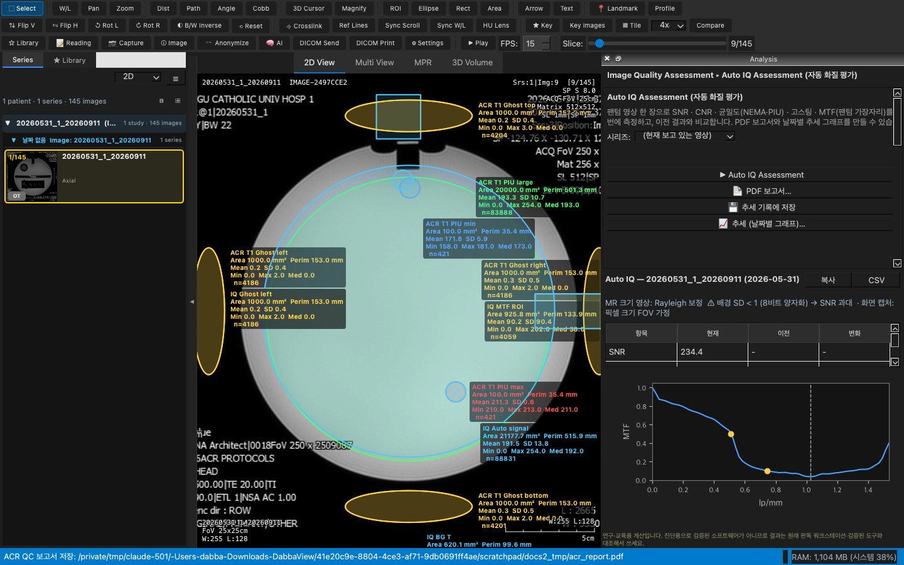

1. 균일한 팬텀 영상(ACR slice 7)을 띄우고 **Analysis → Image Quality Assessment → Auto IQ Assessment → ▶** 를 누릅니다.
2. 한 번에 측정되는 항목:

   | SNR | CNR | NEMA 균일도 | PIU | PSG | MTF50 / MTF10 |
   |---|---|---|---|---|---|
   | 234 | 234 | 94.9 % | 86.5 % | 0.02 % | 0.50 / 0.70 lp/mm |

3. **💾 추세 기록에 저장** → 다음 점검 때 "이전" 열과 변화량이 함께 나옵니다. **📄 PDF 보고서**도 만들 수 있습니다.

> ⚠ 8비트 화면 캡처는 배경 SD가 1 미만(양자화)이라 SNR이 과대 추정되고, 결과에 경고가 표시됩니다. SNR은 DICOM 원본으로, 가능하면 **두 영상 차분법(NEMA)** 으로 재세요 (SNR 도구 → 방법 `두 영상`).

## 10. DWI → ADC Map (L-spine 적용 방법 포함)

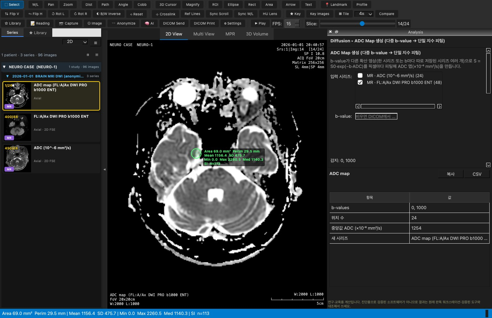

> 이번에 쓸 수 있는 L-spine DWI 원본이 없어 **뇌 DWI (b0 / b1000, 24 슬라이스, 익명화)** 로 보였습니다. L-spine DWI도 같은 순서입니다.

1. DWI 시리즈를 열고 **Analysis → Diffusion → ADC 맵**을 엽니다.
2. 시리즈를 체크하고 **b-value 감지**를 누릅니다 → `0, 1000`
   - GE 가공 DWI는 b0 영상에 b-value 태그가 없는 경우가 있습니다. DabbaView는 이를 b = 0으로 인식합니다 (이번에 고침).
3. **계산**을 누르면 단일 지수 피팅으로 `ADC map` 새 시리즈가 만들어집니다 (중앙값 1254 ×10⁻⁶ mm²/s).
4. 검증: 장비가 만든 ADC 시리즈와 슬라이스별 중앙값 비가 **1.003** (IQR 1.002–1.004)으로 일치했습니다.
5. **L-spine에 적용할 때**
   - 척추체·추간판에 ROI를 그리고 **ROI 평균**으로 ADC를 잽니다. 골수 병변이나 추간판 변성을 비교할 수 있습니다.
   - AI 연구(MedGemma · SPIDER): SPIDER 데이터셋(요추 T1/T2/T2-SPACE 시상면, 추체·추간판·척추관 마스크)을 NIfTI로 열어 라벨을 확인하고, **📦 내보내기**로 train/val/test를 나눕니다.

## 11. TotalSegmentator 자동 세그멘테이션

| Models 탭 | 복부 CT 결과 (구조 77개) |
|---|---|
| 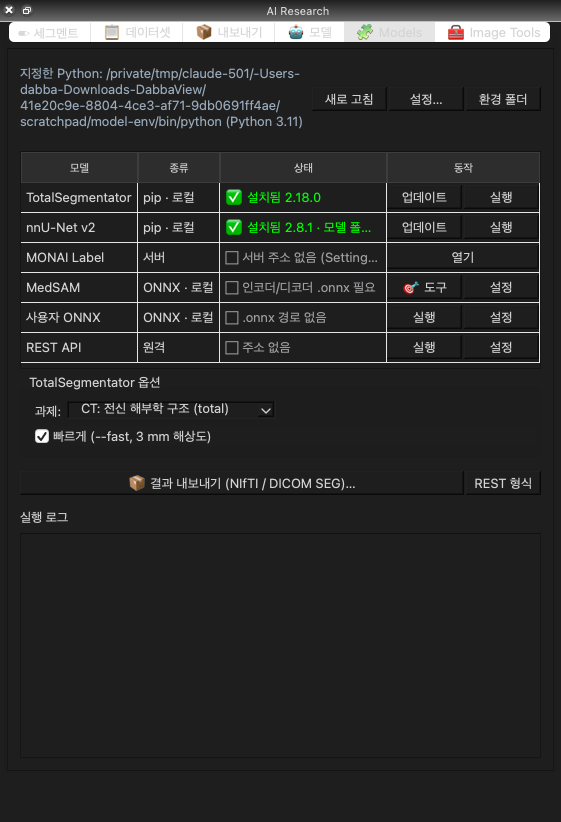 | 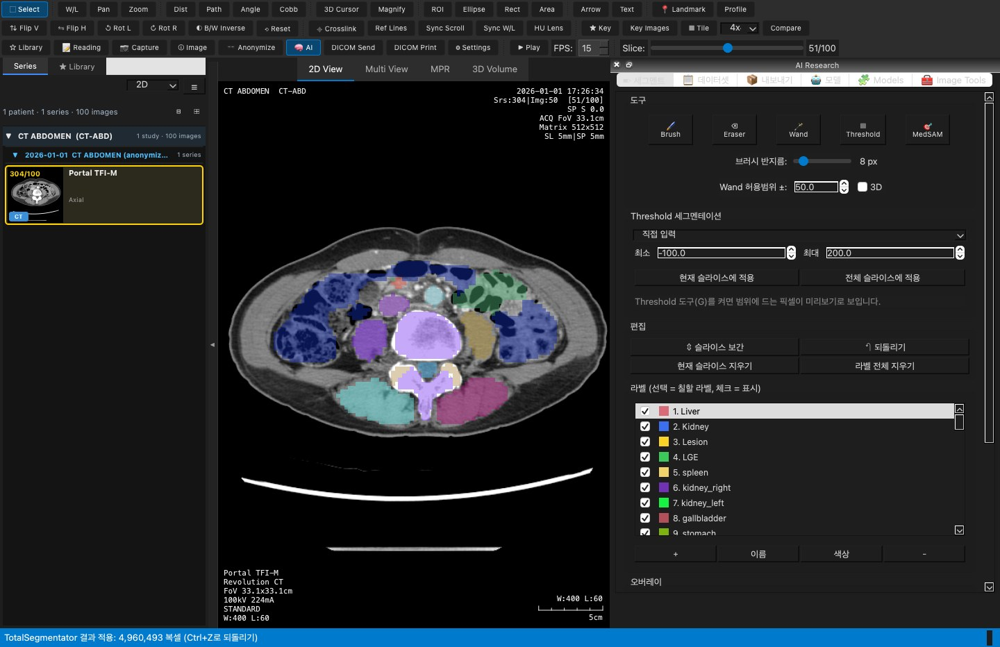 |

**실제 복부 CT 문맥기 (100 슬라이스, 익명화)**

1. AI 패널(**Ctrl+Shift+A**) → **🧩 Models** 탭에서 TotalSegmentator **설치**를 누릅니다.
   - DabbaView 전용 Python 환경에 설치됩니다 (PyTorch 포함, 수 GB).
   - 처음 실행할 때 모델 가중치를 내려받습니다.
2. CT 시리즈를 띄우고 작업 `total`, **빠르게 (--fast, 3 mm)** 를 고른 뒤 **실행**을 누릅니다.
3. 약 1.5분(CPU) 뒤 **구조 77개**가 라벨로 겹쳐 나옵니다. 세그멘트 탭 통계의 부피 예:

   | 간 | 비장 | 우신 | 좌신 | 담낭 | 위 | 췌장 |
   |---|---|---|---|---|---|---|
   | 1278 mL | 92 mL | 124 mL | 143 mL | 32 mL | 234 mL | 61 mL |

4. 심장 CT(CCTA)에서는 작업을 `heartchambers_highres`(라이선스 필요) 또는 `total`로 두면 심방·심실·대동맥 구조를 얻을 수 있습니다.
   - CCTA vs CMR 비교 연구에서 CT 심실 부피를 CMR cine 결과(1번)와 비교할 때 쓸 수 있습니다.
5. 결과는 **📦 내보내기**에서 NIfTI / DICOM SEG로 저장합니다.

> TotalSegmentator는 기본으로 익명 사용 통계를 보냅니다 (영상은 보내지 않음). 끄려면 `~/.totalsegmentator/config.json`에 `"send_usage_stats": false`를 넣습니다.

## 12. Python 콘솔 — 심근 T1 히스토그램

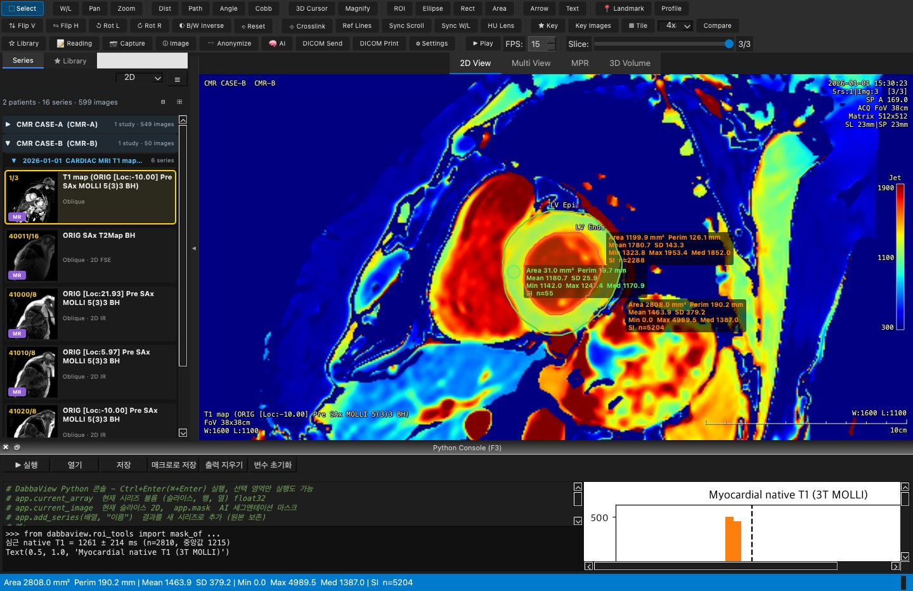

1. T1 맵(2번)을 띄우고 같은 슬라이스에 LV Endo와 Epi를 자유곡선 ROI(**8**)로 차례로 그립니다.
2. **F3**으로 Python 콘솔을 열고 아래 코드를 실행합니다 (**Ctrl/⌘+Enter**).

```python
from dabbaview.roi_tools import mask_of
img = app.current_image                      # T1 맵 (ms)
rois = [a for a in app.viewport.annotations_here() if a['type'] == 'roi']
endo, epi = rois[-2], rois[-1]                # 마지막으로 그린 자유곡선 ROI 두 개 = Endo, Epi
myo = mask_of(epi, img.shape) & ~mask_of(endo, img.shape)
t1 = img[myo & (img > 0)]
print(f'심근 native T1 = {t1.mean():.0f} ± {t1.std():.0f} ms (n={t1.size}, 중앙값 {np.median(t1):.0f})')
plt.hist(t1, bins=40, range=(800, 2000), color='tab:orange')
plt.axvline(t1.mean(), color='k', ls='--'); plt.xlabel('T1 (ms)'); plt.title('Myocardial native T1 (3T MOLLI)')
```

3. 출력: `심근 native T1 = 1261 ± 214 ms (n=2810, 중앙값 1215)`
   - 그래프는 콘솔 오른쪽에 나옵니다.
   - 심근 링 전체는 경계의 혈액풀 부분 용적 때문에 SD가 큽니다. 논문용 값은 중간벽 ROI나 경계를 안쪽으로 줄인 마스크를 쓰세요. 예: `ndi.binary_erosion(myo, iterations=1)`
4. 자주 쓰는 코드는 **매크로로 저장**해 메뉴에서 바로 실행합니다.
5. `app.add_series(배열, "이름")`으로 계산 결과를 새 시리즈로 추가할 수 있습니다 (예: ECV 맵 = (1 − Hct) × ΔR1_myo / ΔR1_blood).

## 13. 부록

### 분석 메뉴

| Analysis 메뉴 | Cardiac 하위 메뉴 |
|---|---|
| 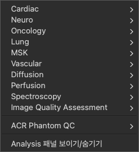 | 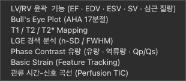 |

- 카테고리: Cardiac · Neuro · Oncology · Lung · MSK · Vascular · Diffusion · Perfusion · Spectroscopy · Image Quality Assessment · ACR Phantom QC
- 결과는 오른쪽 **Analysis 패널**의 표·그래프로 나오고, **복사 / CSV**로 저장합니다. 맵은 새 시리즈로 만들어져 원본은 바뀌지 않습니다.

### 데이터 내보내기

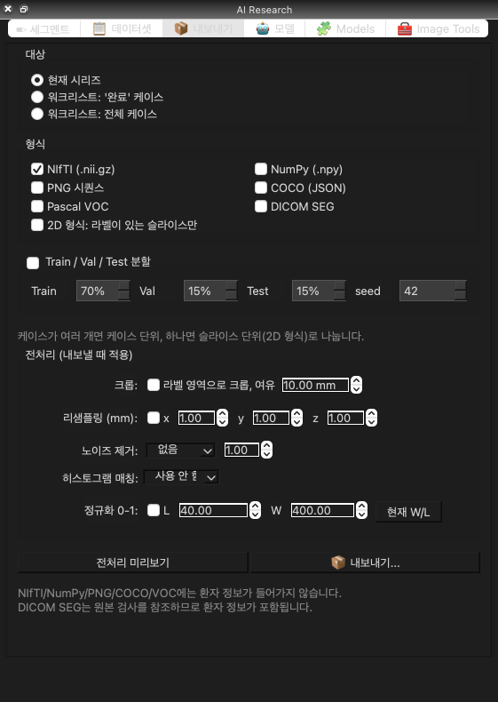

- 형식: NIfTI · NumPy · PNG · COCO · Pascal VOC · DICOM SEG
- train / val / test 자동 분할과 전처리(크롭 · 리샘플 · 정규화)를 지원합니다.
- DICOM ↔ NIfTI 변환은 **File → Convert / Export As** 를 씁니다.

### 오픈 데이터셋

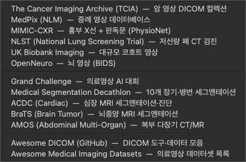

**Help → 📚 Open Datasets**에서 공개 데이터셋 목록을 엽니다.
- 예: TCIA, MIMIC-CXR, NLST, OpenNeuro, Medical Segmentation Decathlon, **ACDC (심장 cine)**, BraTS, AMOS
- 요추 연구용 **SPIDER** 데이터셋은 Grand Challenge / Zenodo에서 받습니다.
