# DabbaView AI & Analysis Guide

버전 2.0.0

> 화면은 설치된 DabbaView 2.0.0을 실제로 실행해서 찍었습니다.
> - 예시 데이터: 합성 CT 팬텀, 합성 MR(cine · DWI · DCE), 합성 화질 팬텀, 그리고 **실제 ACR 대형 팬텀 영상** (GE SIGNA Architect 3.0T 콘솔 화면 캡처).
> - 분석 결과는 연구·교육용입니다. 진단용으로 검증된 소프트웨어가 아니므로 원래 판독 워크스테이션·검증된 도구와 대조하세요.

## 목차

1. [분석 메뉴 개요](#1-분석-메뉴-개요)
2. [Cardiac — EF 계산](#2-cardiac--ef-계산)
3. [Neuro — ADC 컬러맵](#3-neuro--adc-컬러맵)
4. [Oncology — 종양 부피와 RECIST](#4-oncology--종양-부피와-recist)
5. [Lung — 폐결절](#5-lung--폐결절)
6. [Diffusion — ADC 맵과 신호 감쇠](#6-diffusion--adc-맵과-신호-감쇠)
7. [Perfusion — DCE Ktrans](#7-perfusion--dce-ktrans)
8. [Image Quality — MTF · SNR · 왜곡 · Auto IQ](#8-image-quality--mtf--snr--왜곡--auto-iq)
9. [ACR Phantom QC — 실제 데이터 자동 분석](#9-acr-phantom-qc--실제-데이터-자동-분석)
10. [AI 도구 — TotalSegmentator · MedSAM · ONNX](#10-ai-도구--totalsegmentator--medsam--onnx)
11. [세그멘테이션](#11-세그멘테이션)
12. [데이터 내보내기](#12-데이터-내보내기)
13. [Python 콘솔](#13-python-콘솔)
14. [오픈 데이터셋](#14-오픈-데이터셋)

기본 조작은 [사용자 매뉴얼](manual.md)을 보세요.

---

## 1. 분석 메뉴 개요

| Analysis 메뉴 | 하위 메뉴 (예: Cardiac) |
|---|---|
|  |  |

1. 메뉴바 **Analysis**에서 카테고리를 고르고 하위 도구를 누릅니다. 카테고리는 다음과 같습니다.
   - Cardiac · Neuro · Oncology · Lung · MSK · Vascular · Diffusion · Perfusion · Spectroscopy · **Image Quality Assessment** · **ACR Phantom QC**
2. 오른쪽 **Analysis 패널**에 도구 입력 화면이 열립니다. 결과는 아래쪽 표·그래프에 나오고 **복사 / CSV**로 저장할 수 있습니다.
3. 맵(ADC, Ktrans, 균일도 지도 등)은 **새 시리즈**로 만들어집니다. 원본은 바뀌지 않습니다.
4. 대부분의 도구는 **현재 보고 있는 영상과 그 위에 그린 ROI**를 씁니다. 먼저 영상을 띄우고 필요한 ROI나 선을 그린 뒤 실행하세요.

## 2. Cardiac — EF 계산

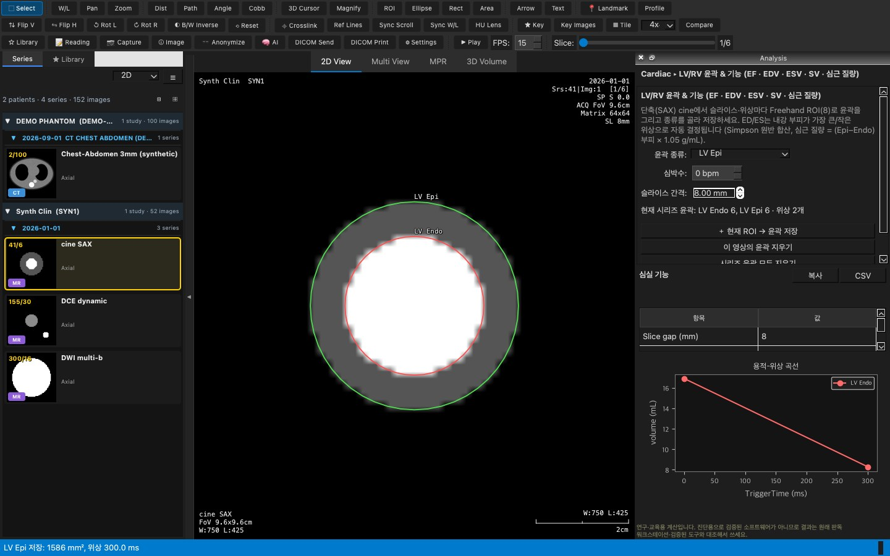

예시: 합성 cine SAX (슬라이스 3개 × 위상, ED/ES)

1. cine SAX 시리즈를 엽니다.
2. **Analysis → Cardiac → LV/RV 윤곽 기능**을 누릅니다.
3. 첫 슬라이스·위상에서 Freehand ROI(8)로 LV 내막을 그리고, 종류를 `LV Endo`로 둔 채 **현재 ROI → 윤곽 저장**을 누릅니다.
4. 종류를 `LV Epi`로 바꾸고 외막을 그려 저장합니다.
5. 슬라이스와 위상(ED·ES)마다 반복합니다. 저장한 윤곽은 영상 위에 색으로 남습니다.
6. **슬라이스 간격**을 확인하고 **계산**을 누릅니다.
   - 결과: EDV · ESV · SV · **EF** · 심근 질량 (예시: EDV 16.9 mL, ESV 8.3 mL, EF 51 %)
   - 그래프: 위상별 LV 부피 곡선
7. **Bull's Eye Plot (AHA 17분절)** 을 누르면 분절별 값이 나옵니다.

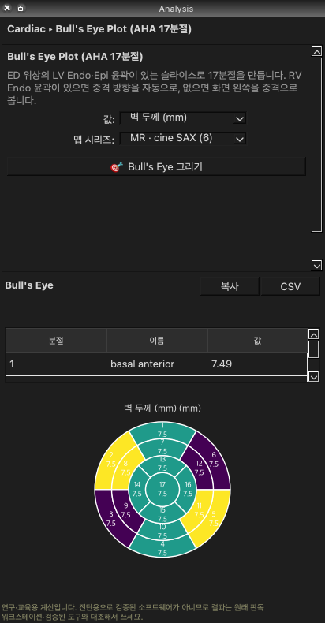

## 3. Neuro — ADC 컬러맵

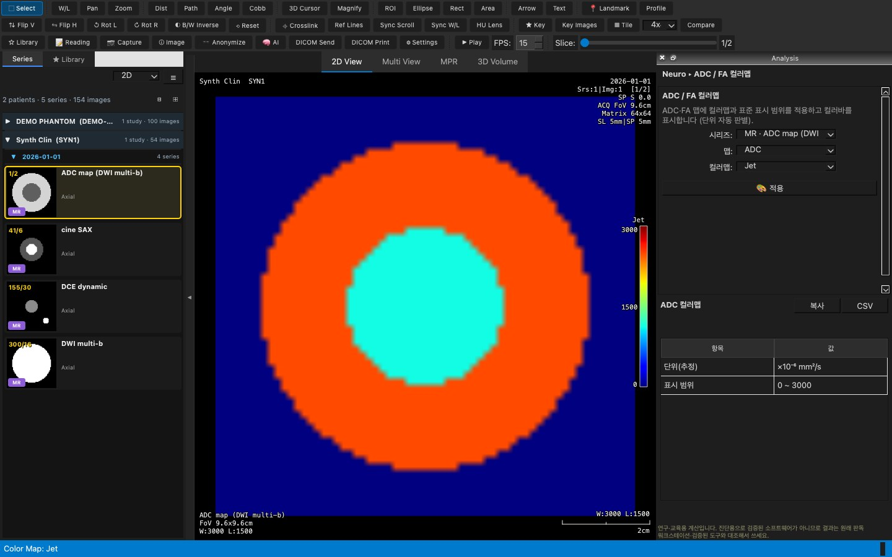

1. ADC 맵 시리즈를 엽니다. 없으면 먼저 [6번](#6-diffusion--adc-맵과-신호-감쇠)으로 만듭니다.
2. **Analysis → Neuro → ADC / FA 컬러맵**을 누릅니다.
3. 맵 종류(ADC / FA)와 컬러맵(Jet · Viridis · Hot …)을 고르고 **🎨 적용**을 누릅니다.
4. 단위를 자동으로 판별하고 표준 표시 범위를 적용합니다. 오른쪽에 컬러바가 나옵니다.
5. **DWI–ADC 미스매치** 도구는 진성 확산 제한(DWI↑ ADC↓)과 T2 shine-through를 AI 라벨로 구분해 보여 줍니다. **FLAIR 병변 볼륨**도 같은 메뉴에 있습니다.

## 4. Oncology — 종양 부피와 RECIST

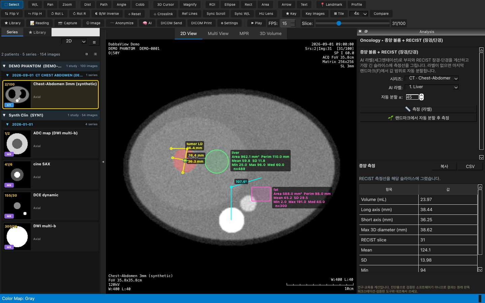

예시: 합성 CT의 간 병변 (지름 36 mm 구)

1. CT를 열고 병변이 보이는 슬라이스로 갑니다.
2. **Landmark (F)** 도구로 병변 중심을 클릭합니다.
3. **Analysis → Oncology → 종양 볼륨 + RECIST**를 엽니다.
4. **자동 분할 ±** 값(시드 HU ± 범위)을 정하고 **🌱 랜드마크에서 자동 분할 후 측정**을 누릅니다.
   - 병변이 AI 라벨로 칠해집니다.
   - 가장 긴 슬라이스에 **장경(LD)·단경(SA)** 측정선이 그려집니다.
5. 결과: 부피, 장경, 단경, 최대 3D 지름, 평균 HU (예시: 24.0 mL, 이론값 24.4 mL)
6. 이미 칠한 라벨이 있으면 **📏 측정 (라벨)** 만 누릅니다.
7. **Follow-up 비교**에서 이전 검사와 비교합니다. 부피 변화율, RECIST 반응, 배가 시간(두 검사의 StudyDate 사용)이 나옵니다.

## 5. Lung — 폐결절

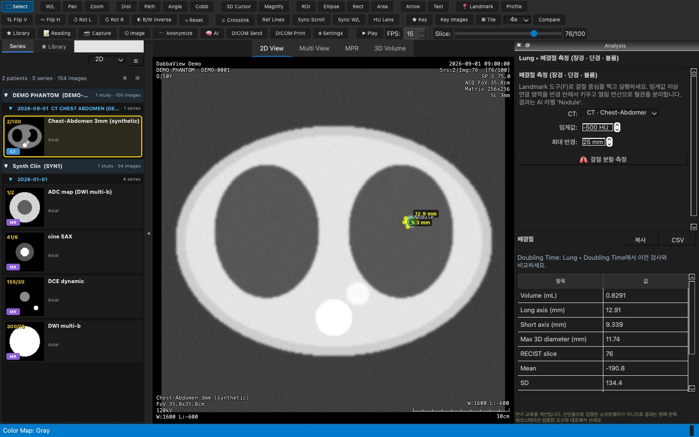

1. 폐 창(C −600 / W 1600)으로 결절을 찾습니다.
2. **Landmark (F)** 로 결절 중심을 클릭합니다.
3. **Analysis → Lung → 폐결절 측정**에서 임계값(기본 −500 HU)과 최대 반경을 정하고 **🫁 결절 분할·측정**을 누릅니다.
4. 결과: 부피, 장경, 단경, 최대 3D 지름, 평균·SD HU (예시: 0.83 mL, 장경 12.0 mm)
   - 혈관은 열림 연산으로 떼어냅니다. 결과는 AI 라벨 `Nodule`로 남습니다.
5. 같은 메뉴에 **Doubling Time**, **폐기종 LAA%(−950 HU, Perc15)**, **GGO** 도구가 있습니다.

## 6. Diffusion — ADC 맵과 신호 감쇠

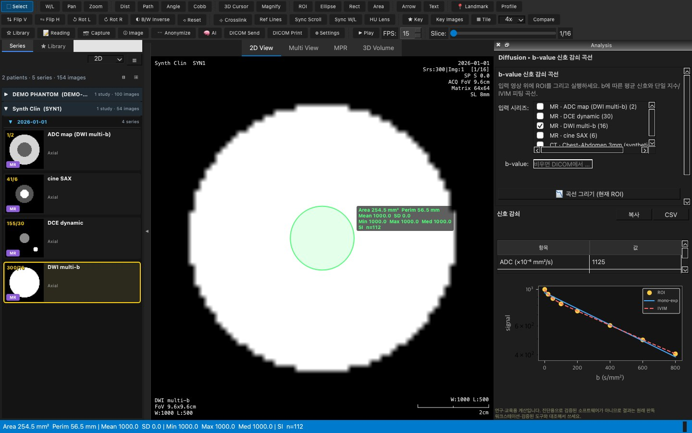

1. 다중 b 값 DWI 시리즈를 엽니다.
2. **Analysis → Diffusion → ADC 맵**에서 시리즈를 체크하고 **b-value 감지**를 누릅니다. b 값은 DICOM 태그·설명에서 자동으로 읽습니다.
3. **계산**을 누르면 단일 지수 피팅으로 `ADC map` 새 시리즈가 만들어집니다.
4. ROI(E)를 그리고 **b-value 신호 감쇠 곡선**을 누르면 ROI 평균 신호와 피팅 곡선, ADC가 나옵니다.
5. **IVIM**은 D · D* · f 맵을 만들고, ROI 비선형 피팅 결과를 보여 줍니다.

## 7. Perfusion — DCE Ktrans

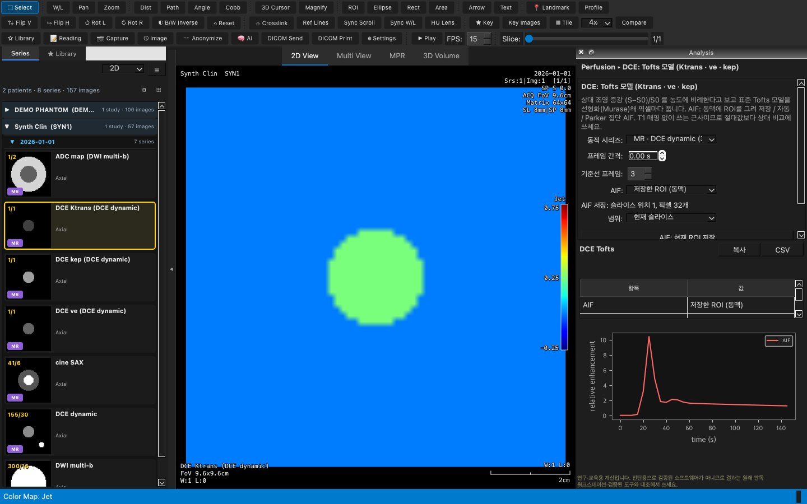

1. DCE 동적 시리즈를 엽니다.
2. **Analysis → Perfusion → DCE Tofts**를 엽니다.
3. 동맥에 작은 ROI를 그리고 **AIF: 현재 ROI 저장**을 누릅니다.
   - 저장하지 않으면 자동 AIF나 Parker 집단 AIF를 쓸 수 있습니다.
4. AIF 방식을 고르고 **계산**을 누릅니다.
   - `DCE Ktrans`, `DCE ve`, `DCE kep` 맵이 새 시리즈로 만들어집니다.
   - 그래프에는 AIF와 조직 곡선이 나옵니다.
5. 만들어진 Ktrans 시리즈를 열고 Jet 컬러맵을 적용하면 위 화면처럼 보입니다 (예시 중심 Ktrans 0.25 /min, 이론값 0.25).
6. **DSC**(CBV · CBF · MTT, 감마 바리에이트)와 **시간-신호 곡선(TIC)** 도 같은 메뉴에 있습니다.

## 8. Image Quality — MTF · SNR · 왜곡 · Auto IQ

도구가 자동으로 놓은 ROI는 `IQ …` 이름의 주석입니다. ROI Manager에서 보고 옮길 수 있고, 옮긴 뒤 **다시 계산**을 누르면 됩니다.

### MTF (Edge method)

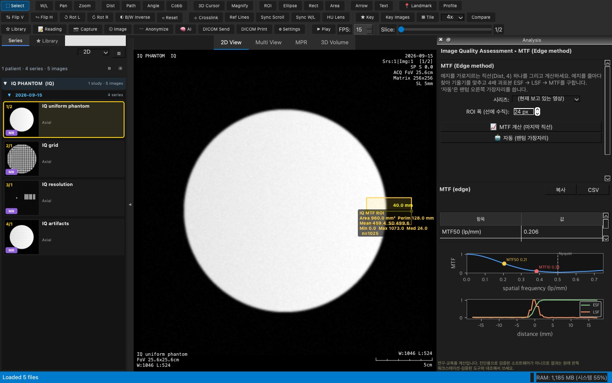

1. 팬텀의 선명한 경계(에지)가 보이는 영상을 엽니다.
2. **Dist (4)** 로 에지를 **가로지르는** 직선을 하나 그립니다.
3. **Analysis → Image Quality Assessment → MTF**에서 ROI 폭을 정하고 **📈 MTF 계산**을 누릅니다.
   - 에지 기울기를 줄마다 맞춰 4배 과표본 ESF → LSF → MTF를 구합니다.
   - 그래프에 **MTF50 · MTF10** 점과 **Nyquist** 선이 나옵니다.
4. **🤖 자동 (팬텀 가장자리)** 는 선을 긋지 않고 팬텀 오른쪽 경계를 씁니다.

### SNR

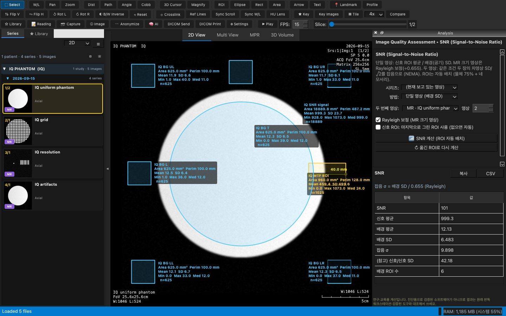

1. 균일한 팬텀 영상을 엽니다.
2. **SNR** 도구에서 방법을 고릅니다.
   - **단일 영상**: 신호 ROI(물체 75 %) 평균 ÷ 배경 SD. MR 크기 영상은 Rayleigh 보정(÷0.655)을 합니다.
   - **두 영상**: 같은 조건 두 장의 차영상 SD/√2 (NEMA 방식)
3. **📶 SNR 계산**을 누르면 신호와 배경 ROI가 자동으로 놓입니다 (예시 SNR 101, 이론값 100).
4. **CNR**은 ROI 두 개를 그린 뒤 실행합니다: |m1 − m2| / √((σ1² + σ2²)/2), 배경 잡음 기준 CNR도 함께 나옵니다.

### 기하학적 왜곡

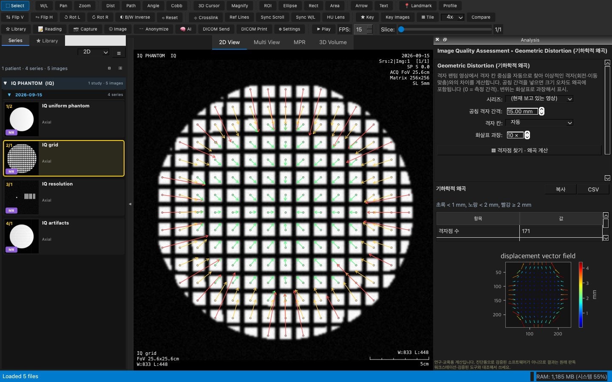

1. 격자 팬텀 영상을 엽니다.
2. **Geometric Distortion**에서 공칭 격자 간격(모르면 0)을 넣고 **▦ 격자점 찾기 · 왜곡 계산**을 누릅니다.
3. 결과:
   - 격자점마다 이상 위치 대비 변위 화살표 (과장 배율 조절, 초록 < 1 mm, 노랑 < 2 mm, 빨강 ≥ 2 mm)
   - 벡터장 그래프, 평균·RMS·최대 변위
4. 격자가 보이지 않는 영상에서는 가짜 결과를 내지 않고 안내를 띄웁니다.

### 그 밖의 IQ 도구

| 도구 | 사용법 |
|---|---|
| Uniformity | NEMA 5-ROI · ACR PIU · 균일도 지도(편차 %, 컬러맵) |
| Ghosting | 팬텀 밖 4방향 ROI 자동 배치 → PSG, 고스팅 비율 지도 |
| NPS | 균일 영역(마지막 ROI 또는 자동) → 2D NPS · 방사 NPS, 백색/상관/구조 잡음 판별 |
| NEQ | MTF와 NPS를 먼저 계산 → NEQ = S²·MTF²/NPS, q를 넣으면 DQE |
| Resolution | 점 광원 FWHM(가로·세로), 선 광원 FWHM, 바 패턴 분해 한계 (lp/mm) |
| Artifact | 링(극좌표) · 지퍼(열·행) · 밴딩(주기 성분) 검출 |

### Auto IQ Assessment

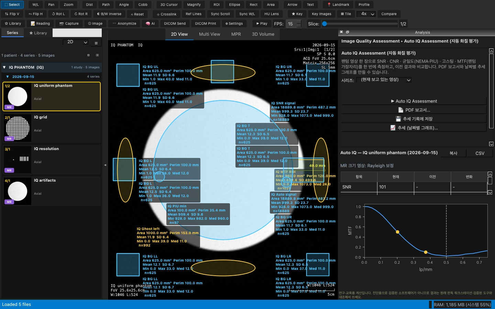

1. 팬텀 영상을 띄우고 **Auto IQ Assessment → ▶ Auto IQ Assessment**를 누릅니다.
2. SNR · CNR · NEMA 균일도 · PIU · 고스팅 · MTF50/10 · 잡음을 한 번에 재고, ROI를 모두 영상에 표시합니다.
3. 결과 표에는 **이전 기록과의 변화**가 나옵니다.
4. **💾 추세 기록에 저장**, **📄 PDF 보고서**, **📈 추세**로 날짜별 비교를 합니다.

## 9. ACR Phantom QC — 실제 데이터 자동 분석

예시 데이터는 **실제 ACR 대형 팬텀 촬영 영상**입니다.
- 장비: GE SIGNA Architect 3.0T, Head 코일
- 폴더 하나에 콘솔 화면 캡처 JPEG 145장
- 구성: localizer, T1 (TR 500 / TE 20) 11장, T2 이중 에코 22장과 병원 측정 화면

DICOM이 아니므로 픽셀 크기는 FOV 250 mm로 가정합니다. 캡처 영상의 W/L이 L = W/2라서 비율 검사(PIU·고스팅)는 그대로 유효합니다.

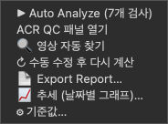

1. 팬텀 폴더(DICOM 또는 이미지 폴더)를 엽니다.
2. **Analysis → ACR Phantom QC → ▶ Auto Analyze (7개 검사)** 를 누릅니다.
3. **영상 자동 찾기**
   - localizer와 T1 slice 1–11(격자 영상이 5번째)을 찾습니다.
   - T2는 이중 에코 중 둘째 에코를 씁니다. DICOM이면 EchoTime으로 구분합니다.
4. 검사마다 해당 슬라이스로 이동해 ROI·측정선을 그리며 진행합니다. 진행 목록에 ✓/✗가 표시됩니다.

| slice 1: 두께·위치·분해능·기하 | slice 7: 균일도·고스팅 | slice 11: 저대조도 |
|---|---|---|
| 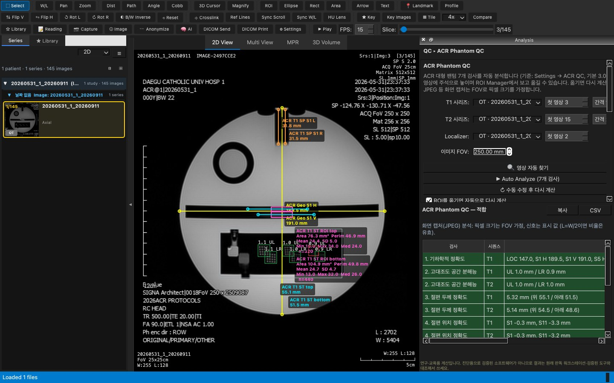 | 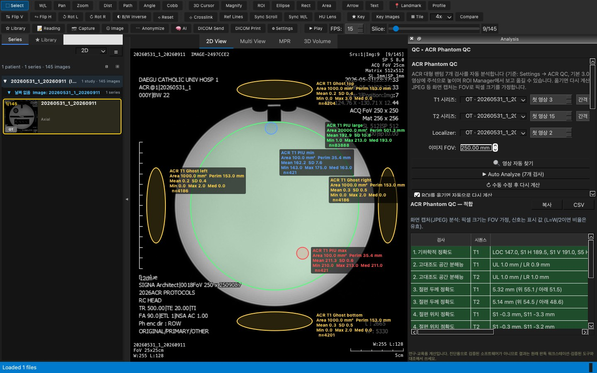 | 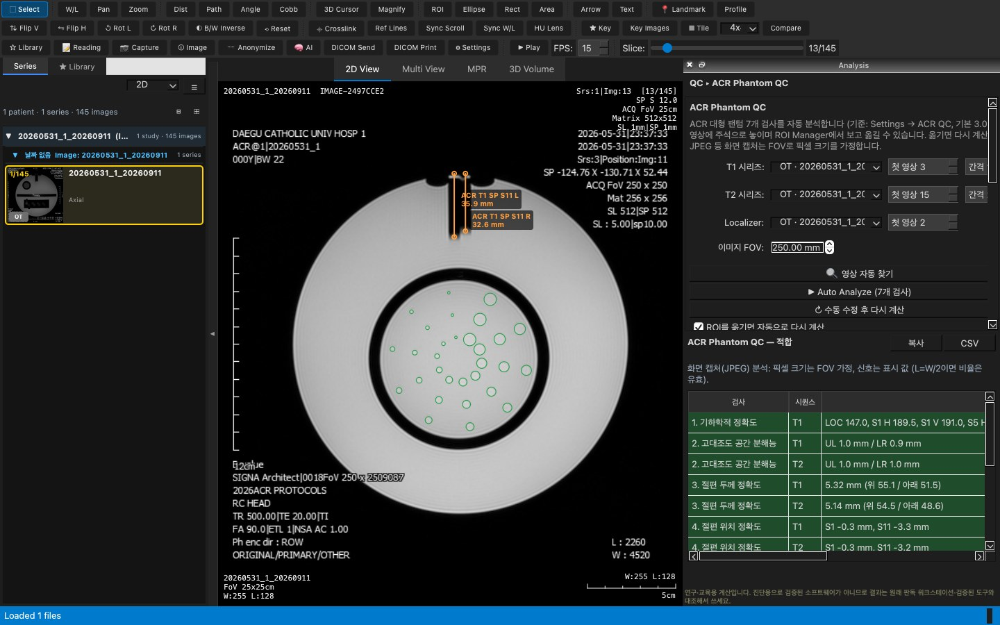 |

5. 결과 표는 항목마다 **적합(초록) / 부적합(빨강)** 으로 나오고 맨 아래에 종합 판정이 있습니다.

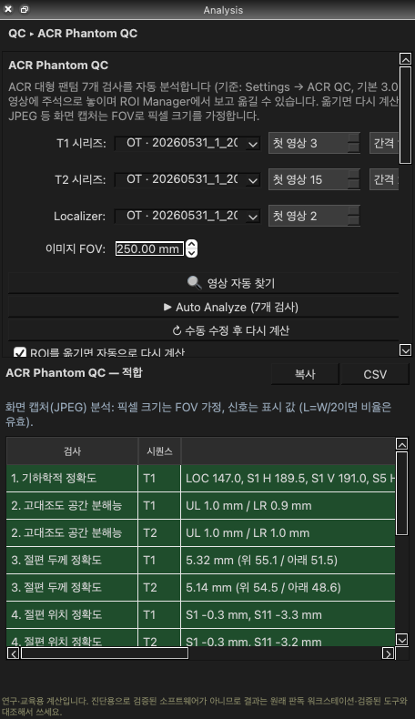

   실제 데이터 결과 (기준은 3.0T ACR, Settings → ACR QC에서 변경):

| 검사 | T1 | T2 | 기준 | 판정 | 병원 수동 측정 |
|---|---|---|---|---|---|
| 기하학적 정확도 | LOC 147.0, S5 189.3–191.2 mm | – | 148 ± 2 / 190 ± 2 mm | 적합 | 148 / 190–191 |
| 고대조도 분해능 | UL 1.0 / LR 0.9 mm | 1.0 / 1.0 mm | ≤ 1.0 mm | 적합 | – |
| 절편 두께 | 5.32 mm | 5.14 mm | 5.0 ± 0.7 mm | 적합 | 약 5.05 |
| 절편 위치 (S1, S11) | −0.3, −3.3 mm | −0.3, −3.2 mm | ≤ 5 mm | 적합 | 1, 3 mm |
| 균일도 PIU | 86.9 % | 87.7 % | ≥ 82 % | 적합 | 89.5 / 89.7 |
| 고스팅 PSG | 0.02 % | 0.29 % | ≤ 2.5 % | 적합 | 거의 0 |
| 저대조도 스포크 | 38 | 37 | ≥ 37 | 적합 | – |

6. **수동 수정**
   - ROI·측정선을 끌어 옮기면 자동으로 다시 계산됩니다 (또는 **↻ 수동 수정 후 다시 계산**).
   - 저대조도 스포크 수와 분해능은 패널 표에서 직접 고칩니다.
   - 원판·구멍 배열은 초록(보임) / 빨강(안 보임)으로 표시되니 보고 확인하세요.
7. **📄 Export Report…** 에서 병원·호기·검사자 등을 넣고 PDF / Word / Excel을 고릅니다.
   - 기록지 형식: 7개 항목 T1/T2, 종합 판정, ROI 그린 영상
   - "추세 기록에도 저장"을 체크하면 날짜별 기록에 남습니다.

| 내보내기 | 보고서 (PDF) |
|---|---|
| 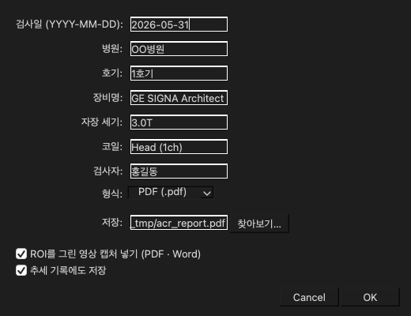 |  |

8. **📈 추세**에서 항목별 날짜 그래프와 기준선을 봅니다.

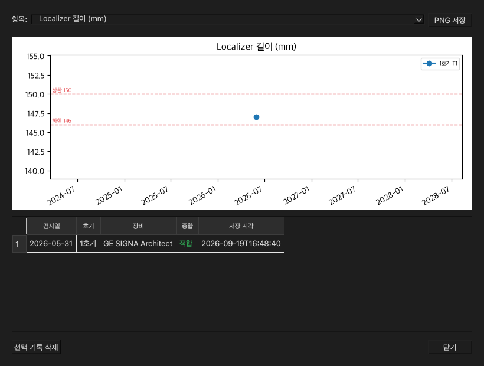

## 10. AI 도구 — TotalSegmentator · MedSAM · ONNX

| 🧩 Models 탭 | 🤖 모델 탭 (ONNX · MONAI) |
|---|---|
| 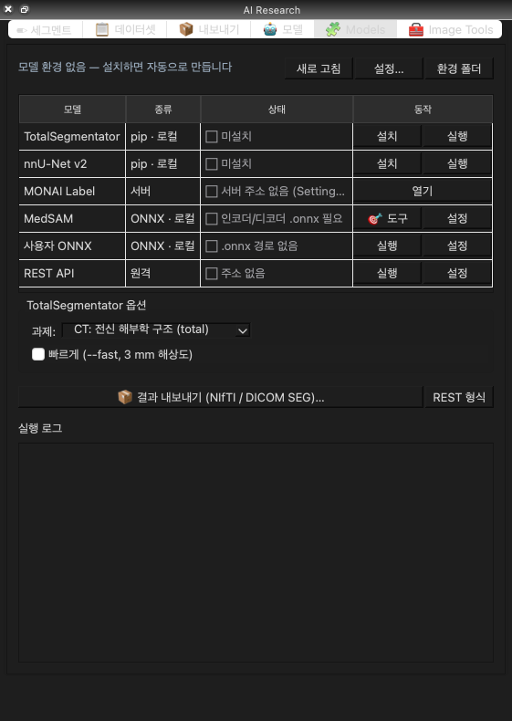 | 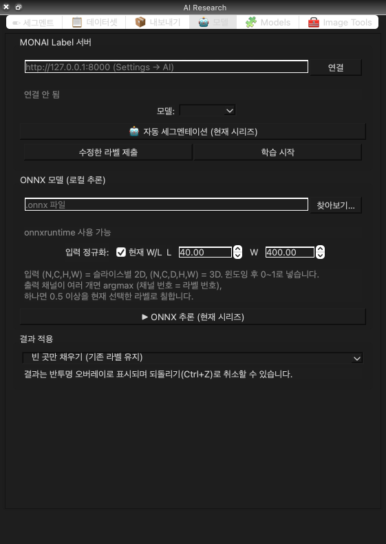 |

1. **AI Research 패널**을 엽니다 (도구 막대 🧠 AI, **Ctrl+Shift+A**).
2. **🧩 Models** 탭에서 모델마다 **설치 / 실행**을 누릅니다.
   - 모델: TotalSegmentator, nnU-Net v2, MONAI Label, MedSAM, 사용자 ONNX, REST API
   - TotalSegmentator·nnU-Net은 PyTorch가 필요합니다. **설치** 버튼이 DabbaView 전용 Python 환경을 만들어 `pip install` 합니다 (시스템 Python 3.9 이상 필요).
3. **TotalSegmentator**: 작업(total, lung_vessels 등)과 fast 옵션을 고르고 **실행**을 누릅니다. 결과 라벨이 영상 위에 겹쳐 나옵니다.
4. **MedSAM**
   - Settings → AI에 encoder/decoder ONNX를 지정합니다.
   - 영상에서 **M** 키를 누르고 병변을 클릭(또는 박스)하면 한 번에 분할합니다.
5. **ONNX**: 🤖 모델 탭에서 `.onnx` 파일을 고르고 입력 창(W/L)과 크기를 맞춰 실행합니다.
   - (N,C,H,W) 모델은 슬라이스별로, (N,C,D,H,W) 모델은 3D로 돌립니다.
6. **MONAI Label**: 서버 주소를 넣고 자동 분할 → 수정 → 제출 → 학습 순서로 active learning을 합니다.

## 11. 세그멘테이션

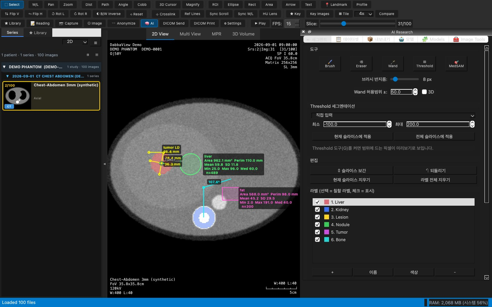

1. AI 패널의 **✏️ 세그멘트** 탭을 엽니다.
2. 라벨을 추가하고 이름·색을 정합니다 (예: `Tumor`, `Bone`).
3. 도구를 고릅니다.
   - **D Brush / X Eraser**: 크기 슬라이더로 조절
   - **W Magic Wand**: 클릭한 값 ± 허용범위의 연결 영역, 3D 옵션
   - **G Threshold**: 값 범위를 미리 보고 현재 슬라이스 또는 전체에 적용
4. 몇 장만 칠하고 **슬라이스 보간**을 누르면 사이를 자동으로 채웁니다.
5. 통계(부피 mL · 복셀 · 슬라이스 범위)를 확인합니다. 마스크는 시리즈별로 자동 저장됩니다.

## 12. 데이터 내보내기


1. **📦 내보내기** 탭에서 대상(현재 시리즈 / 워크리스트)과 형식을 고릅니다.
   - 형식: NIfTI, NumPy, PNG 시퀀스, COCO, Pascal VOC, DICOM SEG
2. train / val / test 비율과 seed를 정하면 자동으로 분할합니다.
3. 전처리를 선택할 수 있습니다: 라벨 영역 크롭, 리샘플링, 필터, 정규화.
4. **내보내기…** 를 누르면 폴더에 저장됩니다. DICOM SEG는 원본 검사와 연결됩니다.
5. 형식만 바꿀 때는 **File → Convert / Export As** 를 씁니다 (DICOM ↔ NIfTI ↔ NRRD ↔ NumPy).

## 13. Python 콘솔

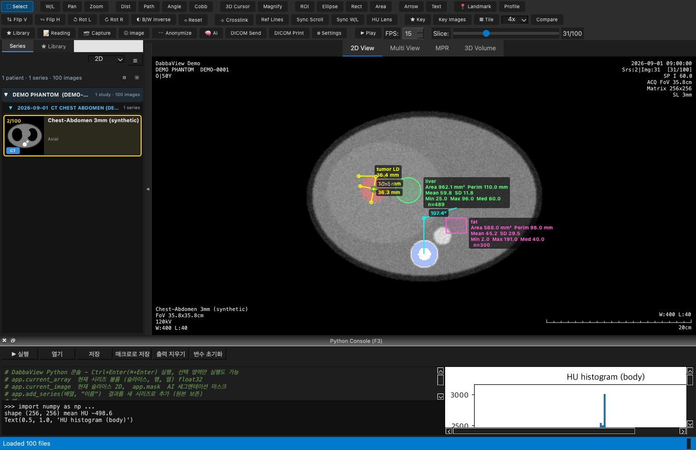

1. **F3** 또는 Tools → 🐍 Python Console을 엽니다.
2. 다음 변수가 준비되어 있습니다.
   - `app.current_image`: 현재 슬라이스 배열
   - `app.current_series`, `app.current_volume`
   - `np`, `plt`
3. 코드를 입력하고 실행하면 출력과 matplotlib 그래프가 콘솔 옆에 나옵니다.
   - 예: 위 화면은 현재 CT 슬라이스의 HU 히스토그램입니다.
4. 자주 쓰는 코드는 **매크로**로 저장해 메뉴에서 바로 실행합니다 (예: Otsu 임계값).

```python
img = app.current_image
body = img[img > -500]
print(img.shape, body.mean())
plt.hist(body.ravel(), bins=120, range=(-200, 300))
```

## 14. 오픈 데이터셋


1. **Help → 📚 Open Datasets** 를 엽니다.
2. 공개 의료영상 데이터셋 목록이 나옵니다. 항목을 누르면 브라우저로 열립니다.
   - 예: TCIA, MedPix, MIMIC-CXR, NLST, UK Biobank, OpenNeuro, Grand Challenge, Medical Segmentation Decathlon, ACDC, BraTS, AMOS
3. 받은 데이터는 DICOM 폴더 또는 NIfTI로 열어 이 가이드의 도구를 그대로 쓸 수 있습니다.
