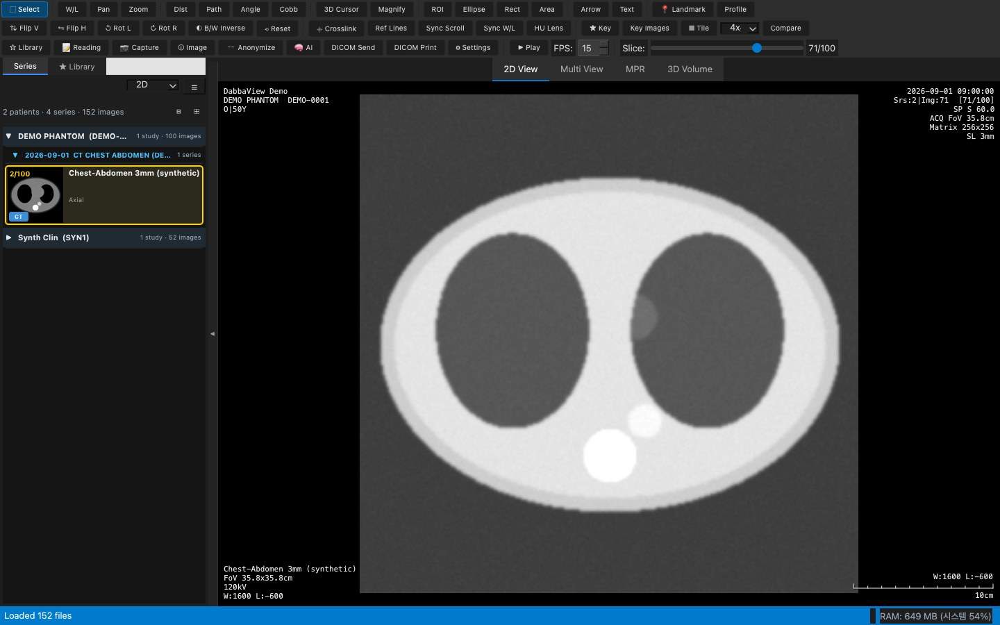

# DabbaView 사용자 매뉴얼

버전 2.0.0 · macOS / Windows

> 이 매뉴얼의 화면은 설치된 DabbaView 2.0.0을 실제로 실행해서 찍었습니다. 예시 영상은 합성 CT 팬텀(`DEMO^PHANTOM`)과 합성 MR 데이터라 개인정보가 없습니다.
>
> ⚠️ DabbaView는 진단용으로 인증된 의료기기가 아닙니다. 학습·연구·참고용으로 사용하세요.

## 목차

1. [설치](#1-설치)
2. [첫 실행](#2-첫-실행)
3. [파일 열기](#3-파일-열기)
4. [시리즈 패널](#4-시리즈-패널)
5. [2D View](#5-2d-view)
6. [Multi View](#6-multi-view)
7. [MPR](#7-mpr)
8. [3D Volume](#8-3d-volume)
9. [측정 도구](#9-측정-도구)
10. [ROI Manager](#10-roi-manager)
11. [W/L 프리셋](#11-wl-프리셋)
12. [영상 조작](#12-영상-조작)
13. [태그 뷰어](#13-태그-뷰어)
14. [익명화](#14-익명화)
15. [동영상 내보내기](#15-동영상-내보내기)
16. [DICOM Send / Print](#16-dicom-send--print)
17. [Reading (판독)](#17-reading-판독)
18. [Library (스터디 라이브러리)](#18-library-스터디-라이브러리)
19. [Settings](#19-settings)
20. [단축키 목록](#20-단축키-목록)
21. [마우스 조작](#21-마우스-조작)

분석·AI 기능은 [AI & Analysis Guide](analysis_guide.md)를 보세요.

---

## 1. 설치

### 미리 빌드된 앱 (권장)

1. GitHub [Actions](https://github.com/Dabbabbu/DabbaView/actions)에서 최근 빌드를 열고 **Artifacts**의 zip을 받습니다 (GitHub 로그인 필요).
2. 압축을 풉니다.
   - macOS: `DabbaView.app`을 **응용 프로그램(/Applications)** 폴더로 옮깁니다.
   - Windows: `DabbaView` 폴더를 원하는 곳에 둡니다.
3. 처음 열 때는 서명되지 않은 앱이라는 경고가 나옵니다.
   - macOS: 앱을 **우클릭 → 열기**를 누릅니다.
   - Windows: SmartScreen에서 **추가 정보 → 실행**을 누릅니다.

### 소스에서 실행

```bash
git clone https://github.com/Dabbabbu/DabbaView.git
cd DabbaView
python3 -m venv venv
source venv/bin/activate        # Windows: venv\Scripts\activate
pip install -r requirements.txt
python create_icon.py
python run.py                   # 또는: python run.py /path/to/dicom/folder
```

- Python 3.11을 권장합니다.
- VTK가 없으면 3D 탭만 꺼지고 나머지 기능은 동작합니다.
- 앱을 직접 빌드하려면 macOS는 `./build_app.sh`, Windows는 `build_windows.bat`를 실행합니다.

## 2. 첫 실행


1. 앱을 실행하면 빈 작업 화면이 열립니다. 이전 파일을 자동으로 불러오지는 않습니다.
2. 화면 구성:
   - 위쪽: 도구 막대 세 줄 (도구 / 영상 조작 / 기능)
   - 왼쪽: **Series · ★ Library** 탭
   - 가운데: 영상 탭 (**2D View · Multi View · MPR · 3D Volume**)
   - 아래: 상태 막대 (메시지 · RAM)
3. 가운데 안내에 나온 형식(DICOM · NIfTI · NRRD · MHA · NumPy · PNG/JPEG)의 파일이나 폴더를 창으로 끌어다 놓으면 바로 열립니다.

## 3. 파일 열기


1. **File → Open File…** (Ctrl+O)로 파일을 엽니다. DICOM, NIfTI, NRRD, MHA, NumPy, PNG/JPEG, STL을 열 수 있습니다.
2. **File → Open DICOM Folder…** (Ctrl+Shift+O)로 폴더를 엽니다. 하위 폴더까지 읽고, 시리즈별로 자동으로 나눕니다.
3. Finder나 탐색기에서 파일·폴더를 창으로 **드래그 앤 드롭**해도 됩니다.
4. 클라우드 폴더는 **Open from Google Drive… / Open from OneDrive…** 로 엽니다. 각자의 OAuth 키를 Settings → Cloud에 먼저 넣어야 합니다.
5. 최근에 연 파일은 **Recent Files**에 10개까지 남습니다.

> 손상되었거나 지원하지 않는 파일은 건너뛰고 오른쪽 아래 **⚠ 로딩 실패** 버튼에 목록으로 남깁니다. OneDrive·Google Drive 동기화 폴더는 "로컬로 복사 후 열기 / 다운로드하며 열기" 중에서 고를 수 있습니다.


## 4. 시리즈 패널

| 썸네일 보기 | 환자/검사 트리 (☰ 버튼) |
|---|---|
|  |  |

1. 불러온 영상은 **환자 → 검사 → 시리즈** 순으로 묶여 보입니다. 카드에는 중간 슬라이스 썸네일과 `시리즈번호/총장수`가 나옵니다.
2. 카드를 클릭하면 그 시리즈가 2D View에 뜹니다. 선택된 카드는 노란 테두리로 표시됩니다.
3. 카드를 **Multi View의 칸으로 끌어다 놓으면** 그 칸에 표시됩니다.
4. **☰** 버튼으로 트리 보기로 바꿉니다. **F2** 또는 패널 옆 ◀ 버튼으로 패널을 접을 수 있습니다.
5. 카드에 마우스를 올리면 시퀀스 정보(TR/TE/TI, FA, 두께, Matrix, FoV 등)가 나옵니다.
6. 우클릭하면 **Rename Study… (F2) / Rename Series… (⇧F2) / Edit Patient Name/ID…** 가 있습니다.
   - DICOM 원본까지 고칠 수 있고, 이때 `.bak` 백업을 만듭니다.

## 5. 2D View



1. 영상 위에서 **휠**을 굴리면 슬라이스가 넘어갑니다. 위쪽 **Slice** 슬라이더를 끌어도 됩니다.
2. **우클릭 드래그**로 W/L을 바꿉니다 (좌우 = Width, 상하 = Level).
3. **가운데 버튼 드래그**로 이동하고, **Ctrl(⌘)+휠**로 확대합니다.
4. 네 모서리 오버레이에 환자·검사·시리즈·획득 정보가 나옵니다. **T** 키로 켜고 끕니다.
5. **▦ Tile** (Shift+T)을 누르면 여러 슬라이스를 격자로 봅니다. 격자 크기는 옆의 `4x` 목록에서 고릅니다.


## 6. Multi View


1. 위쪽 **Multi View** 탭을 누르거나 레이아웃 목록에서 `1X1` ~ `4X4`를 고릅니다.
2. 왼쪽 시리즈 카드를 원하는 칸으로 끌어다 놓습니다.
3. 칸을 클릭하면 그 칸이 활성(노란 테두리)이 되고, 도구와 W/L은 활성 칸에 적용됩니다.
4. **Space**를 누르면 활성 칸만 크게 보고, 다시 누르면 돌아옵니다.
5. 같은 좌표계의 시리즈끼리는 **Sync Scroll / Sync W/L / Crosslink(C) / Ref Lines**로 함께 움직일 수 있습니다.
6. 레이아웃 `Default`는 Hanging Protocol로 자동 배치하고, `ALL`은 검사의 모든 시리즈를 띄웁니다.

## 7. MPR


1. 볼륨(여러 슬라이스) 시리즈를 선택한 뒤 **MPR** 탭을 누릅니다.
2. Axial / Sagittal / Coronal 세 평면이 mm 기준 실제 비율로 나옵니다.
3. 한 평면을 클릭하거나 끌면 십자선이 움직이고, 다른 두 평면이 따라 바뀝니다.
4. 십자선 끝 핸들을 끌면 **Oblique** 각도로 회전합니다. Shift+드래그는 1°씩 움직입니다.

## 8. 3D Volume


1. 볼륨 시리즈를 선택하고 **3D Volume** 탭을 누릅니다.
2. **Preset**에서 CT Bone / Skin / Soft Tissue / Lung / Angiography 중 하나를 고릅니다.
3. 마우스를 끌어 돌리고, 휠로 확대하고, 가운데 버튼으로 이동합니다. **Reset Camera**를 누르면 처음 보기로 돌아갑니다.
4. **Quality** 슬라이더로 속도와 화질을 조절합니다.

## 9. 측정 도구


| 도구 | 키 | 결과 |
|---|---|---|
| 거리 (Dist) | 4 | mm |
| 각도 | 5 | ° |
| Cobb 각 | B | ° |
| Freehand ROI | 8 | 면적·평균·SD·Min·Max |
| 타원 ROI (Shift: 원) | E | 같음 |
| 사각형 ROI (Shift: 정사각형) | Shift+E | 같음 |
| 면적 | 9 | mm² |
| 경로 길이 | Shift+D | mm (더블클릭으로 끝) |
| 화살표 / 텍스트 | 0 / A | 주석 |
| 3D Cursor | 6 | 환자 좌표 |
| HU Lens | L | 커서 옆 픽셀 값 |

1. 도구 막대나 키보드로 도구를 고릅니다.
2. 영상 위에서 끌어 그립니다. 그리는 중에 **Shift**를 누르면 0/45/90°로 맞춰집니다.
3. 그린 측정은 선택한 뒤 끝점이나 몸체를 끌어 고칩니다. **Delete**로 지우고, **Ctrl+Z / Ctrl+Y**로 되돌립니다.
4. 선택 도구 상태에서 두 점을 더블클릭하면 빠르게 거리를 잽니다.

## 10. ROI Manager


1. **Ctrl+Shift+M** 또는 도구 막대 메뉴로 ROI Manager를 엽니다.
2. 현재 영상(또는 시리즈 전체)의 ROI와 측정이 목록으로 나옵니다. 이름·색·표시·잠금을 바꿀 수 있습니다.
3. **Measure (Ctrl+M)** 를 누르면 선택한 ROI(선택이 없으면 전체)의 면적·둘레·Mean·SD·Min·Max·Median·픽셀 수를 표로 보여 줍니다. 표는 복사하거나 CSV로 저장할 수 있습니다.
4. ROI 복사/붙여넣기, 여러 슬라이스로 복사, 좌우 대칭, ROI 세트 저장/적용, 템플릿, 볼륨 계산 기능이 있습니다.

## 11. W/L 프리셋

| 프리셋 메뉴 | Settings → W/L Presets |
|---|---|
|  |  |

1. 도구 막대의 프리셋 메뉴에서 Brain, Lung, Bone, Abdomen 등 원하는 창을 고릅니다.
2. **Edit Presets…** 에서 프리셋을 추가·편집·삭제합니다.
3. **Ctrl(⌘)+좌클릭 드래그**로 사각형을 그리면 그 영역에 맞춰 W/L을 자동으로 설정합니다.

## 12. 영상 조작


1. **V / H**: 상하 / 좌우 반전
2. **[ / ]**: 왼쪽 / 오른쪽 90° 회전
3. **I**: 흑백 반전
4. **Shift+R**: 회전·반전을 초기화하고 화면에 맞춤
5. 컬러맵은 Analysis 도구나 메뉴에서 고릅니다 (Gray, Hot, Jet, Viridis 등). 오른쪽에 컬러바가 나옵니다.
6. **7 (Magnify)** 돋보기, **Shift+L** 선 프로파일도 쓸 수 있습니다.

## 13. 태그 뷰어


1. **Ctrl+T** 또는 Tools 메뉴 → DICOM Tags를 누릅니다.
2. 현재 영상의 모든 태그가 표로 나옵니다. 위쪽 검색 칸에 태그 이름이나 값을 넣어 거릅니다.

## 14. 익명화


1. 도구 막대 **🕶 Anonymize** 또는 Tools 메뉴에서 엽니다.
2. 프리셋(최소 / 표준 / 완전 / 연구용)을 고르거나 항목을 직접 체크합니다. 항목은 개인정보 · 기관정보 · 검사정보 · 촬영 파라미터로 나뉩니다.
3. 오른쪽 미리보기에서 바뀔 태그가 강조됩니다. Private 태그 제거와 UID 재생성 옵션도 있습니다.
4. **Save Anonymized Files…** 로 새 폴더에 저장합니다. 원본은 그대로 남습니다.

## 15. 동영상 내보내기


1. **Ctrl+Shift+E** 또는 File → Export as Video… 를 누릅니다.
2. 형식(MP4 / GIF 등), 길이 또는 FPS, 해상도를 고릅니다. **현재 W/L 적용**을 체크하면 보고 있는 창 그대로 저장합니다.
3. **Export…** 로 저장합니다. 시네 영상은 도구 막대 **▶ Play (P)** 와 FPS로 미리 볼 수 있습니다.

## 16. DICOM Send / Print

| DICOM Send | DICOM Print |
|---|---|
|  |  |

1. Settings → **DICOM Nodes**에 이 컴퓨터의 AE Title과 대상(AE Title · Host · Port)을 등록합니다.
2. 도구 막대 **DICOM Send** 또는 **DICOM Print**를 누릅니다.
3. 대상과 범위(현재 영상 / 현재 시리즈 전체 / Key Image)를 고릅니다.
4. **연결 확인 (C-ECHO)** 으로 통신을 확인한 뒤 **전송** 또는 **인쇄**를 누릅니다. Print는 필름 크기·배열·방향·매체·확대·매수를 고를 수 있습니다.

## 17. Reading (판독)


1. 검사를 열고 **R** 키 또는 도구 막대 **📝 Reading**을 누릅니다.
2. Report 탭에 소견과 결론(Conclusion)을 씁니다. 작성자·승인자·검사일이 함께 저장됩니다.
3. **Import…** 로 txt·rtf·이미지·PDF·DICOM SR 판독문을 불러옵니다. 파일명에 다른 환자 ID가 있으면 경고합니다.
4. **Save / Approve**로 저장하거나 승인하고, JSON으로 저장·열기, Copy, Print를 할 수 있습니다.
5. Settings → Reading에서 판독문 폴더를 지정하면 새 파일을 PatientID와 검사일로 자동 연결합니다.

## 18. Library (스터디 라이브러리)


1. 스터디를 연 상태에서 **Ctrl+D** 또는 **★ Library** 버튼을 누르면 즐겨찾기에 추가됩니다.
2. 왼쪽 **★ Library** 탭에서 컬렉션 트리, 스터디 목록, 메모, 태그를 봅니다.
3. **컬렉션**을 만들고 스터디를 끌어다 넣습니다. 한 스터디를 여러 컬렉션에 넣을 수 있습니다.
4. **메모**는 굵게·목록을 지원하고 자동 저장됩니다. 본문에 `#태그`를 쓰면 태그가 됩니다.
5. 검색 칸에서 환자·설명·메모·`#태그`로 찾습니다. 더블클릭하면 그 스터디가 열립니다.
6. **Export…** (우클릭 또는 File → Export Library…)
   - 형식: PDF / Word / Excel / PNG·JPEG / CSV / JSON / Markdown
   - 범위: 전체 / 컬렉션 / 선택

## 19. Settings

macOS는 **⌘,**, Windows는 **File → Settings**로 엽니다.

| Mouse | Reading | AI |
|---|---|---|
|  |  |  |

| ACR QC | Cache |
|---|---|
|  |  |

| 탭 | 내용 |
|---|---|
| Mouse | 버튼·휠·더블클릭 동작 매핑, ROI 자동 W/L 방식 |
| W/L Presets | 프리셋 추가·편집·삭제 |
| Hanging Protocols | 모달리티·부위별 자동 배치 |
| DICOM Nodes | AE Title, Send/Print 대상 |
| Reading | 판독문 폴더, 기본 Creator, DICOM 원본 수정 전 .bak 백업 |
| AI | MONAI Label 서버, 모델 Python, nnU-Net·MedSAM·ONNX·REST 설정 |
| Cloud | Google / OneDrive OAuth 키, 로그아웃 |
| Cache | 캐시 위치·용량 (1–50 GB), Clear Cache |
| ACR QC | 판정 기준(3T / 1.5T), 보고서 머리글, 이미지 FOV |

## 20. 단축키 목록

한/영 입력 상태와 관계없이 동작합니다.

| 키 | 기능 | 키 | 기능 |
|---|---|---|---|
| S | Selector | 1 | W/L |
| 2 | Pan | 3 | Zoom |
| 4 | 거리 | 5 | 각도 |
| B | Cobb 각 | 6 | 3D Cursor |
| 7 | 돋보기 | 8 | Freehand ROI |
| E | 타원 ROI (Shift: 원) | 9 | 면적 |
| 0 | 화살표 | A | 텍스트 메모 |
| V / H | 상하 / 좌우 반전 | [ / ] | 왼쪽 / 오른쪽 90° 회전 |
| I | 흑백 반전 | Shift+R | 회전·반전 초기화 |
| C | Crosslink | L | HU Lens |
| K | Key Image 표시/해제 | Shift+K | Key Image 모아보기 |
| Shift+T | Stack ↔ Tile | T / O | 오버레이 표시/숨김 |
| Space | Multi View 칸 최대화 | P | 시네 재생/정지 |
| R | Reading 창 | Esc | 그리기 취소 |
| Ctrl+T | DICOM 태그 | Ctrl+I | Image 정보 패널 |
| Ctrl+O | 파일 열기 | Ctrl+Shift+O | 폴더 열기 |
| Ctrl+S | 이미지 내보내기 | Ctrl+Shift+E | 동영상 내보내기 |
| Ctrl+Shift+S | Capture | F2 | 시리즈 패널 접기 / (목록에서) 스터디 이름 바꾸기 |
| ⇧F2 | 시리즈 이름 바꾸기 | ⌘, | Settings |
| Ctrl+Shift+A | AI Research 패널 | D / X | Brush / Eraser |
| W / G / M | Magic Wand / Threshold / MedSAM | Ctrl+Z / Ctrl+Y | 되돌리기 / 다시 하기 |
| Shift+E | 사각형 ROI | Shift+D | 경로 길이 |
| Ctrl+C / Ctrl+V | ROI 복사 / 붙이기 | Ctrl+Shift+M | ROI Manager |
| Ctrl+M | Measure | Delete | 선택 ROI 삭제 |
| Ctrl+D | Library에 추가 | F | Landmark |
| Shift+L | Line Profile | F3 | Python 콘솔 |

## 21. 마우스 조작

PACS 표준 배치이며 Settings → Mouse에서 바꿀 수 있습니다.

| 조작 | 기능 |
|---|---|
| 좌클릭 드래그 | 선택한 도구 (기본: Selector) |
| **우클릭 드래그** | **W/L** (좌우 = Width, 상하 = Level) |
| **가운데 버튼 드래그** | **Pan** |
| Ctrl(⌘) + 좌클릭 드래그 | ROI 자동 W/L (사각형 영역) |
| Alt(⌥) + 좌클릭 드래그 | Pan |
| 휠 | 슬라이스 이동 |
| Shift + 휠 | 5장씩 빠르게 이동 |
| Ctrl(⌘) + 휠 | Zoom (커서 위치 기준) |
| 좌측 더블클릭 | 화면에 맞춤 |
| 우측 더블클릭 | W/L을 DICOM 기본값으로 |

macOS에서는 표의 `Ctrl` 자리에 ⌘(Command)와 Control 모두 쓸 수 있습니다.
