# DabbaView 사용자 매뉴얼

버전 2.9.0 · macOS / Windows · 변경 이력은 [CHANGELOG](../CHANGELOG.md)

> 이 매뉴얼의 화면은 DabbaView 2.2.x를 실제로 실행해서 찍었습니다 (MPR · 3D · 프리셋 · Send/Print 화면은 2.0.0 그대로 — 바뀐 내용 없음).
> - 예시 영상은 GE SIGNA Architect 3.0T **심장 MRI 임상 영상**(cine · T1/T2 mapping · perfusion · LGE)과 복부 CT입니다.
> - 모두 DabbaView 익명화 기능으로 환자 이름·ID·생년월일·기관·검사일·오더 정보를 지운 사본입니다 (`CMR^CASE-A`, 검사일 2026-01-01).
> - 몇몇 대화상자 화면은 합성 팬텀(`DEMO^PHANTOM`)으로 찍었습니다.
>
> ⚠️ DabbaView는 진단용으로 인증된 의료기기가 아닙니다. 학습·연구·참고용으로 사용하세요.

## 목차

1. [설치](#1-설치)
2. [첫 실행](#2-첫-실행)
3. [파일 열기](#3-파일-열기)
4. [시리즈 패널](#4-시리즈-패널)
5. [2D View](#5-2d-view)
6. [Multi View](#6-multi-view)
7. [MPR](#7-mpr)
8. [3D Volume](#8-3d-volume)
9. [측정 도구](#9-측정-도구)
10. [ROI Manager](#10-roi-manager)
11. [W/L 프리셋](#11-wl-프리셋)
12. [영상 조작](#12-영상-조작)
13. [태그 뷰어](#13-태그-뷰어)
14. [익명화](#14-익명화)
15. [동영상 내보내기](#15-동영상-내보내기)
16. [DICOM Send / Print](#16-dicom-send--print)

18. [Library (스터디 라이브러리)](#18-library-스터디-라이브러리)
19. [Settings](#19-settings)
20. [단축키 목록](#20-단축키-목록)
21. [마우스 조작](#21-마우스-조작)
22. [패널 · 탭 닫기와 다시 열기](#22-패널--탭-닫기와-다시-열기)
23. [작업 저장 · 복원](#23-작업-저장--복원)

분석·AI 기능은 [AI & Analysis Guide](analysis_guide.md)를 보세요.

---

## 1. 설치

### 미리 빌드된 앱 (권장)

1. GitHub [Releases](https://github.com/Dabbabbu/DabbaView/releases/latest)에서 `DabbaView-v2.6.2-macOS.zip` (또는 `DabbaView-v2.6.2-Windows.zip`)을 받습니다. 파일 이름에 버전과 운영체제가 들어 있고, 로그인 없이 받을 수 있습니다.
2. 압축을 풉니다.
   - macOS: `DabbaView.app`을 **응용 프로그램(/Applications)** 폴더로 옮깁니다.
   - Windows: `DabbaView` 폴더를 원하는 곳에 둡니다.
3. 처음 열 때는 서명되지 않은 앱이라는 경고가 나옵니다.
   - macOS: 앱을 **우클릭 → 열기**를 누릅니다.
   - Windows: SmartScreen에서 **추가 정보 → 실행**을 누릅니다.

### 소스에서 실행

```bash
git clone https://github.com/Dabbabbu/DabbaView.git
cd DabbaView
python3 -m venv venv
source venv/bin/activate        # Windows: venv\Scripts\activate
pip install -r requirements.txt
python create_icon.py
python run.py                   # 또는: python run.py /path/to/dicom/folder
```

- Python 3.11을 권장합니다.
- VTK가 없으면 3D 탭만 꺼지고 나머지 기능은 동작합니다.
- 앱을 직접 빌드하려면 macOS는 `./build_app.sh`, Windows는 `build_windows.bat`를 실행합니다.

## 2. 첫 실행

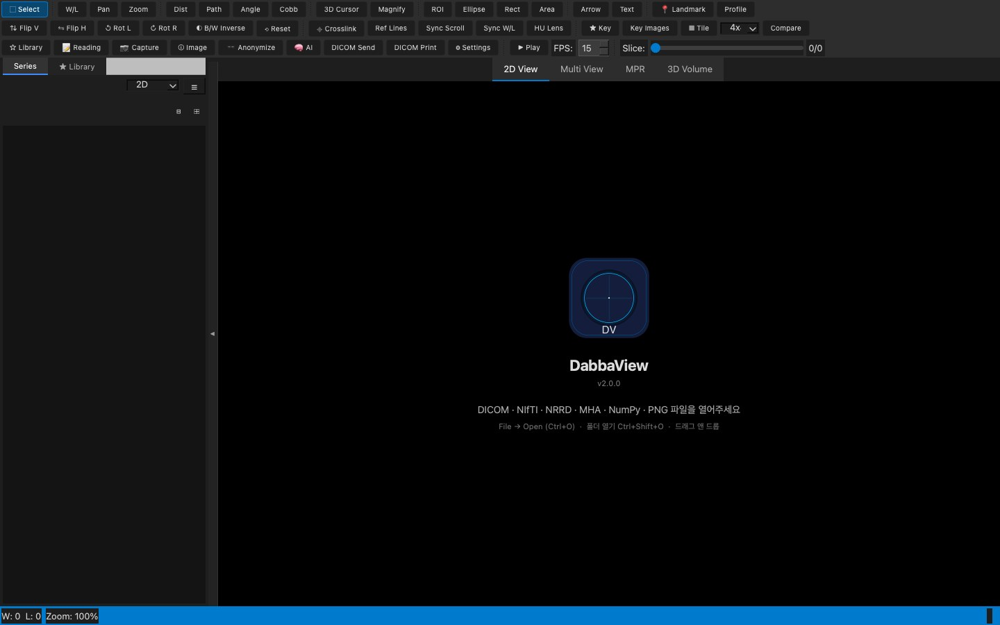

1. 앱을 실행하면 빈 작업 화면이 열립니다. 이전 파일을 자동으로 불러오지는 않습니다.
2. 화면 구성:
   - 위쪽: 도구 막대 세 줄 (도구 / 영상 조작 / 기능). 셋째 줄의 **★ Library · ⓘ Image · 🧠 AI** 버튼은 누를 때마다 그 패널을 열고 닫습니다.
   - 왼쪽: **Series · ★ Library** 탭
   - 가운데: 영상 탭 (**2D View · Multi View · MPR · 3D Volume**)
   - 오른쪽 · 아래: Analysis · ROI Manager · Image · AI · Histogram/Profile · Python Console 패널 (필요할 때 열림, 제목에 마우스를 올리면 ✕)
   - 아래: 상태 막대 (메시지 · RAM)
3. 가운데 안내에 나온 형식(DICOM · NIfTI · NRRD · MHA · NumPy · PNG/JPEG)의 파일이나 폴더를 창으로 끌어다 놓으면 바로 열립니다.

## 3. 파일 열기

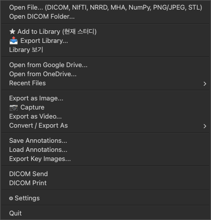

1. **File → Open File…** (Ctrl+O)로 파일을 엽니다. DICOM, NIfTI, NRRD, MHA, NumPy, PNG/JPEG, STL을 열 수 있습니다.
2. **File → Open DICOM Folder…** (Ctrl+Shift+O)로 폴더를 엽니다. 하위 폴더까지 읽고, 시리즈별로 자동으로 나눕니다.
3. Finder나 탐색기에서 파일·폴더를 창으로 **드래그 앤 드롭**해도 됩니다.
4. 클라우드 폴더는 **Open from Google Drive… / Open from OneDrive…** 로 엽니다. 각자의 OAuth 키를 Settings → Cloud에 먼저 넣어야 합니다.
5. 최근에 연 파일은 **Recent Files**에 10개까지 남습니다.

> 손상되었거나 지원하지 않는 파일은 건너뛰고 오른쪽 아래 **⚠ 로딩 실패** 버튼에 목록으로 남깁니다.

**OneDrive · Google Drive · iCloud 동기화 폴더**를 열면 경고창이 뜹니다:

| 버튼 | 동작 |
|---|---|
| 로컬로 복사 후 열기 (권장) | 고른 로컬 폴더에 복사한 뒤 복사본을 엶 (아직 안 받은 파일도 받아서 복사) |
| 계속 (다운로드하며 불러오기) | 원래 폴더에서 읽음. 안 받은 파일은 읽을 때 받음 (응답이 없으면 건너뜀) |
| 다운로드된 N개만 불러오기 | 이미 이 Mac에 있는 파일만 |
| 취소 · **Esc** | 불러오지 않고 원래 화면으로 |

- 경고창이 떠 있는 동안에도 **⌘Q**로 앱을 끝낼 수 있습니다 (2.1.0에서 버튼 · Esc가 눌리지 않던 문제 수정).

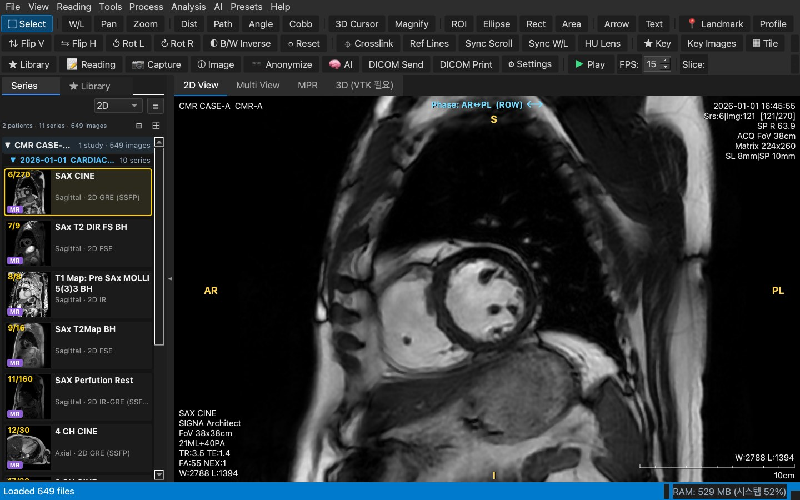

## 4. 시리즈 패널

| 썸네일 보기 | 환자/검사 트리 (☰ 버튼) |
|---|---|
| 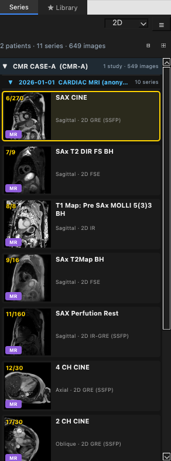 | 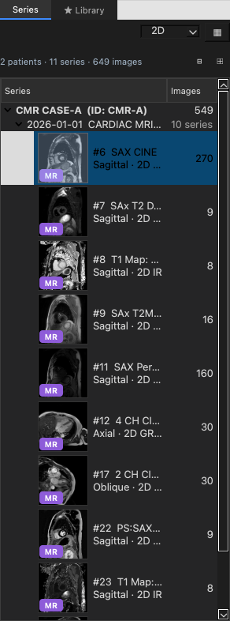 |

1. 불러온 영상은 **환자 → 검사 → 시리즈** 순으로 묶여 보입니다. 카드에는 중간 슬라이스 썸네일과 `시리즈번호/총장수`가 나옵니다.
   - 예: 심장 MRI 한 검사 = SAX CINE (270장), SAx T2 DIR, T1 Map, T2Map, Perfusion, 4CH/2CH CINE, PSMDE (LGE)
2. 카드를 클릭하면 그 시리즈가 2D View에 뜹니다. 선택된 카드는 노란 테두리로 표시됩니다.
3. 카드를 **Multi View의 칸으로 끌어다 놓으면** 그 칸에 표시됩니다.
4. **☰** 버튼으로 트리 보기로 바꿉니다. **F2** 또는 패널 옆 ◀ 버튼으로 패널을 접을 수 있습니다.
   - **Series · ★ Library** 탭 이름에 마우스를 올리면 **✕ 버튼**이 나오고, 누르면 그 탭이 닫힙니다. 다시 여는 방법은 [22장](#22-패널--탭-닫기와-다시-열기).
5. 카드에 마우스를 올리면 시퀀스 정보(TR/TE/TI, FA, 두께, Matrix, FoV 등)가 나옵니다.
6. 우클릭하면 **Rename Study… (F2) / Rename Series… (⇧F2) / Edit Patient Name/ID…** 가 있습니다.
   - DICOM 원본까지 고칠 수 있고, 이때 `.bak` 백업을 만듭니다.

## 5. 2D View

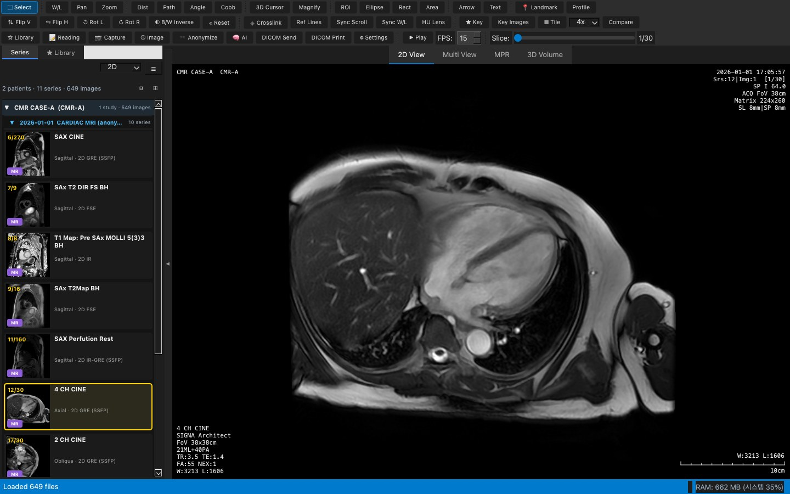

1. 영상 위에서 **휠**을 굴리면 슬라이스(cine은 위상)가 넘어갑니다. 위쪽 **Slice** 슬라이더를 끌어도 됩니다.
   - cine은 **P**(또는 ▶ Play)로 재생하고 FPS를 조절합니다. 재생 중에는 버튼이 **■ Stop**(빨강)으로 바뀌고, 다시 누르면 멈추고 **▶ Play**(초록)로 돌아옵니다.

     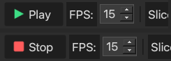
2. **우클릭 드래그**로 W/L을 바꿉니다 (좌우 = Width, 상하 = Level).
3. **가운데 버튼 드래그**로 이동하고, **Ctrl(⌘)+휠**로 확대합니다.
4. 네 모서리 오버레이에 환자·검사·시리즈·획득 정보가 나옵니다. **T** 키로 켜고 끕니다.
5. 영상 가장자리 가운데에 **방향 문자**(L/R · A/P · S/I)가, 위쪽 가운데에 **위상 인코딩 방향**이 나옵니다.
   - 방향 문자는 DICOM 위치 정보로 계산하고, 회전 · 반전하면 따라 바뀝니다. 비스듬한 면(4CH 등)은 두 글자로 씁니다 (예: `AI`, `PS`).
   - 위상 방향은 (0018,1312) InPlanePhaseEncodingDirection 값입니다. `Phase: AR↔PL (ROW)`처럼 방향과 ↔/↕ 화살표로 보여 줍니다. 모션 · 접힘(wrap) 아티팩트가 이 방향으로 생깁니다. DICOM 표준 태그에는 +/− 극성이 없어 양쪽 화살표입니다.
   - 켜고 끄기: **View ▸ 오버레이 항목** (항목별) 또는 **T** (전체). 기본값은 Settings ▸ Display.

   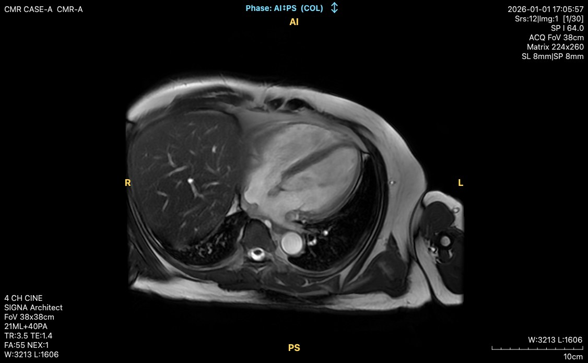
6. **Phase 버튼 띠** — cine · perfusion처럼 한 위치에 여러 장(시간 위상)이 있는 시리즈에서는 영상 위에 위상 번호 버튼이 나옵니다.

   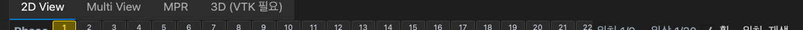

   - 번호를 누르면 **그 위상**으로 갑니다 (보고 있던 슬라이스 위치는 그대로). 지금 위상은 노란색입니다.
   - 맨 오른쪽 **[ALL]** 은 기본 모드입니다. 전체 위상을 영상 순서대로 스크롤·재생합니다 (지금 위상은 점선 테두리로 표시).
   - 오른쪽에 `위치 2/9 · 위상 13/30`처럼 현재 위치와 위상이 나옵니다.
   - 번호를 고르면 그 위상만 봅니다: 휠은 위상을 고정한 채 슬라이스 위치를 옮기고, ▶ Play는 그 위치의 위상을 차례로 돌립니다. [ALL]을 누르면 예전 동작으로 돌아옵니다.
   - **🔒 이 슬라이스에서 위상 보기**: 한 슬라이스 위치에 머문 채 휠로 위상을 넘깁니다 (수축기 → 이완기를 한 단면에서 확인). ▶ Play도 그 위치의 위상만 돌립니다. [ALL]을 누르면 풀립니다.
   - **방향키**: **← →** 슬라이스 위치, **↑ ↓** 위상. 어느 모드에서나 같습니다 (위상이 없는 시리즈에서는 넷 다 슬라이스 이동).
   - 위상 구분은 TemporalPositionIdentifier (0020,0100) 또는 TriggerTime (0018,1060)으로 하고, 두 태그가 없으면 같은 위치에 있는 영상의 순서로 나눕니다. 위치마다 장수가 달라도(검사 일부만 내보낸 경우) 됩니다.
   - 띠는 한 위치에 위상이 **5개 이상**일 때 나옵니다. T1/T2 map, DWI b값처럼 파라미터만 다른 영상은 나오지 않습니다.
7. **▦ Tile** (Shift+T)을 누르면 여러 영상을 격자로 봅니다. 아래 예는 SAX cine의 연속 위상입니다. 격자 크기는 옆의 `4x` 목록에서 고릅니다.

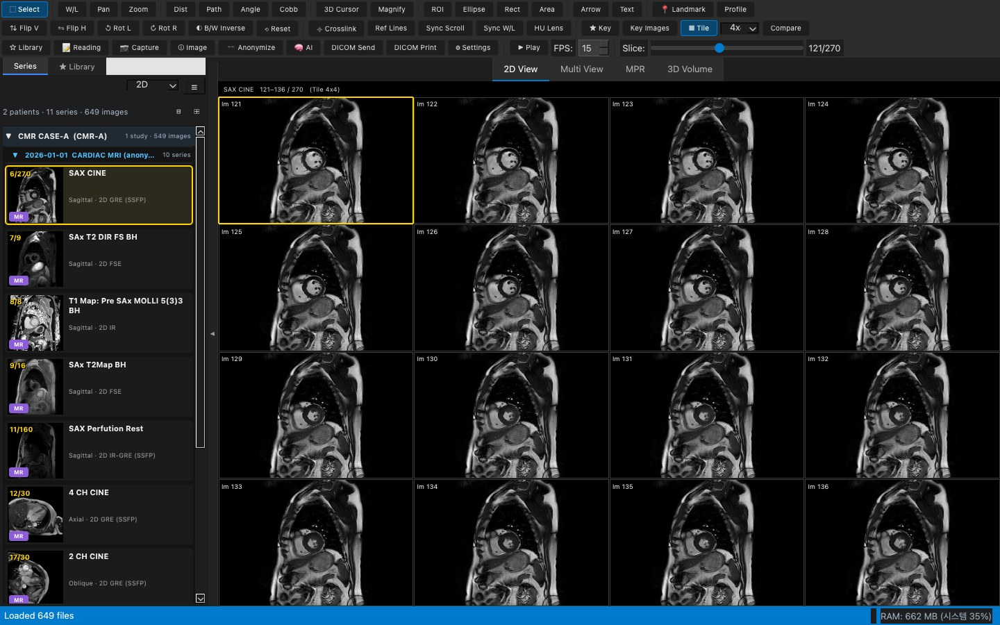

## 6. Multi View


1. 위쪽 **Multi View** 탭을 누르거나 레이아웃 목록에서 `1X1` ~ `4X4`를 고릅니다.
2. 왼쪽 시리즈 카드를 원하는 칸으로 끌어다 놓습니다 (예: SAX cine · 4CH · 2CH · LGE를 한 화면에 두고 기록).
3. 칸을 클릭하면 그 칸이 활성(노란 테두리)이 되고, 도구와 W/L은 활성 칸에 적용됩니다.
4. **Space**를 누르면 활성 칸만 크게 보고, 다시 누르면 돌아옵니다.
5. 같은 좌표계의 시리즈끼리는 **Sync Scroll / Sync W/L / Crosslink(C) / Ref Lines**로 연동됩니다 (아래 표 참고).

### 여러 칸 함께 움직이기

| 조작 | 결과 |
|---|---|
| **Ctrl(⌘)+클릭** | 그 칸을 "함께 움직이는 칸"에 넣거나 뺌 (파란 테두리) |
| **Shift+클릭** | 활성 칸부터 그 칸까지 한 번에 선택 |
| 그냥 클릭 | 선택 해제, 그 칸만 활성 (노란 테두리) |
| **Sync Scroll** 버튼 | 따로 고르지 않아도 보이는 모든 칸이 함께 움직임 |

- 고른 칸들은 **휠 · ← → (슬라이스 위치) · ↑ ↓ (위상)** 에 함께 반응합니다.
- 같은 좌표계에 평행한 시리즈는 **위치(mm) 기준**으로, 좌표계가 다르거나 장수가 다른 시리즈는 **장수 비율**로 맞춥니다.
  - 예: SA CINE(270장)의 100번째 → 2CH CINE(30장)의 11번째
- Compare로 묶은 칸은 예전처럼 간격을 유지합니다.
- 칸을 고르면 Sync Scroll 버튼보다 **선택이 우선**입니다 (고른 칸끼리만 움직임).
6. 레이아웃 `Default`는 Hanging Protocol로 자동 배치하고, `ALL`은 검사의 모든 시리즈를 띄웁니다.

### 세 가지 연동 기능 구분

| 기능 | 하는 일 |
|---|---|
| **Crosslink (C)** | 다른 칸 시리즈가 덮는 **전체 스캔 범위**를 이 영상 위에 점선으로, 그 칸이 보고 있는 슬라이스는 **노란 실선**으로 |
| **Ref Lines** | 다른 칸이 보고 있는 **현재 슬라이스 한 줄만** (1:1 대응, 가벼움) |
| **Sync Scroll** | 여러 칸을 **함께 스크롤** (같은 좌표계는 위치 기준, 다른 시리즈는 비례) |

#### Crosslink — 스캔 범위 보기

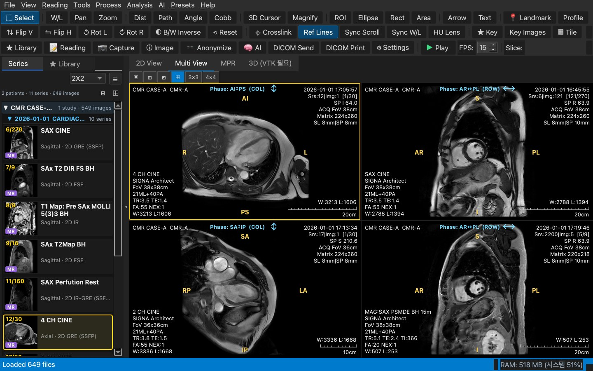

1. 도구 막대 **Crosslink** (또는 **C**)를 켭니다 (Multi View).
2. 다른 칸 시리즈의 **전체 슬라이스 위치**가 가는 점선으로, **그 칸이 지금 보고 있는 슬라이스**는 노란 실선(2 px)으로 그려집니다.
   - 예: 4CH · 2CH 칸에 SAX cine 슬라이스 10개가 점선으로 나와, 단축 스택이 심장을 어디부터 어디까지 덮는지 한눈에 보입니다.
   - SAX 칸을 휠로 넘기면 노란 실선이 따라 움직입니다.
3. 점선 색은 칸마다 다릅니다: 1번 칸 파랑, 2번 초록, 3번 주황, 4번 보라 …. 선 끝의 `S6:136`은 시리즈 번호 : 슬라이스입니다.
4. cine처럼 한 위치에 위상이 여러 장이면 위치마다 한 번만 그립니다.
5. 점선만 끄려면 **View ▸ 오버레이 항목 ▸ 스캔 커버리지 선** (T 키로 오버레이를 끄면 점선도 숨김, 노란 실선은 남음).
6. Crosslink를 켜면 3D Cursor와 클릭 위치도 같은 좌표계의 다른 칸으로 전파됩니다.

#### Reference Line — 현재 슬라이스 한 줄

**Ref Lines**만 켜면 전체 범위 없이, 다른 칸이 보고 있는 슬라이스가 이 영상의 어디인지 **한 줄**로만 표시합니다. 예: 왼쪽 SA CINE의 5번 슬라이스가 오른쪽 2CH 영상에서 어느 높이인지 한 줄로 확인.

## 7. MPR

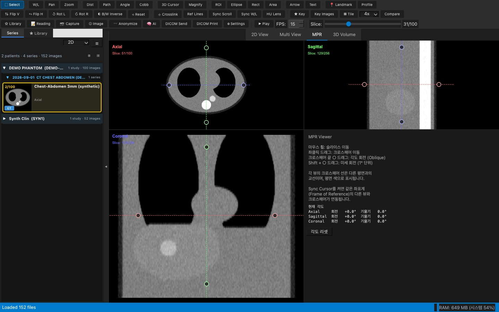

1. 볼륨(여러 슬라이스) 시리즈를 선택한 뒤 **MPR** 탭을 누릅니다.
2. Axial / Sagittal / Coronal 세 평면이 mm 기준 실제 비율로 나옵니다.
3. 한 평면을 클릭하거나 끌면 십자선이 움직이고, 다른 두 평면이 따라 바뀝니다.
4. 십자선 끝 핸들을 끌면 **Oblique** 각도로 회전합니다. Shift+드래그는 1°씩 움직입니다.

## 8. 3D Volume

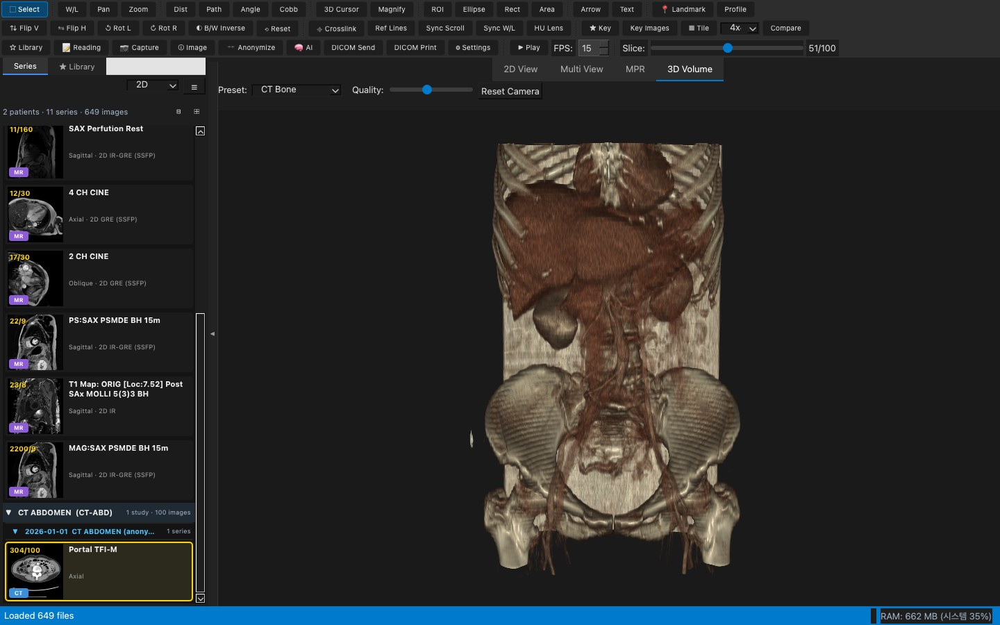

1. 볼륨 시리즈를 선택하고 **3D Volume** 탭을 누릅니다.
2. **Preset**에서 CT Bone / Skin / Soft Tissue / Lung / Angiography 중 하나를 고릅니다.
3. 마우스를 끌어 돌리고, 휠로 확대하고, 가운데 버튼으로 이동합니다. **Reset Camera**를 누르면 처음 보기로 돌아갑니다.
4. **Quality** 슬라이더로 속도와 화질을 조절합니다.

### 3D Cursor

**6** 키(또는 도구 막대 3D Cursor)로 고른 뒤 영상을 클릭하면 그 지점의 환자 좌표(L/P/S mm)와 신호값(SI)이 표시됩니다.

| 보이는 곳 | 색 | 표시 |
|---|---|---|
| 직접 찍은 영상 | **빨강** 십자선 | 좌표 + SI |
| 같은 좌표계의 다른 시리즈 | **초록** 십자선 | 좌표 + SI + `Δ ○○ mm` (그 슬라이스와 좌표 사이 거리, 0에 가까울수록 정확히 대응) |
| 좌표가 스캔 범위 밖 | 표시 없음 | 상태 막대에 "⚠ 대응되는 좌표가 없습니다 (스캔 범위 밖)" |

- 대응되는 칸은 좌표에 가장 가까운 슬라이스로 자동으로 이동합니다.
- 커서와 좌표는 **3D Cursor 도구일 때만** 영상에 그려집니다. 다른 도구로 바꾸면 화면이 깨끗해집니다 (상태 막대의 좌표·HU 표시는 그대로).

## 9. 측정 도구

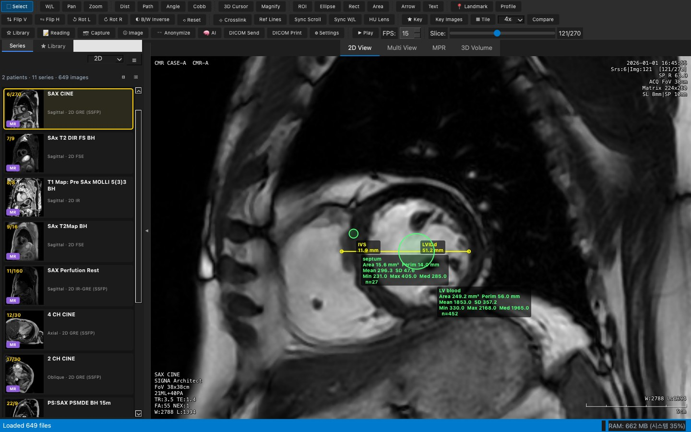

| 도구 | 키 | 결과 |
|---|---|---|
| 거리 (Dist) | 4 | mm |
| 각도 | 5 | ° |
| Cobb 각 | B | ° |
| Freehand ROI | 8 | 면적·평균·SD·Min·Max |
| 타원 ROI (Shift: 원) | E | 같음 |
| 사각형 ROI (Shift: 정사각형) | Shift+E | 같음 |
| 면적 | 9 | mm² |
| 경로 길이 | Shift+D | mm (더블클릭으로 끝) |
| 화살표 / 텍스트 | 0 / A | 주석 |
| 3D Cursor | 6 | 환자 좌표 |
| HU Lens | L | 커서 옆 픽셀 값 |

1. 도구 막대나 키보드로 도구를 고릅니다.
2. 영상 위에서 끌어 그립니다. 그리는 중에 **Shift**를 누르면 0/45/90°로 맞춰집니다.
3. 그린 측정은 선택한 뒤 끝점이나 몸체를 끌어 고칩니다. **Delete**로 지우고, **Ctrl+Z / Ctrl+Y**로 되돌립니다.
4. 선택 도구 상태에서 두 점을 더블클릭하면 빠르게 거리를 잽니다.
5. 예: SAX 중간 슬라이스에서 LV 내경(LVIDd)과 중격 두께(IVS)를 거리로 재고, 중격 심근과 LV 혈액풀에 타원 ROI를 놓아 신호를 비교합니다.

## 10. ROI Manager

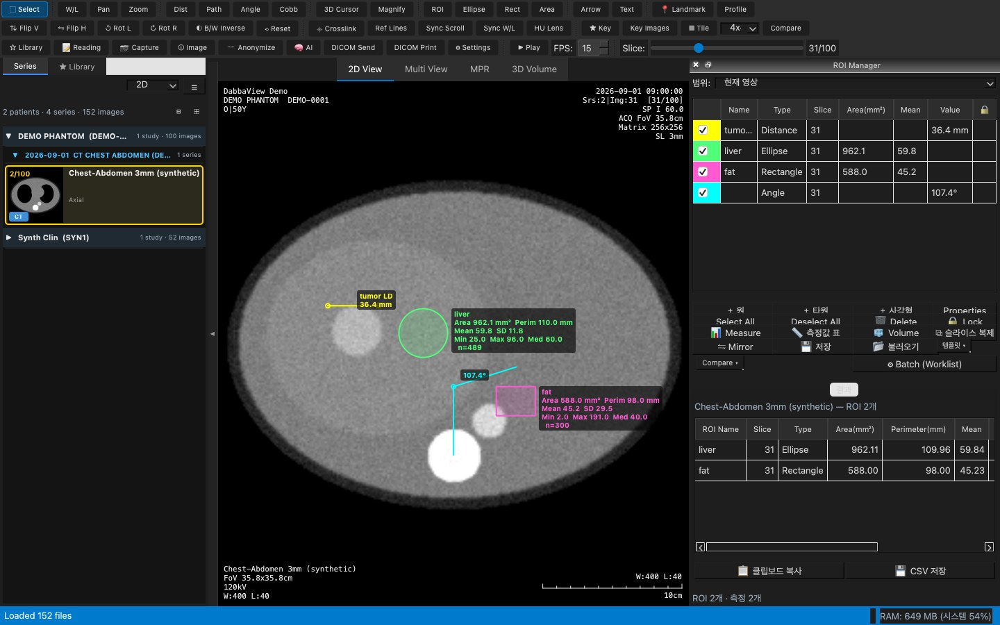

1. **Ctrl+Shift+M** 또는 도구 막대 메뉴로 ROI Manager를 엽니다.
2. 현재 영상(또는 시리즈 전체)의 ROI와 측정이 목록으로 나옵니다. 이름·색·표시·잠금을 바꿀 수 있습니다.
3. **Measure (Ctrl+M)** 를 누르면 선택한 ROI(선택이 없으면 전체)의 면적·둘레·Mean·SD·Min·Max·Median·픽셀 수를 표로 보여 줍니다. 표는 복사하거나 CSV로 저장할 수 있습니다.
4. ROI 복사/붙여넣기, 여러 슬라이스로 복사, 좌우 대칭, ROI 세트 저장/적용, 템플릿, 볼륨 계산 기능이 있습니다.

## 11. W/L 프리셋

| 프리셋 메뉴 | Settings → W/L Presets |
|---|---|
| 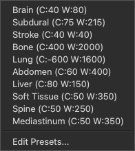 | 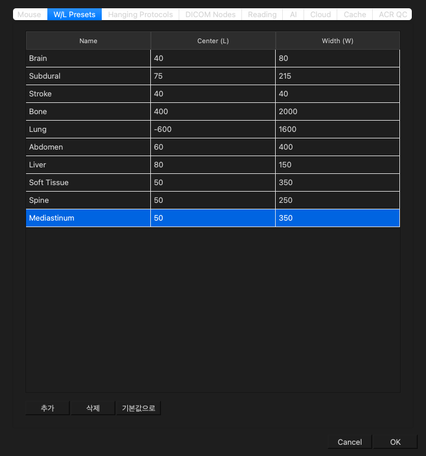 |

1. 도구 막대의 프리셋 메뉴에서 Brain, Lung, Bone, Abdomen 등 원하는 창을 고릅니다.
2. **Edit Presets…** 에서 프리셋을 추가·편집·삭제합니다.
3. **Ctrl(⌘)+좌클릭 드래그**로 사각형을 그리면 그 영역에 맞춰 W/L을 자동으로 설정합니다.

## 12. 영상 조작

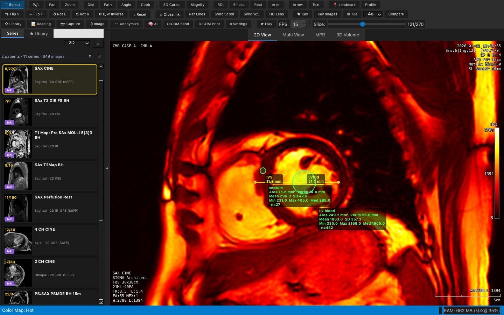

1. **V / H**: 상하 / 좌우 반전
2. **[ / ]**: 왼쪽 / 오른쪽 90° 회전
3. **I**: 흑백 반전
4. **Shift+R**: 회전·반전을 초기화하고 화면에 맞춤
5. 컬러맵은 Analysis 도구나 메뉴에서 고릅니다 (Gray, Hot, Jet, Viridis 등). 오른쪽에 컬러바가 나옵니다.
6. **7 (Magnify)** 돋보기, **Shift+L** 선 프로파일도 쓸 수 있습니다.

## 13. 태그 뷰어

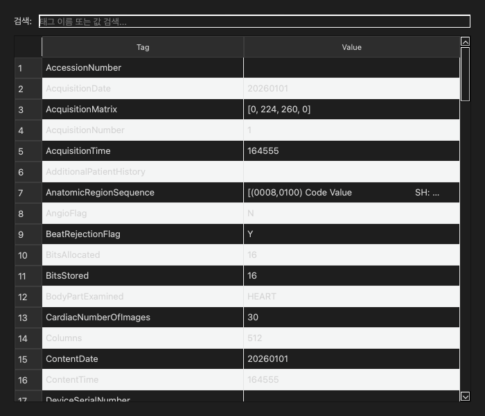

1. **Ctrl+T** 또는 Tools 메뉴 → DICOM Tags를 누릅니다.
2. 현재 영상의 모든 태그가 표로 나옵니다. 위쪽 검색 칸에 태그 이름이나 값을 넣어 거릅니다.

## 14. 익명화

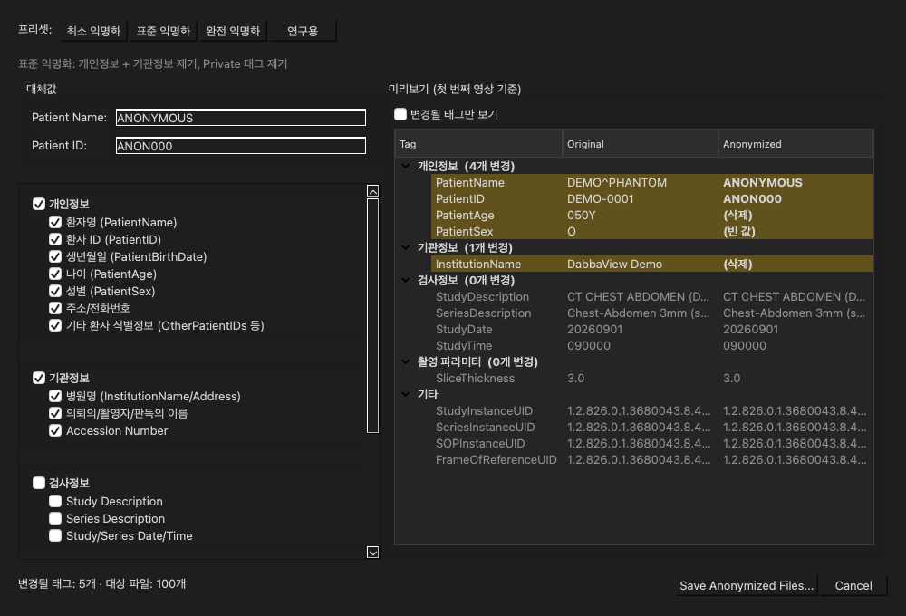

1. 도구 막대 **🕶 Anonymize** 또는 Tools 메뉴에서 엽니다.
2. 프리셋(최소 / 표준 / 완전 / 연구용)을 고르거나 항목을 직접 체크합니다. 항목은 개인정보 · 기관정보 · 검사정보 · 촬영 파라미터로 나뉩니다.
3. 오른쪽 미리보기에서 바뀔 태그가 강조됩니다. Private 태그 제거와 UID 재생성 옵션도 있습니다.
4. **Save Anonymized Files…** 로 새 폴더에 저장합니다. 원본은 그대로 남습니다.

## 15. 동영상 내보내기

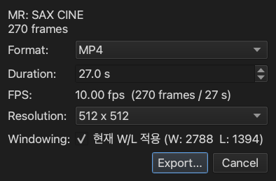

1. **Ctrl+Shift+E** 또는 File → Export as Video… 를 누릅니다.
2. 형식(MP4 / GIF 등), 길이 또는 FPS, 해상도를 고릅니다. **현재 W/L 적용**을 체크하면 보고 있는 창 그대로 저장합니다.
3. **Export…** 로 저장합니다. 시네 영상은 도구 막대 **▶ Play (P)** 와 FPS로 미리 볼 수 있습니다.
4. 예: 학회 발표·교육 자료용으로 4CH·SAX cine을 MP4로 저장합니다.

## 16. DICOM Send / Print

| DICOM Send | DICOM Print |
|---|---|
| 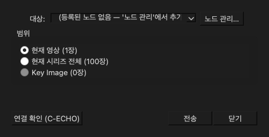 | 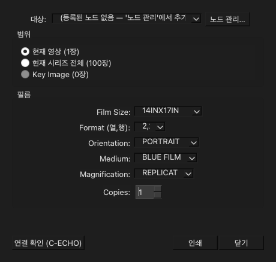 |

1. Settings → **DICOM Nodes**에 이 컴퓨터의 AE Title과 대상(AE Title · Host · Port)을 등록합니다.
2. 도구 막대 **DICOM Send** 또는 **DICOM Print**를 누릅니다.
3. 대상과 범위(현재 영상 / 현재 시리즈 전체 / Key Image)를 고릅니다.
4. **연결 확인 (C-ECHO)** 으로 통신을 확인한 뒤 **전송** 또는 **인쇄**를 누릅니다. Print는 필름 크기·배열·방향·매체·확대·매수를 고를 수 있습니다.

## 17. Reading (기록)

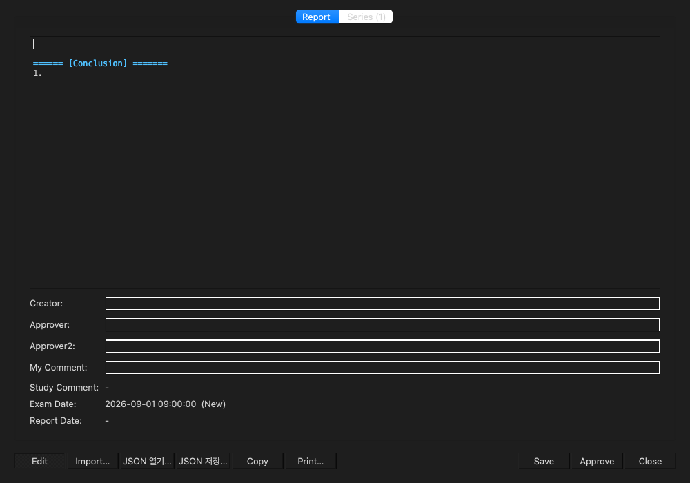

1. 검사를 열고 **R** 키 또는 도구 막대 **📝 Reading**을 누릅니다.
   - 붙인 파일(이미지 · PDF · 텍스트) 탭은 이름에 마우스를 올리면 ✕로 닫을 수 있습니다 (Report · Series 탭은 닫히지 않음).
2. Report 탭에 소견과 결론(Conclusion)을 씁니다. 작성자·승인자·검사일이 함께 저장됩니다. (화면은 CMR 기록 틀 예시)
3. **Import…** 로 txt·rtf·이미지·PDF·DICOM SR 기록을 불러옵니다. 파일명에 다른 환자 ID가 있으면 경고합니다.
4. **Save / Approve**로 저장하거나 승인하고, JSON으로 저장·열기, Copy, Print를 할 수 있습니다.
5. Settings에서 기록 폴더를 지정하면 새 파일을 PatientID와 검사일로 자동 연결합니다.

## 18. Library (스터디 라이브러리)

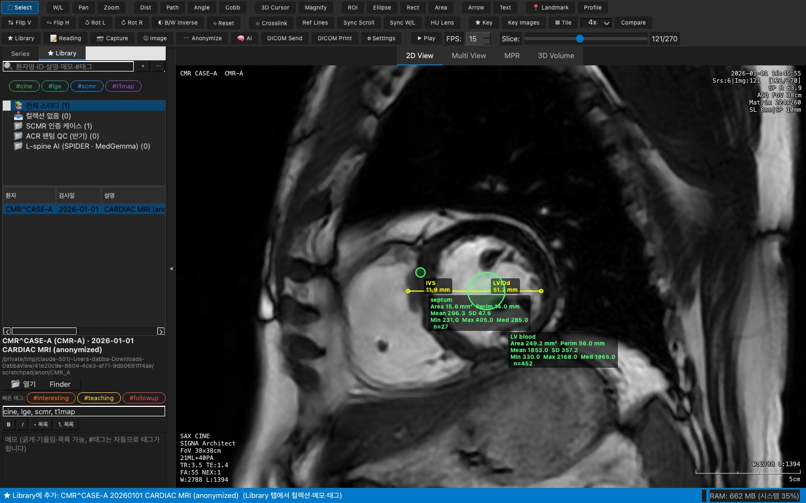

1. 스터디를 연 상태에서 **Ctrl+D** (또는 File ▸ ☆ 현재 스터디를 Library에 추가)를 누르면 즐겨찾기에 추가되고 Library 탭이 열립니다.
2. 왼쪽 **★ Library** 탭에서 컬렉션 트리, 스터디 목록, 메모, 태그를 봅니다.
   - 도구 막대 **★ Library** 버튼(또는 **Ctrl+Shift+L**)은 Library 탭을 열고 닫습니다. 보이면 닫고, 닫혔거나 Series 탭에 가려져 있거나 왼쪽 패널이 접혀 있으면 열어서 보여 줍니다.
3. **컬렉션**을 만들고 스터디를 끌어다 넣습니다. 한 스터디를 여러 컬렉션에 넣을 수 있습니다.
   - 예: `SCMR 인증 케이스`(케이스 로그북), `ACR 팬텀 QC (반기)`, `L-spine AI (SPIDER · MedGemma)`, 논문용 `CCTA vs CMR`
4. **메모**는 굵게·목록을 지원하고 자동 저장됩니다. 본문에 `#태그`를 쓰면 태그가 됩니다 (예: `#scmr #lge #t1map`).
5. 검색 칸에서 환자·설명·메모·`#태그`로 찾습니다. 더블클릭하면 그 스터디가 열립니다.
6. **Export…** (우클릭 또는 File → Export Library…)
   - 형식: PDF / Word / Excel / PNG·JPEG / CSV / JSON / Markdown
   - 범위: 전체 / 컬렉션 / 선택

## 19. Settings

macOS는 **⌘,**, Windows는 **File → Settings**로 엽니다.

| Mouse | Reading | AI |
|---|---|---|
| 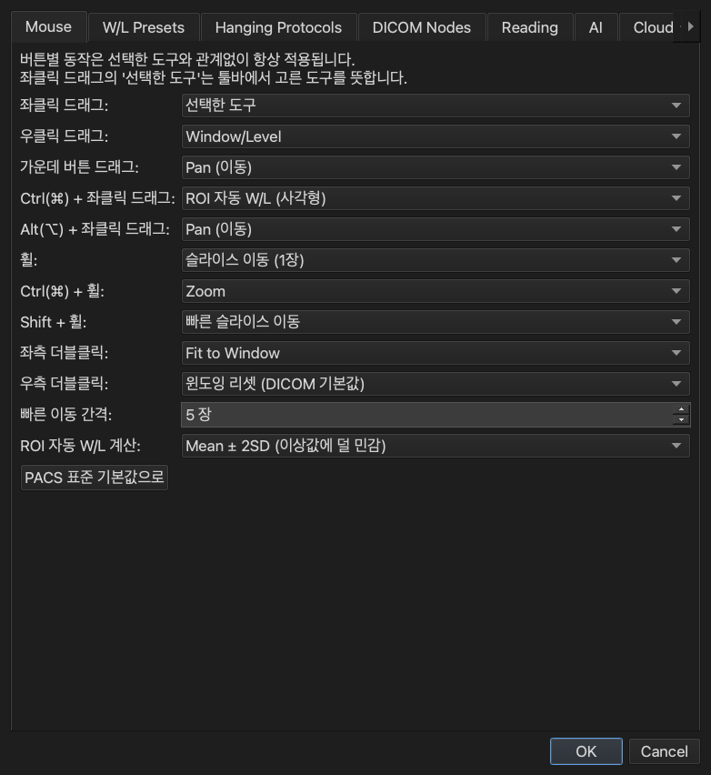 | 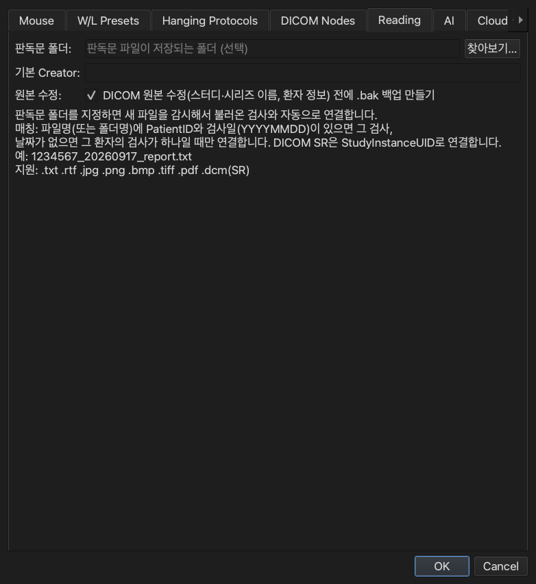 | 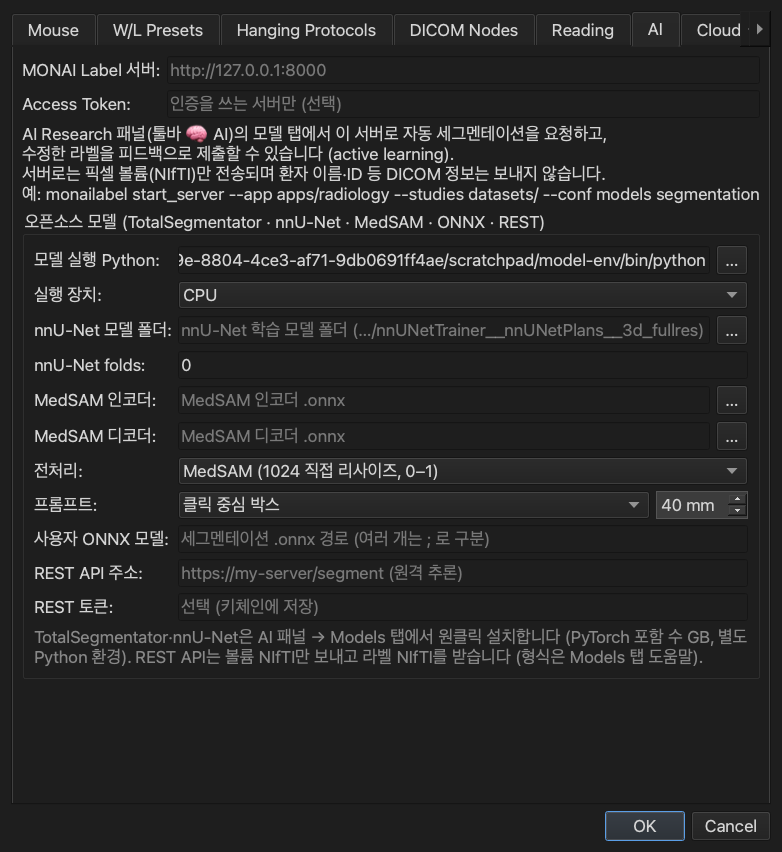 |

| ACR QC | Cache | Display |
|---|---|---|
| 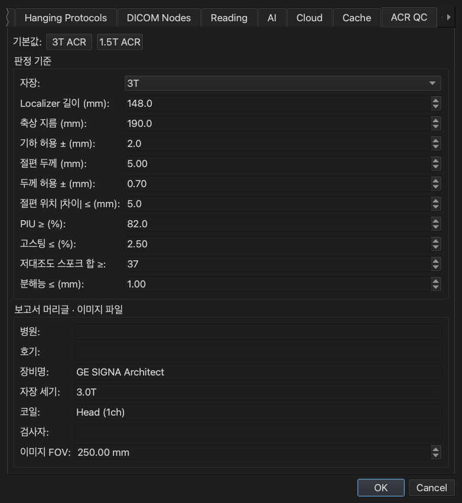 | 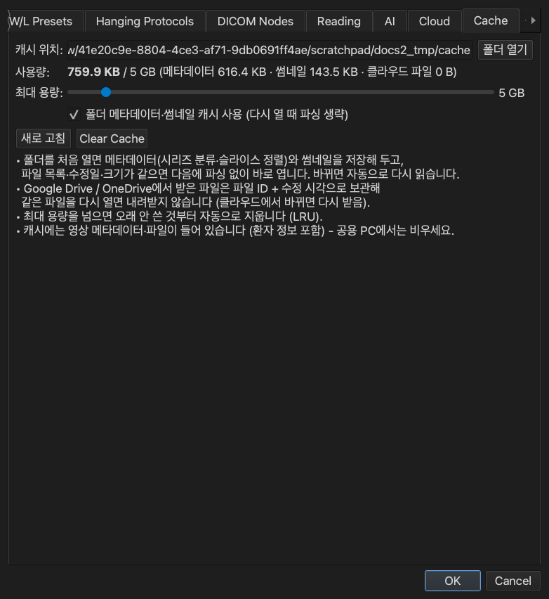 | 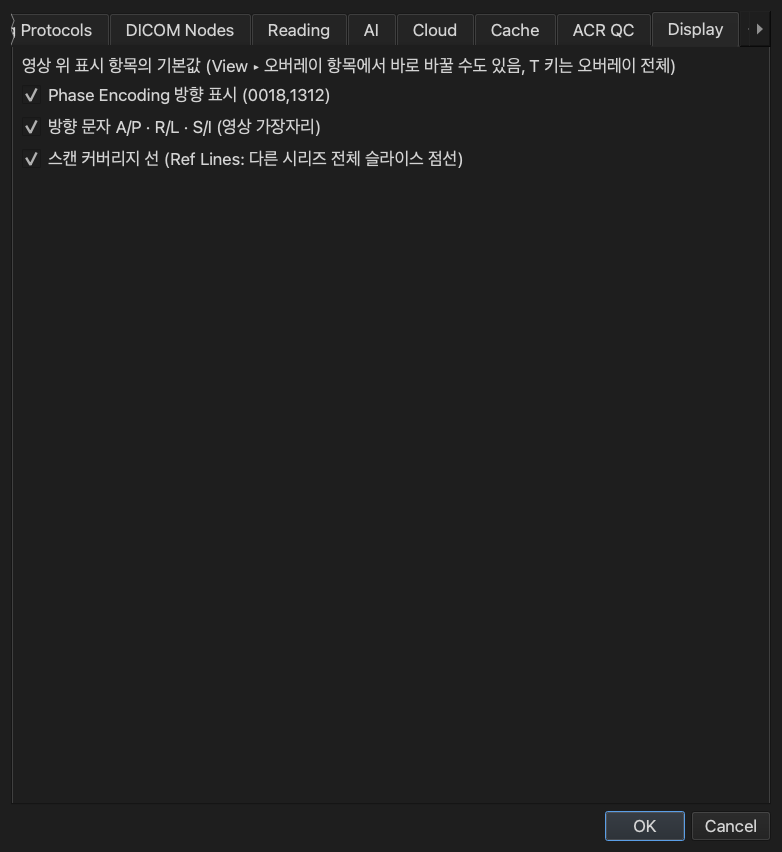 |

| 탭 | 내용 |
|---|---|
| Mouse | 버튼·휠·더블클릭 동작 매핑, ROI 자동 W/L 방식 |
| W/L Presets | 프리셋 추가·편집·삭제 |
| Hanging Protocols | 모달리티·부위별 자동 배치 |
| DICOM Nodes | AE Title, Send/Print 대상 |

| AI | MONAI Label 서버, 모델 Python, nnU-Net·MedSAM·ONNX·REST 설정 |
| Cloud | Google / OneDrive OAuth 키, 로그아웃 |
| Cache | 캐시 위치·용량 (1–50 GB), Clear Cache |
| ACR QC | 판정 기준(3T / 1.5T), 보고서 머리글, 이미지 FOV |
| 작업 저장 | 자동 저장 켜기·간격, 종료할 때 동작, 다시 열 때 복원 동작, 자동 저장 위치, 시작할 때 새 버전 확인 |
| Display | 영상 위 표시 항목의 기본값: 위상 인코딩 방향 · 방향 문자 · 스캔 커버리지 선 |

### 새 버전 알림

- 앱을 열고 잠시 뒤 GitHub Releases의 최신 버전을 확인합니다. 새 버전이 있으면 창이 뜹니다.
  - **다운로드 페이지 열기** — Releases 페이지를 브라우저로 엽니다
  - **나중에** — 닫기
  - **이 버전은 다시 알리지 않기** — 체크하면 그 버전은 다시 알리지 않습니다 (Settings ▸ 작업 저장에서 해제 가능)
- 직접 확인하려면 **Help ▸ 🔄 새 버전 확인…** (건너뛴 버전도 다시 보여 줍니다).
- 끄려면 **Settings ▸ 작업 저장 ▸ 시작할 때 새 버전 확인** 체크를 해제하세요. 확인할 때 보내는 것은 요청 하나뿐이고 개인 정보는 담기지 않습니다.
- 웹 버전은 새로 배포되면 위쪽에 띠가 뜨고 **새로고침**을 누르면 캐시를 지우고 최신으로 바뀝니다.

## 20. 단축키 목록

한/영 입력 상태와 관계없이 동작합니다.

| 키 | 기능 | 키 | 기능 |
|---|---|---|---|
| S | Selector | 1 | W/L |
| 2 | Pan | 3 | Zoom |
| 4 | 거리 | 5 | 각도 |
| B | Cobb 각 | 6 | 3D Cursor |
| 7 | 돋보기 | 8 | Freehand ROI |
| E | 타원 ROI (Shift: 원) | 9 | 면적 |
| 0 | 화살표 | A | 텍스트 메모 |
| V / H | 상하 / 좌우 반전 | [ / ] | 왼쪽 / 오른쪽 90° 회전 |
| I | 흑백 반전 | Shift+R | 회전·반전 초기화 |
| C | Crosslink (스캔 범위) | L | HU Lens |
| K | Key Image 표시/해제 | Shift+K | Key Image 모아보기 |
| Shift+T | Stack ↔ Tile | T / O | 오버레이 표시/숨김 |
| Space | Multi View 칸 최대화 | P | 시네 재생/정지 (▶ Play ↔ ■ Stop) |
| Esc | 그리기 취소 | | |
| Ctrl+T | DICOM 태그 | Ctrl+I | Image 정보 패널 |
| Ctrl+O | 파일 열기 | Ctrl+Shift+O | 폴더 열기 |
| Ctrl+S | 이미지 내보내기 | Ctrl+Shift+E | 동영상 내보내기 |
| Ctrl+Shift+S | Capture | F2 | 시리즈 패널 접기 / (목록에서) 스터디 이름 바꾸기 |
| ⇧F2 | 시리즈 이름 바꾸기 | ⌘, | Settings |
| Ctrl+Shift+A | AI Research 패널 | D / X | Brush / Eraser |
| W / G / M | Magic Wand / Threshold / MedSAM | Ctrl+Z / Ctrl+Y | 되돌리기 / 다시 하기 |
| Shift+E | 사각형 ROI | Shift+D | 경로 길이 |
| Ctrl+C / Ctrl+V | ROI 복사 / 붙이기 | Ctrl+Shift+M | ROI Manager |
| Ctrl+M | Measure | Delete | 선택 ROI 삭제 |
| Ctrl+D | 현재 스터디를 Library에 추가 | F | Landmark |
| Shift+L | Line Profile | F3 | Python 콘솔 |
| Ctrl+Shift+L | ★ Library 탭 열기/닫기 | ⌘Q | 끝내기 (클라우드 경고창이 떠 있어도) |
| ← / → | 슬라이스 위치 (cine: 위상 고정) | ↑ / ↓ | 위상 (cine · perfusion) |

## 21. 마우스 조작

PACS 표준 배치이며 Settings → Mouse에서 바꿀 수 있습니다.

| 조작 | 기능 |
|---|---|
| 좌클릭 드래그 | 선택한 도구 (기본: Selector) |
| **우클릭 드래그** | **W/L** (좌우 = Width, 상하 = Level) |
| **가운데 버튼 드래그** | **Pan** |
| Ctrl(⌘) + 좌클릭 드래그 | ROI 자동 W/L (사각형 영역) |
| Alt(⌥) + 좌클릭 드래그 | Pan |
| 휠 | 슬라이스 이동 |
| Shift + 휠 | 5장씩 빠르게 이동 |
| Ctrl(⌘) + 휠 | Zoom (커서 위치 기준) |
| 좌측 더블클릭 | 화면에 맞춤 |
| 우측 더블클릭 | W/L을 DICOM 기본값으로 |

macOS에서는 표의 `Ctrl` 자리에 ⌘(Command)와 Control 모두 쓸 수 있습니다.

## 22. 패널 · 탭 닫기와 다시 열기

| 탭 | 패널 제목 |
|---|---|
| 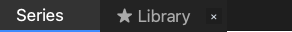 | 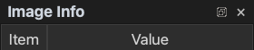 |

1. 탭 이름이나 패널 제목에 **마우스를 올리면 ✕ 버튼**이 나옵니다 (평소에는 숨김). 누르면 잠깐 흐려지며 닫힙니다.
   - 패널 제목의 □ 버튼(또는 제목 두 번 클릭)은 패널을 떼어 창으로 띄우거나 다시 붙입니다.
2. 닫으면 상태 막대에 다시 여는 방법이 나옵니다 (예: `ROI Manager 닫힘 — 다시 열기: View ▸ 패널 ▸ ROI Manager`).
3. **다시 열기**: **View ▸ 패널**에 모든 탭 · 패널이 있습니다. 도구 막대 버튼과 단축키도 같은 동작입니다 (누를 때마다 열기 ↔ 닫기).

| 탭 · 패널 | 버튼 / 메뉴 | 단축키 |
|---|---|---|
| ★ Library 탭 | 도구 막대 ★ Library · View ▸ 패널 | Ctrl+Shift+L |
| Series 탭 | View ▸ 패널 | — |
| 시리즈 패널 전체 (접기) | 패널 옆 ◀ · View ▸ 패널 | F2 |
| Image 정보 | 도구 막대 ⓘ Image | Ctrl+I |
| AI | 도구 막대 🧠 AI · Tools | Ctrl+Shift+A |
| Analysis | Analysis 메뉴에서 도구 선택 · View ▸ 패널 | — |
| ROI Manager | Tools ▸ ROI Manager · View ▸ 패널 | Ctrl+Shift+M |
| Histogram / Profile | View ▸ 패널 | Shift+L (Line Profile) |
| Python Console | Tools · View ▸ 패널 | F3 |

- ✕로 닫은 것과 버튼 · 메뉴로 닫은 것은 같습니다. 왼쪽 탭을 둘 다 닫으면 왼쪽 패널이 접히고, 다시 열면 원래 자리에 돌아옵니다.

## 23. 작업 저장 · 복원

ROI · 측정 · 주석 · Key Image는 DICOM 파일과 따로 관리됩니다. 앱을 끄면 사라지므로 종료할 때 확인합니다.

### 종료할 때

앱을 끄거나 ⌘Q를 누를 때 작업이 있으면 창이 뜹니다.

> **저장되지 않은 작업이 있습니다.**
> 현재 작업: ROI 3개, 측정 2개, 주석 1개

| 버튼 | 동작 |
|---|---|
| 저장 후 종료 | 저장 방법을 고른 뒤 종료 |
| 저장 없이 종료 | 그대로 끝냄 |
| 취소 | 종료하지 않고 돌아감 |

### 저장 방법 세 가지

| 방법 | 내용 |
|---|---|
| **어노테이션만 별도 저장** (권장) | DICOM은 건드리지 않고 자동 저장 폴더에 검사별 JSON으로 저장. 다음에 같은 검사를 열면 복원할지 물어봅니다 |
| **사본 만들어 저장** | 고른 폴더에 DICOM 사본과 `annotations.json`을 만듭니다. 원본은 그대로입니다 |
| **원본에 덮어쓰기** | ⚠️ 원본 DICOM 파일에 주석을 넣습니다 (개인 태그 `(0071,xx01)`, 작성자 `DabbaView Annotations`). 파일마다 `.bak` 백업을 만듭니다 (Settings의 백업 설정) |

- 자동 저장 위치: macOS `~/Library/Application Support/DabbaView/autosave/`, Windows `%APPDATA%\DabbaView\autosave\`

### 다시 열 때 복원

같은 검사를 다시 열면 **"이전 작업을 복원하시겠습니까?"** 라고 물어봅니다. 자동 저장 폴더의 JSON과 원본 DICOM 개인 태그에 저장해 둔 주석을 모두 찾습니다.

### Settings ▸ 작업 저장

| 설정 | 기본값 |
|---|---|
| 작업 중 자동 저장 | 꺼짐 (켜면 정한 간격마다 자동 저장 폴더에 저장) |
| 자동 저장 간격 | 5분 |
| 종료할 때 | 물어보기 (항상 저장 / 묻지 않고 종료로 바꿀 수 있음) |
| 같은 검사를 다시 열 때 | 복원할지 물어보기 (항상 복원 / 복원하지 않음) |

- 작업 도중에도 **File ▸ Save Annotations…** 로 원하는 위치에 JSON으로 저장할 수 있습니다.
- **세그멘테이션 마스크**(AI 패널의 Brush · Wand · Threshold로 칠한 빨간 영역)는 편집할 때마다 자동으로 저장되고, 같은 시리즈를 다시 열면 그대로 나옵니다. 종료 창에는 따로 세지 않습니다.

### 작업 되돌리기 · 원본 복구

**Tools ▸ ↩︎ 작업 되돌리기 · 원본 복구…** 에서 저장된 작업을 지우고 원본 상태로 되돌립니다. 지금 열려 있는 검사에 무엇이 남아 있는지 개수로 보여 주고, 고른 것만 지웁니다.

| 항목 | 하는 일 |
|---|---|
| 화면의 ROI · 측정 · 주석 지우기 | 지금 화면의 주석과 Key Image 표시를 모두 지움 |
| 세그멘테이션 마스크 지우기 | 빨간 마스크를 지우고 저장된 `.npz` 파일도 삭제 |
| 자동 저장 파일 삭제 | 자동 저장 폴더의 이 검사 JSON 삭제 (다시 열어도 복원 안 함) |
| 원본 DICOM 복구 | `.bak` 백업으로 파일을 되돌리고 백업을 지움. 백업이 없으면 넣었던 주석 개인 태그만 제거 |

- 원본 DICOM을 복구한 뒤에는 폴더를 다시 열어야 화면에 반영됩니다.
- 되돌린 내용은 복구할 수 없습니다. 남겨 두고 싶으면 먼저 **File ▸ Save Annotations…** 로 JSON을 빼 두세요.

